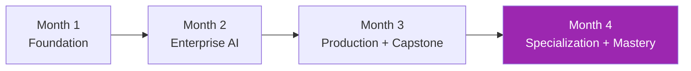
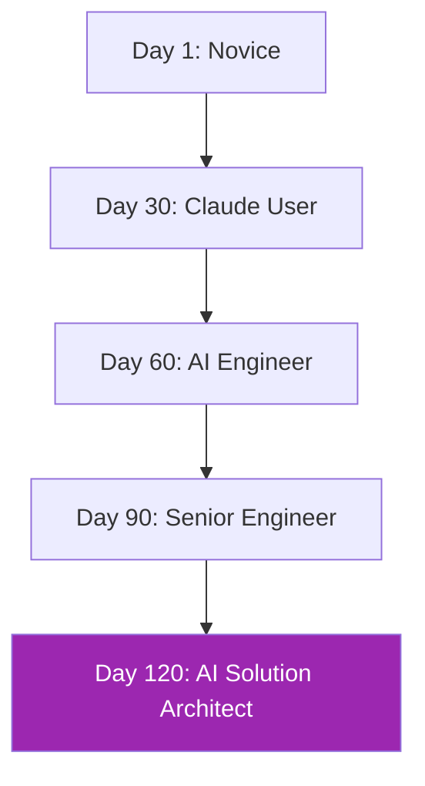

# ภาพรวมหลักสูตร 120 วัน 🗺️

## โครงสร้างหลัก

---

## Month 1: Foundation (Day 1-30)

ทำให้คุณใช้ Claude ได้คล่อง + เข้าใจ agent architecture

### Week 1 — Claude พื้นฐาน
| Day | หัวข้อ |
|-----|--------|
| 1 | AI และ LLM คืออะไร |
| 2 | เริ่มต้นกับ Claude.ai |
| 3 | Prompting 101 |
| 4 | Projects, Artifacts, Memory |
| 5 | Advanced Prompting |
| 6 | ทำงานกับ Multimodal |
| 7 | Mini Project |

### Week 2 — Applied Claude
8-14 — Writing, Data analysis, Coding, API, Cowork, Mini project

### Week 3 — Developer Tools
15-21 — Claude Code, Subagents, MCP intro + build, Mini project

### Week 4 — Agents & Capstone
22-30 — Agent architecture, A2A intro, Chrome/Excel, Design, Security/Cost, Capstone

---

## Month 2: Enterprise AI Engineering (Day 31-60)

RAG + Frameworks + Multi-cloud

### Week 5 — RAG Fundamentals
31-37 — Embeddings, Vector DBs, Chunking, Citation, Wiki Q&A project

### Week 6 — Advanced RAG
38-44 — Hybrid search, Re-ranking, Query transformation, Neo4j + GraphRAG, Agentic RAG, Graph+Vector project

### Week 7 — Frameworks Ecosystem
45-51 — LangChain, LangGraph, LlamaIndex, DSPy, Pydantic, Framework decision

### Week 8 — Claude on Cloud
52-60 — Bedrock (setup/KB/agents/production), Vertex AI + Agent Builder, Foundry, Multi-cloud, Capstone

---

## Month 3: Production + Multi-Agent + Capstone (Day 61-90)

### Week 9 — Advanced Agents
61-67 — Computer Use, E2B sandboxing, Agent Skills, Playwright, Spec-driven, Doc AI intro, Voice intro

### Week 10 — Multi-Agent Systems
68-74 — CrewAI, LangGraph Multi-Agent, AutoGen, Agent Memory, Letta/LangMem/Mem0, A2A protocol, Platform

### Week 11 — LLMOps in Production
75-81 — Observability (Langfuse/Phoenix/OTel), Evaluation (Ragas/DeepEval), CI/CD, Red teaming (Giskard/PyRIT), Guardrails (NeMo/GuardrailsAI), Cost optimization, Runbook

### Week 12 — Enterprise Capstone v2
82-90 — Full capstone: Design, RAG core, Agent layer, UI+Auth+SSO, Terraform deploy, Observability+Eval CI, Red team, Final demo + FAD

---

## Month 4: Specialization & Mastery (Day 91-120)

### Week 13 — Voice + Document AI Deep
91-97 — LiveKit production voice, Google ADK, Voice production (latency/PCI/compliance), Agentic Document Extraction, Tables/Forms/KV, Charts/Multi-modal, Mini-project

### Week 14 — Compliance & Governance
98-104 — NIST AI RMF, EU AI Act + ISO 42001, PDPA + GDPR, HIPAA + sectoral (PCI/SOX/FERPA), Carbon footprint, Green AI, Compliance audit template

### Week 15 — Vertical Use Cases
105-111 — Customer Support, Coding Agents, Legal AI, Financial Services, Healthcare, Education, Cross-vertical comparison

### Week 16 — Advanced MCP & A2A
112-120 — MCP Transports (Streamable HTTP), MCP OAuth + multi-tenant, MCP Scaling, A2A Protocol Deep, A2A Security, Build Enterprise MCP server (2 days), MCP Marketplace, Course Finale + Roadmap

---

## เป้าหมายผลลัพธ์

---

## เวลาที่ต้องลงทุน

- **เฉลี่ย 3-4 ชั่วโมง/วัน** × 120 วัน = ~400 ชั่วโมง
- **Hands-on > 50%** ของเวลา
- **2 capstone projects** (Day 28-30 + Day 82-90)
- **5+ mini projects** ตลอดหลักสูตร

---

## วิธีเรียน

1. **อ่าน + ทำตาม** — ทุกบทมี code ที่ run ได้จริง
2. **Cross-check** — references ทุกบท ลิงก์ไป Anthropic docs, papers, courses
3. **Exercises** — 2-3 ข้อต่อบท + quiz
4. **Build portfolio** — ทุก project บันทึก + push GitHub
5. **Reflect weekly** — ดูว่าใช้ที่งานได้อย่างไร

[เริ่มเลย → Week 1 :material-arrow-right:](week-01/index.md){ .md-button .md-button--primary }
