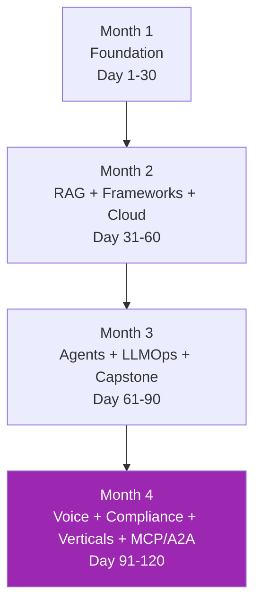

---
hide:
  - navigation
---

# Claude Mastery 🚀

## เรียน Claude — Solution Architect Edition (120 วัน)

> หลักสูตร **hands-on** ครอบคลุม Claude AI ตั้งแต่พื้นฐานจนถึงระดับ Solution Architect — RAG, agents, multi-cloud, LLMOps, compliance, vertical playbooks, MCP/A2A

[เริ่มเรียน Week 1 :material-rocket-launch:](week-01/index.md){ .md-button .md-button--primary }
[ดูภาพรวมหลักสูตร :material-map:](curriculum.md){ .md-button }

---

## เลือก Tier ที่เหมาะกับคุณ

| Tier | เวลา | เนื้อหา | เหมาะกับ |
|------|------|---------|----------|
| **Core** | 30 วัน | Foundation + Tools + Agents | ใครก็ตามที่ต้องการพื้นฐานแน่น |
| **Comprehensive** | 60 วัน | + RAG, Frameworks, Cloud | Engineer ที่ต้อง build production |
| **Full Stack** | 90 วัน | + LLMOps, Enterprise Capstone | Senior Engineer / Tech Lead |
| **Master (this course)** ⭐ | 120 วัน | + Voice, Compliance, Verticals, MCP/A2A | **Solution Architect / AI Architect** |

หลักสูตรนี้คือ **Tier 4: Master** — เนื้อหาเต็มสำหรับ Solution Architect ที่ต้องการเป็น senior AI Architect

---

## คุณจะได้อะไรจากหลักสูตรนี้

-   :material-brain:{ .lg .middle } **เข้าใจ Claude ลึกถึงแก่น**

    ---

    LLM, prompting, agent architecture, MCP, A2A — เข้าใจ "ทำไม" ไม่ใช่แค่ "ทำอย่างไร"

-   :material-tools:{ .lg .middle } **ใช้ทุกเครื่องมือเป็น**

    ---

    Claude.ai, Claude Code, Cowork, Chrome, Excel + LangChain/LangGraph/LlamaIndex/DSPy

-   :material-cloud:{ .lg .middle } **Multi-cloud Production**

    ---

    AWS Bedrock, Google Vertex AI, Microsoft Foundry — เปรียบเทียบ + เลือกเป็น

-   :material-shield-check:{ .lg .middle } **Enterprise-grade**

    ---

    LLMOps, observability, evaluation, red team, guardrails, cost — production-ready

-   :material-gavel:{ .lg .middle } **Compliance Mastery**

    ---

    NIST AI RMF, EU AI Act, ISO 42001, PDPA Thailand, GDPR, HIPAA, FERPA

-   :material-domain:{ .lg .middle } **Vertical Playbooks**

    ---

    Customer support, code, legal, finance, healthcare, education — 6 industries

-   :material-microphone:{ .lg .middle } **Voice + Document AI**

    ---

    LiveKit production voice + LandingAI agentic doc extraction

-   :material-connection:{ .lg .middle } **MCP + A2A Advanced**

    ---

    Build enterprise MCP server with OAuth multi-tenant + A2A cross-vendor

---

## โครงสร้าง 4 เดือน

| Month | Weeks | จุดเด่น |
|-------|-------|---------|
| **1: Foundation** | 1-4 | Claude basics, prompting, tools, first agent + capstone |
| **2: Enterprise** | 5-8 | RAG (basic + graph), frameworks, multi-cloud |
| **3: Production** | 9-12 | Agents, multi-agent, LLMOps, full enterprise capstone |
| **4: Mastery** | 13-16 | Voice/Doc, compliance, verticals, advanced MCP/A2A |

---

## เริ่มกันเลย

[เริ่ม Week 1 :material-arrow-right:](week-01/index.md){ .md-button .md-button--primary }
[ดู Resources](resources/cheatsheets.md){ .md-button }

---

!!! info "เป้าหมาย"
    เมื่อจบ Day 120 — คุณจะเป็น **senior AI Solution Architect** ที่นำ enterprise LLM program ได้ครบทุก dimension: technical, compliance, vendor, cost, carbon

