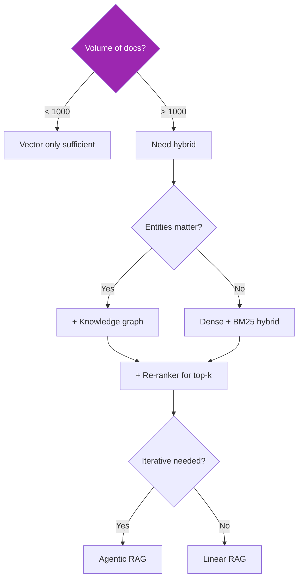

# Cheatsheets & Templates 📑

## 1. Model Selection Matrix

| Task | Model | Why |
|------|-------|-----|
| FAQ / classification / routing | Claude Haiku 4.5 | Fast + cheap |
| RAG QA / summarization / typical chat | Claude Sonnet 4.6 | Best balance |
| Complex reasoning / planning / legal / medical | Claude Opus 4.7 | Highest quality |
| Voice agent | Claude Haiku 4.5 | TTFB critical |
| Security scan / code architecture | Claude Opus 4.7 | High recall, low FN |
| High-volume embeddings | Cohere / OpenAI | Specialized + cheaper |

## 2. RAG Architecture Decision Tree



## 3. Framework Selection

| Need | Framework |
|------|-----------|
| Pure RAG | LlamaIndex |
| Sequential agent steps | LangChain |
| Complex state machines (multi-agent) | LangGraph |
| Optimized prompts | DSPy |
| Strong typing / validation | Pydantic AI |
| Voice agents | LiveKit Agents |
| GCP-native + eval | Google ADK |
| Role-based crews | CrewAI |

## 4. Cloud Provider Matrix

| Aspect | Bedrock | Vertex AI | Foundry |
|--------|---------|-----------|---------|
| Best for | AWS-native, multi-model | GCP-native, Gemini+ | Azure/Microsoft 365 |
| Claude | ✅ | ✅ | ❌ (direct) |
| VPC endpoint | ✅ | ✅ | ✅ |
| HIPAA BAA | ✅ | ✅ | ✅ |
| Streaming | ✅ | ✅ | ✅ |
| Region (TH) | ap-southeast-1 (SG) | asia-southeast1 (SG) | southeastasia (SG) |

## 5. Bedrock IAM Template

```json
{
  "Version": "2012-10-17",
  "Statement": [{
    "Effect": "Allow",
    "Action": [
      "bedrock:InvokeModel",
      "bedrock:InvokeModelWithResponseStream"
    ],
    "Resource": [
      "arn:aws:bedrock:us-east-1::foundation-model/anthropic.claude-sonnet-4-6-*",
      "arn:aws:bedrock:us-east-1::foundation-model/anthropic.claude-haiku-4-5-*"
    ],
    "Condition": {
      "StringEquals": {
        "aws:SourceVpc": "vpc-xxxxx"
      }
    }
  }]
}
```

## 6. Cost Optimization Checklist

```markdown
- [ ] Right-size model (route simple → Haiku)
- [ ] Enable prompt caching (Anthropic API)
- [ ] Semantic cache for repeat queries (30%+ hit possible)
- [ ] Batch API for non-urgent (~50% cost off)
- [ ] Compress long prompts (LLMLingua)
- [ ] Streaming + early stop
- [ ] Embedding cache
- [ ] Budget alerts per service / tenant
- [ ] Distillation for high-volume classification
- [ ] Carbon-aware region selection
```

## 7. Compliance Quick Checklist

```markdown
## Per Use Case
- [ ] Use case card (purpose, scope, owners)
- [ ] Risk classification (EU AI Act tier, internal)
- [ ] DPIA if high-risk
- [ ] Model card
- [ ] Eval baseline + freshness

## Per System
- [ ] AI policy approved
- [ ] BAA chain (if PHI)
- [ ] PII handling (mask, retain, delete)
- [ ] Audit log
- [ ] Incident runbook
- [ ] Vendor disclosure list
- [ ] Right-to-delete tested end-to-end
- [ ] Bias / fairness eval
- [ ] Carbon footprint estimate
```

## 8. MCP Server Production Checklist

```markdown
- [ ] OAuth 2.1 with PKCE
- [ ] Per-tool scope enforcement
- [ ] Rate limit per user + tenant
- [ ] Multi-tenant isolation tested (cross-tenant attempt blocked)
- [ ] Input schema validation (Pydantic)
- [ ] Output PII filter
- [ ] Audit log all tool calls
- [ ] OTel tracing + Prometheus metrics
- [ ] Health + ready endpoints
- [ ] Circuit breakers for downstream
- [ ] Connection pooling
- [ ] HTTPS only
- [ ] Secrets in Secret Manager
- [ ] CI: tests + safety + bandit
- [ ] Terraform IaC
- [ ] Auto-scaling configured
- [ ] Smoke tests post-deploy
```

## 9. Voice Agent Production Checklist

```markdown
- [ ] Latency p95 < 1.5s target
- [ ] Streaming STT + TTS + LLM
- [ ] Interrupt handling tuned
- [ ] Recording consent flow
- [ ] PII / PCI scrubbing
- [ ] Multi-language detection
- [ ] Escalation to human (sentiment + explicit + keywords)
- [ ] Session duration / turn limits
- [ ] Voice-specific metrics (Prometheus)
- [ ] BAA / DPA if applicable
- [ ] Retention policy
```

## 10. Cross-Vertical Pattern Library

| Pattern | When |
|---------|------|
| Tiered AI (auto / assist) | Risk per query matters |
| Authoritative DB backbone | Domain has source of truth (drugs, cases, fraud rules) |
| Vulnerability-aware triage | Minors, distressed users, emergencies possible |
| Citation provenance | Legal, medical, financial outputs |
| BAA chain | PHI involved |
| Audit-first | Regulated industry |
| Bias monitoring | Protected attributes affected |
| Scope minimization | PCI / sensitive data — avoid bringing into your system |
| Socratic limiting | Education — don't just give answers |
| Recording consent | Voice deployment |

## 11. Anthropic API Models Reference

```python
MODELS = {
    "opus":   "claude-opus-4-7",
    "sonnet": "claude-sonnet-4-6",
    "haiku":  "claude-haiku-4-5-20251001"
}

# Pricing — verify at https://docs.claude.com (changes)
# Use Bedrock model IDs differently:
#   anthropic.claude-opus-4-7-v1:0
#   anthropic.claude-sonnet-4-6-v1:0
#   anthropic.claude-haiku-4-5-v1:0
```

## 12. Quick Eval Setup

```python
# Golden set
EVAL_CASES = [
    {"id": "qa_1", "question": "...", "expected": "...", "category": "factual"},
    # ... 30-100 cases
]

def eval_pass_rate(model_fn):
    pass_count = 0
    for case in EVAL_CASES:
        result = model_fn(case["question"])
        if llm_judge(result, case["expected"]) == "pass":
            pass_count += 1
    return pass_count / len(EVAL_CASES)

# Run on every PR; block deploy if < threshold
```

---

[← Glossary](glossary.md){ .md-button }
[← Home](../index.md){ .md-button }
