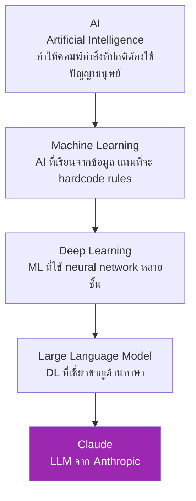
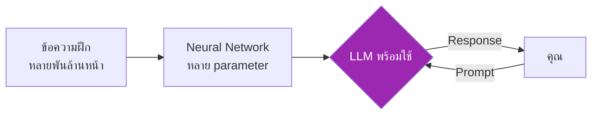

# Day 1: AI และ LLM คืออะไร 🧠

<div class="lesson-meta" markdown>
**⏱️ เวลา:** 3 ชั่วโมง · **📊 ระดับ:** Beginner · **📋 ต้องรู้มาก่อน:** ไม่ต้อง
</div>

## 🎯 เป้าหมายของบทนี้

<ul class="objectives">
<li>เข้าใจว่า AI, ML, Deep Learning, LLM ต่างกันยังไง</li>
<li>เข้าใจว่า LLM ทำงานยังไง แบบ intuition (ไม่ต้องรู้คณิตศาสตร์)</li>
<li>รู้ว่า Claude แตกต่างจาก ChatGPT, Gemini ตรงไหน</li>
<li>รู้ขีดจำกัดของ LLM ที่ต้องระวัง (hallucination, context, knowledge cutoff)</li>
</ul>

---

## 1. AI, ML, Deep Learning, LLM — ต่างกันยังไง? 🤔

ก่อนเข้าใจ Claude ต้องเข้าใจคำพวกนี้ก่อน เพราะคนใช้ปนกันบ่อย จริงๆ แล้วเป็น **subset ซ้อนกันแบบ Russian doll**



### เปรียบเทียบให้เห็นภาพ

| คำ | เปรียบเทียบ | ตัวอย่าง |
|---|---|---|
| **AI** | "เครื่องจักรที่ฉลาด" — เป็นคำกว้างที่สุด | หุ่นยนต์, รถยนต์ไร้คนขับ, Siri |
| **ML** | "AI ที่เรียนเองได้" จากข้อมูล | Netflix แนะนำหนัง, Email anti-spam |
| **Deep Learning** | "ML ที่เลียนแบบสมอง" ใช้ neural network | จดจำใบหน้า, แปลภาษา |
| **LLM** | "Deep Learning ที่เข้าใจและสร้างภาษา" | Claude, ChatGPT, Gemini |

!!! example "ตัวอย่างจาก Solution Architect"

    - **AI**: เรียก AWS Lex chatbot ว่า "AI-powered chatbot"
    - **ML**: AWS SageMaker train ตัว model ทำนายว่าลูกค้าจะยกเลิกสมัครสมาชิกไหม
    - **DL**: AWS Rekognition ตรวจวัตถุในรูป
    - **LLM**: Claude สรุปเอกสาร 100 หน้าให้ในเวลา 30 วินาที

---

## 2. LLM ทำงานยังไง — แบบ Intuition 💡

ลืม math ไปก่อน เรามาคิดง่ายๆ

### LLM = นักพยากรณ์คำถัดไป

LLM ทำสิ่งเดียวเก่งมาก: **ทำนายคำถัดไป**

```
Input:  "ฉันชอบกินก๋วยเตี๋ยว..."
LLM:    "เรือ" (น่าจะ 40%), "ราดหน้า" (20%), "ต้มยำ" (15%), ...
```

แล้วทำซ้ำ ทำซ้ำ ทำซ้ำ — ทำนายทีละคำ จนเป็นประโยค จนเป็นย่อหน้า

### แล้วทำไมมันถึงตอบคำถามได้ดี?

เพราะมัน **เห็นข้อความเยอะมาก** ตอน training (พันล้านหน้า) — มันเลยจำ pattern ของภาษาได้ละเอียดมาก ทั้ง:

- ไวยากรณ์
- ข้อเท็จจริง
- การให้เหตุผล
- โค้ดในภาษาต่างๆ
- ฯลฯ



### Token ไม่ใช่คำ

LLM ไม่ได้ทำงานทีละ "คำ" แต่ทำงานทีละ **token** (ชิ้นเล็กกว่าคำบ้าง ใหญ่กว่าคำบ้าง)

ตัวอย่าง: ประโยค "Claude ฉลาดมาก" อาจถูกแบ่งเป็น tokens เช่น `["Claude", " ", "ฉลาด", "มาก"]` — 4 tokens

!!! info "ทำไมต้องรู้เรื่อง token?"

    เพราะ Claude คิดเงินตาม **token** ไม่ใช่ตามคำ และ context window ก็วัดเป็น token

    - ภาษาอังกฤษ: ~1 token = 4 ตัวอักษร = 0.75 คำ
    - ภาษาไทย: ~1 token = 2-3 ตัวอักษร (เพราะการ tokenize ไทยใช้พื้นที่มากกว่า)

---

## 3. Claude ต่างจาก ChatGPT, Gemini ยังไง? 🆚

LLM ที่ดังๆ ปัจจุบันมี 3-4 ตัวหลัก ทุกตัวทำงานคล้ายกัน แต่มีจุดเด่นต่าง

| โมเดล | ผู้สร้าง | จุดเด่น | สถานที่ใช้ |
|---|---|---|---|
| **Claude** | Anthropic | ปลอดภัย, เข้าใจบริบทยาวๆ ดี, coding เก่ง, มี Artifact | claude.ai |
| **GPT** | OpenAI | popular ที่สุด, multimodal ดี, มี GPT Store | chat.openai.com |
| **Gemini** | Google | integrate กับ Google Workspace ดี | gemini.google.com |
| **Llama** | Meta | open source (รันบนเครื่องตัวเองได้) | local |

### จุดเด่นของ Claude

1. **Constitutional AI** — Anthropic ฝึกให้ Claude มี "หลักการ" — refuse คำขอที่อันตราย
2. **Context window ใหญ่มาก** (200K tokens — ประมาณหนังสือ 500 หน้า)
3. **Coding และ reasoning เก่ง** — ผ่าน benchmarks หลายตัวที่ระดับ top
4. **Artifacts** — สร้างโค้ดและ document แยกออกมาเห็นได้ทันที
5. **Claude Code** — agentic CLI สำหรับงาน software engineering

!!! example "Use case ที่ Claude เก่งเป็นพิเศษ"

    - วิเคราะห์เอกสารยาวๆ (สัญญา, paper)
    - เขียน code ที่ต้องเข้าใจ codebase ใหญ่ๆ
    - งานที่ต้องการ reasoning หลายขั้น
    - งานที่ต้องการความปลอดภัย/ความรับผิดชอบสูง

---

## 4. ขีดจำกัดของ LLM ที่ต้องระวัง ⚠️

LLM ฉลาดก็จริง แต่มีข้อจำกัดที่ต้องเข้าใจไม่งั้นจะใช้ผิด

### 4.1 Hallucination — กล้าตอบสิ่งที่ไม่จริง

LLM พยากรณ์คำ → ถ้าไม่รู้ มันก็เดา แล้วเขียนเป็นประโยคที่ฟังดูน่าเชื่อ

```
You:    "ใครเป็นผู้ค้นพบหลุมดำชื่อ Phantom Galaxy X-7?"
LLM:    "Phantom Galaxy X-7 ถูกค้นพบในปี 2019 โดย Dr. Maria Chen..."
```

หลุมดำชื่อนี้**ไม่มีอยู่จริง** — แต่ LLM ก็แต่งเรื่องมาให้

**วิธีรับมือ:** ตรวจสอบ fact ที่สำคัญทุกครั้ง โดยเฉพาะตัวเลข ชื่อคน ปี ใช้ web search หรือบอก Claude ให้ระบุว่า "ถ้าไม่แน่ใจให้บอกว่าไม่รู้"

### 4.2 Knowledge Cutoff — ไม่รู้เรื่องล่าสุด

Claude ถูก train ด้วยข้อมูลถึงวันที่หนึ่ง (เรียกว่า knowledge cutoff) — ไม่รู้เรื่องที่เกิดหลังจากนั้น เว้นแต่จะใช้ web search

```
You:    "ราคา Bitcoin วันนี้?"
Claude: "ผมไม่ทราบราคาล่าสุด ขอ search ก่อนนะ" [ใช้ web tool]
```

### 4.3 Context Window — ความจำมีจำกัด

ในการ chat หนึ่งครั้ง Claude จำได้แค่ **ภายใน context window** เท่านั้น (200K tokens สำหรับ Sonnet/Opus) ถ้าเกินจะลืมส่วนต้น

ในแต่ละ chat ใหม่ — เริ่มต้น = ไม่จำอะไรเลย (ยกเว้นใช้ feature **Memory**)

### 4.4 Math และ Calculation — ไม่แม่นเหมือนคิดเลข

LLM พยากรณ์คำ — ไม่ใช่ calculator! ตอบเลขง่ายๆ ได้ แต่ตัวเลขใหญ่ๆ ผิดบ่อย

```
You:    "234,567 × 891 = ?"
LLM:    "208,999,197" (อาจผิด!)
```

**วิธีรับมือ:** เปิด **Code Execution** ใน Claude.ai หรือใช้ tool use ใน API

### 4.5 Bias และ Outdated Information

ข้อมูลที่ train มาอาจมี bias — ระวังเรื่อง gender, race, culture และข้อมูลล้าสมัย

---

## 🛠️ Hands-on Exercise

### Exercise 1: ทดลองคิดแบบ token

ไปที่ [https://platform.openai.com/tokenizer](https://platform.openai.com/tokenizer) (เครื่องมือดู token — ใช้ได้แม้ไม่ใช่ของ Anthropic)

1. พิมพ์ประโยค: `Claude ฉลาดมากใช่ไหม`
2. ดูว่าได้กี่ tokens
3. ลองภาษาอังกฤษ: `Claude is very smart, isn't it?`
4. เปรียบเทียบ — ภาษาไหนใช้ token มากกว่า?

??? success "Expected Answer"

    ภาษาไทยจะใช้ token มากกว่า เพราะ tokenizer ส่วนใหญ่ฝึกด้วยภาษาอังกฤษ → ภาษาไทยถูกตัดเป็นชิ้นเล็กกว่า

    **บทเรียน:** ถ้าใช้ภาษาไทย จะเปลือง token (= แพงกว่า) และ context window เต็มเร็วกว่า

### Exercise 2: ทดสอบ Hallucination ของ Claude

(ทำใน claude.ai — ถ้ายังไม่ได้สมัคร ทำ [Setup](../setup.md) ก่อน)

ลองถาม Claude:

1. "อธิบายเรื่องหลุมดำ Phantom Galaxy X-7" (เรื่องไม่จริง)
2. "ใครเป็นนายกรัฐมนตรีคนที่ 47 ของประเทศไทย" (ปัจจุบันยังไม่ถึง)

สังเกตว่า:

- Claude **จะปฏิเสธ** หรือไม่? (ที่ดี)
- หรือ **แต่งเรื่อง** ขึ้นมา? (hallucination)

??? tip "ผลที่อาจเจอ"

    Claude มักจะตอบดีกว่า model อื่นๆ — มันจะบอกว่า "ผมไม่พบข้อมูลเกี่ยวกับ X" หรือ "Y ยังไม่เกิดขึ้น" แต่ก็ไม่ใช่ 100%

---

## ✅ Self-Check Quiz

<div class="quiz" markdown>

### ทดสอบความเข้าใจ

**Q1:** AI, ML, DL, LLM อันไหนเป็น subset ของอันไหน?

??? success "Answer"
    LLM ⊂ DL ⊂ ML ⊂ AI (LLM อยู่ในสุด, AI ใหญ่สุด)

**Q2:** Token คืออะไร และทำไมต้องสนใจ?

??? success "Answer"
    Token = หน่วยที่ LLM แบ่งข้อความเป็นชิ้นๆ — ไม่ใช่คำเสมอไป สำคัญเพราะ:
    1. คิดเงินตาม token
    2. Context window วัดเป็น token
    3. ภาษาต่างกันใช้ token ต่างกัน

**Q3:** ทำไม Claude ตอบ "1 + 1 = 2" ได้ถูก แต่ "234,567 × 891" อาจผิด?

??? success "Answer"
    เพราะ Claude **ทำนายคำถัดไป** ไม่ใช่ **คิดเลข** — `1 + 1 = 2` มันเจอบ่อยใน training data จนจำได้ แต่ตัวเลขใหญ่ๆ ไม่เคยเจอ pattern เดิม → เดามั่ว
    ใช้ Code Execution หรือ tool use แก้ปัญหานี้

**Q4:** Hallucination แก้ยังไง?

??? success "Answer"
    1. บอก Claude ให้ระบุชัดถ้าไม่รู้
    2. ใช้ web search สำหรับข้อมูลปัจจุบัน
    3. **Cross-check ทุกครั้ง** สำหรับ fact สำคัญ
    4. ใช้ RAG (จะเรียนตอน Week 4) สำหรับ knowledge base เฉพาะ

**Q5:** Knowledge Cutoff คืออะไร และทำไมต้องรู้?

??? success "Answer"
    วันที่สุดท้ายที่ LLM ถูก train — ไม่รู้เรื่องหลังจากนั้น ต้องรู้เพราะถ้าถามเรื่องล่าสุดต้องใช้ web search หรือยอมรับว่าข้อมูลอาจไม่ update

</div>

---

## 🔍 Cross-check & References

ตรวจสอบเนื้อหาในบทนี้กับแหล่งต้นฉบับ:

1. **Anthropic — How Claude Works** : [https://www.anthropic.com/news](https://www.anthropic.com/news)
2. **3Blue1Brown — But what is a GPT?** (วิดีโออธิบาย LLM ภาพชัดเจน): [YouTube](https://www.youtube.com/watch?v=wjZofJX0v4M)
3. **Karpathy — Intro to LLMs** : [YouTube](https://www.youtube.com/watch?v=zjkBMFhNj_g)
4. **Anthropic — Constitutional AI paper**: [https://arxiv.org/abs/2212.08073](https://arxiv.org/abs/2212.08073)

!!! tip "อ่านเพิ่มเติม"

    - หนังสือ [The Hundred-Page Machine Learning Book](http://themlbook.com) — สั้น เข้าใจง่าย
    - [Anthropic Research](https://www.anthropic.com/research) — งานวิจัยล่าสุด

---

## :material-check-decagram: สรุป

วันนี้คุณได้เรียน:

- AI ⊃ ML ⊃ DL ⊃ LLM — Claude คือ LLM จาก Anthropic
- LLM = นักพยากรณ์คำถัดไป — ทำงานทีละ token
- Claude เด่นเรื่อง safety, context ยาว, coding, Artifacts
- ข้อจำกัด: hallucination, knowledge cutoff, context window, math

พรุ่งนี้: เรามาเริ่ม **ใช้ Claude.ai จริงๆ** กัน!

[Day 2: เริ่มต้นกับ Claude.ai :material-arrow-right:](day-02.md){ .md-button .md-button--primary }
