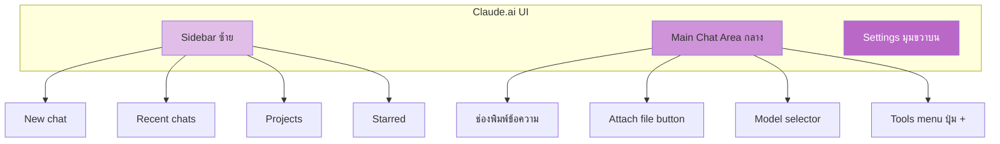
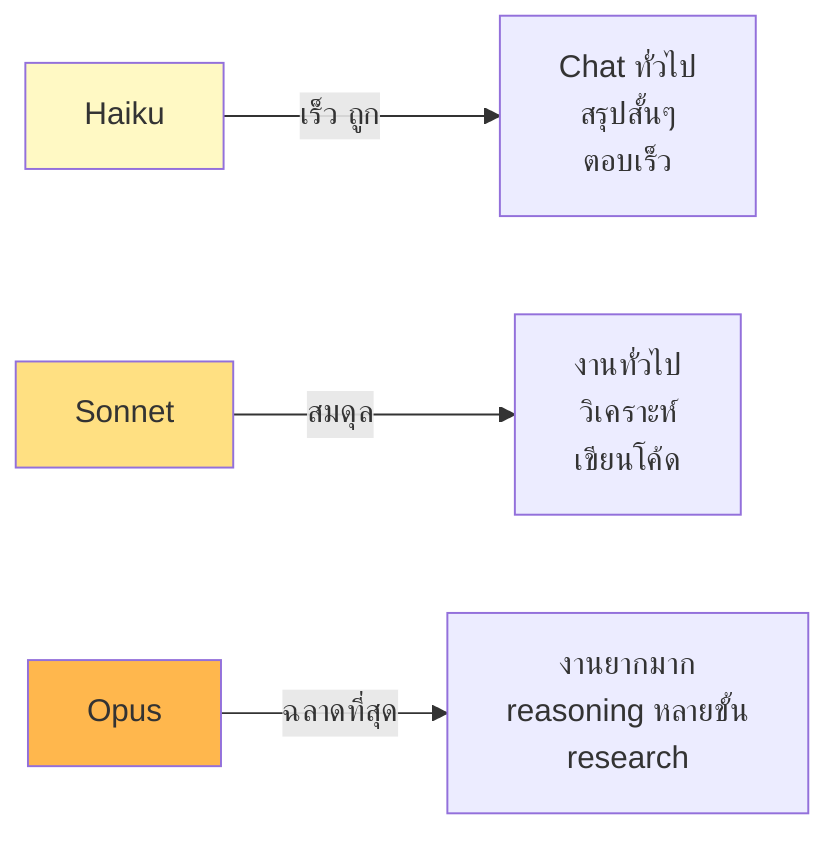
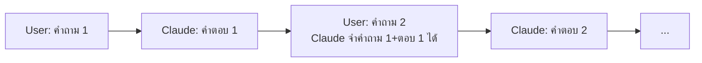
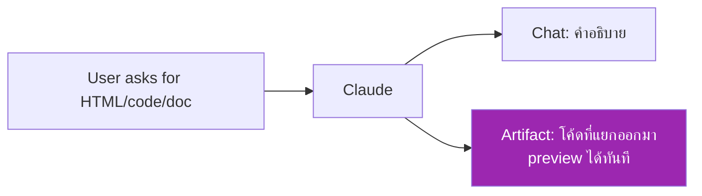

# Day 2: เริ่มต้นกับ Claude.ai 🚀

<div class="lesson-meta" markdown>
**⏱️ เวลา:** 3 ชั่วโมง · **📊 ระดับ:** Beginner · **📋 ต้องรู้มาก่อน:** [Day 1](day-01.md)
</div>

## 🎯 เป้าหมายของบทนี้

<ul class="objectives">
<li>สร้างบัญชี Claude.ai และเข้าใจ UI ทั้งหมด</li>
<li>เลือกใช้ model ได้ถูกกับงาน (Haiku/Sonnet/Opus)</li>
<li>เข้าใจ Free vs Pro vs Max — ควรซื้อตัวไหน</li>
<li>ตั้งค่า personal preferences และ features ให้เหมาะกับตัวเอง</li>
<li>คุยกับ Claude ครั้งแรก — ได้ผลลัพธ์ที่ใช้ได้จริง</li>
</ul>

---

## 1. โครงสร้าง UI ของ Claude.ai 🗺️

เปิด [https://claude.ai](https://claude.ai) ขึ้นมา จะเห็นหน้าตาแบบนี้ (ส่วนประกอบสำคัญ):



### ส่วนประกอบหลัก

| ส่วน | หน้าที่ |
|---|---|
| **New chat** (มุมซ้ายบน) | เริ่ม conversation ใหม่ |
| **Recent chats** | conversation ก่อนหน้า — Claude จำได้ภายใน chat แต่ละอันเท่านั้น |
| **Projects** | จัดกลุ่ม chat ที่ใช้ context เดียวกัน (เช่น โปรเจกต์งานเดียวกัน) |
| **Model selector** | เลือกรุ่น Claude (Haiku/Sonnet/Opus) |
| **Tools (+)** | เปิด/ปิด: web search, code execution, file creation, artifacts, memory |
| **Settings** | personal preferences, features, account |

---

## 2. รุ่นของ Claude — เลือกใช้ให้ถูกงาน 🎚️

ปัจจุบัน Claude มี 3 รุ่นหลัก (ในตระกูล Claude 4.7):



### เปรียบเทียบ

| รุ่น | ความเร็ว | ความฉลาด | ราคา (API) | ใช้เมื่อ |
|---|:---:|:---:|---|---|
| **Haiku 4.5** | ⚡⚡⚡ | ⭐⭐⭐ | $$ | งานง่าย, ตอบเร็ว, ปริมาณมาก |
| **Sonnet 4.6** | ⚡⚡ | ⭐⭐⭐⭐ | $$$ | งานทั่วไป (default ที่ดี) |
| **Opus 4.7** | ⚡ | ⭐⭐⭐⭐⭐ | $$$$ | งานยาก, reasoning ลึก, research |

!!! tip "คำแนะนำเริ่มต้น"

    - **เริ่มจาก Sonnet** สำหรับงานส่วนใหญ่
    - เปลี่ยนเป็น **Opus** ถ้าเจองานที่ Sonnet ตอบไม่ดีพอ
    - ใช้ **Haiku** เมื่อต้องการความเร็ว เช่น แชทตอบกลับสั้นๆ

!!! example "ตัวอย่างจริง"

    - **Haiku**: "แปลคำว่า 'serendipity' เป็นไทย" → ตอบเร็วฉับ
    - **Sonnet**: "ช่วยรีวิว pull request นี้ให้หน่อย" → เขียน comment ดีๆ ได้
    - **Opus**: "ออกแบบ microservice architecture สำหรับ e-commerce ที่รองรับ 10K req/s" → คิดละเอียดทุกมิติ

---

## 3. Plans — Free, Pro, Max 💰

| Plan | ราคา | จุดเด่น | เหมาะกับ |
|---|---|---|---|
| **Free** | ฟรี | ใช้ Sonnet ได้จำกัด, ไม่มี Projects, ไม่มี Claude Code | ลองใช้, งานเบาๆ |
| **Pro** | ~$20/เดือน | ใช้ Sonnet/Opus ได้, มี Projects, มี Claude Code, มี Artifacts | งานประจำวัน (แนะนำ) |
| **Max** | สูงกว่า Pro | usage สูงสุด, priority access | ใช้หนัก, professional |
| **Team / Enterprise** | per-seat | shared projects, admin controls, SSO | บริษัท |

!!! warning "ก่อนตัดสินใจซื้อ Pro"

    ลอง Free สัก 1–2 วันก่อน — ดูว่าคุณใช้ feature ที่ Pro ต้องมีจริงไหม (เช่น Projects, Claude Code)
    สำหรับหลักสูตรนี้ — **Pro คุ้มมาก** เพราะใช้ Claude Code (Week 3) และมี usage มากพอ

> 🔎 **Cross-check ราคา**: ราคาอาจเปลี่ยน — ตรวจที่ [https://claude.com/pricing](https://claude.com/pricing) เสมอ

---

## 4. Settings ที่ควรตั้ง 🔧

คลิก **profile icon มุมขวาบน → Settings** จะเจอ:

### 4.1 Personal Preferences

นี่คือ "instructions ลับ" ที่ Claude ใช้ทุก chat — ใส่ context เกี่ยวกับตัวคุณ

!!! example "ตัวอย่าง Personal Preferences สำหรับ Solution Architect"

    ```
    ฉันเป็น Solution Architect ที่มีประสบการณ์ Kubernetes, AWS, Red Hat
    เวลาอธิบายเรื่องเทคนิค ขอแบบ:
    - มี diagram ประกอบ
    - มี real-world example
    - cross-check sources ถ้าเป็นข้อมูลที่อาจล้าสมัย
    - อธิบายแบบ step-by-step
    ```

### 4.2 Features (เปิด/ปิด)

- **Web search** — ให้ Claude ค้นข้อมูลล่าสุดได้ (✅ ควรเปิด)
- **Code execution & file creation** — ให้ Claude รัน Python จริง สร้างไฟล์ Excel/PDF ได้ (✅ ควรเปิด)
- **Artifacts** — สร้างโค้ด/document แยกออกมาเห็นได้ (✅ ควรเปิด)
- **Search and reference past chats** — Claude ค้น chat เก่าๆ ได้ (เปิดถ้าคุยกัน Claude เป็น personal assistant)
- **Memory** — Claude จำข้อมูลข้าม chat ได้ (เปิดถ้าอยากให้ Claude รู้จักคุณ)

### 4.3 Style (ทำที่ใน chat)

นอกจาก preferences แล้ว Claude มี **Style** — preset โทนการตอบ
- Normal, Concise, Explanatory, Formal
- หรือสร้าง custom style ของตัวเอง

---

## 5. Conversation พื้นฐาน 💬

### Chat แรกของคุณ

ลองพิมพ์ที่ช่องข้อความ:

```
สวัสดี Claude! ช่วยแนะนำตัวเอง และบอกว่าวันนี้ทำอะไรให้ฉันได้บ้าง
```

จะเห็น Claude ตอบในสัก 5 วินาที

### Conversation มีโครงสร้างเป็น Turn



**สำคัญ:** Claude **จำทั้ง conversation** จนกว่าจะเกิน context window

### ทดลอง: ดูว่า Claude จำได้

```
Turn 1: ฉันชอบสีฟ้า และทำงานเป็น Solution Architect
Turn 2: แนะนำสีสำหรับ logo บริษัทใหม่ของฉัน ที่ตรงกับสิ่งที่ฉันเล่าก่อนหน้านี้
```

Claude ควรแนะนำเฉดสีฟ้า เพราะมันจำได้ว่าคุณชอบสีฟ้า

### กดปุ่ม Edit ที่ข้อความเก่า

- คลิก ✏️ ที่ข้อความตัวเองเก่าๆ
- แก้ใหม่ — Claude จะ regenerate คำตอบจากจุดนั้นไป
- มีประโยชน์เวลา prompt ที่ส่งไปได้ผลไม่ดี — แก้แทนที่จะถามใหม่ (เปลือง token เปล่า)

---

## 6. Artifacts — สิ่งที่ทำให้ Claude.ai พิเศษ ✨

ลองพิมพ์:

```
เขียน landing page HTML สวยๆ เกี่ยวกับร้านกาแฟชื่อ "Bangkok Brew"
ใช้สีน้ำตาลและครีม มีปุ่ม "Order Now"
```

จะเห็น Claude แสดง **Artifact** ขึ้นมาที่ขวามือ — มีตัวอย่างเว็บจริงๆ ที่ดูได้



Artifacts รองรับ: HTML, React, SVG, Mermaid, Markdown, code (Python/JS/...)

> เราจะลงลึก Artifacts ใน [Day 4](day-04.md)

---

## 🛠️ Hands-on Exercise

### Exercise 1: ตั้งค่า Personal Preferences

1. ไปที่ Settings → Personal Preferences
2. เขียนเกี่ยวกับตัวเอง 3–5 บรรทัด (อาชีพ, สิ่งที่ชอบ, ไม่ชอบ, style การอธิบาย)
3. เริ่ม chat ใหม่ → ถาม "อธิบายเรื่อง Kubernetes ให้ฟังหน่อย"
4. ลบ preferences → ถามเรื่องเดิมอีกครั้ง
5. **สังเกตความต่าง**

### Exercise 2: เปรียบเทียบรุ่น

ส่งคำถามเดียวกันไปทุกรุ่น (เปลี่ยนที่ model selector):

```
ออกแบบ API endpoint สำหรับระบบ booking โรงแรมที่รองรับ:
- ค้นหาห้อง
- จอง
- ยกเลิก
- ดู booking history

ให้ครบทั้ง: endpoint, method, request body, response, error handling
```

ดูความต่างของคำตอบจาก Haiku vs Sonnet vs Opus

### Exercise 3: สร้าง Artifact แรก

```
สร้าง diagram (mermaid) แสดง flow ของ user signup process
ที่มี email verification และ welcome email
```

ลองคลิก Edit ที่ Artifact แล้วแก้เพิ่ม "OAuth login" → Claude จะอัปเดต diagram

---

## ✅ Self-Check Quiz

<div class="quiz" markdown>

**Q1:** Haiku, Sonnet, Opus — ใช้ตัวไหนเขียน production code ที่ critical?

??? success "Answer"
    **Opus** หรือ **Sonnet** — Opus ฉลาดกว่า แต่ Sonnet เร็วและถูกกว่า สำหรับ production code ทั่วไป Sonnet พอ; งานออกแบบสถาปัตยกรรมใหญ่ ใช้ Opus

**Q2:** Personal Preferences กับ Project instructions ต่างกันยังไง?

??? success "Answer"
    - **Personal Preferences**: ใช้ทุก chat ที่เกิดขึ้น
    - **Project instructions**: ใช้เฉพาะ chat ใน project นั้น (จะเรียน Day 4)

**Q3:** Artifact คืออะไร และต่างจากการตอบในแชทยังไง?

??? success "Answer"
    Artifact = ผลงาน (โค้ด, doc, diagram) ที่ Claude แยกออกมาเป็น panel ของตัวเอง — preview ได้ทันที, edit ได้, download ได้ ต่างจากการตอบในแชทที่เป็นแค่ข้อความ

**Q4:** ถ้า conversation ยาวมาก (เกิน context window) จะเกิดอะไรขึ้น?

??? success "Answer"
    Claude จะลืม **ส่วนต้นๆ** ของ conversation — เริ่ม chat ใหม่ดีกว่า หรือใช้ Projects เพื่อเก็บ context ที่สำคัญไว้

**Q5:** เปิด Web search ใน feature settings มีประโยชน์ตอนไหน?

??? success "Answer"
    เมื่อถามเรื่องข้อมูลล่าสุดที่ Claude ไม่รู้เพราะ knowledge cutoff (ราคาหุ้น, ข่าว, เวอร์ชันซอฟต์แวร์ล่าสุด)

</div>

---

## 🔍 Cross-check & References

1. **Claude.ai Help Center**: [https://support.claude.com](https://support.claude.com)
2. **Models overview**: [https://docs.claude.com/en/docs/about-claude/models](https://docs.claude.com/en/docs/about-claude/models)
3. **Pricing**: [https://claude.com/pricing](https://claude.com/pricing)
4. **Anthropic — Build with Claude**: [https://docs.claude.com/en/docs/intro](https://docs.claude.com/en/docs/intro)

---

## :material-check-decagram: สรุป

วันนี้คุณได้:

- สร้างบัญชี Claude.ai เรียบร้อย
- เข้าใจ Haiku/Sonnet/Opus — เลือกใช้ได้ถูกงาน
- ตั้งค่า Personal Preferences ที่เหมาะกับตัวเอง
- คุยกับ Claude ครั้งแรกและเห็น Artifact
- รู้จัก Feature menu (web search, code execution, etc.)

พรุ่งนี้: เรามาเรียน **Prompting** อย่างจริงจัง — จะได้คำตอบที่ดีจริงๆ

[Day 3: Prompting 101 :material-arrow-right:](day-03.md){ .md-button .md-button--primary }
