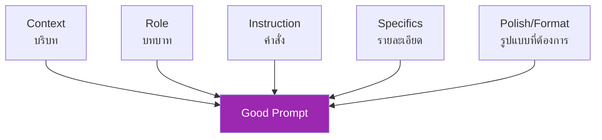
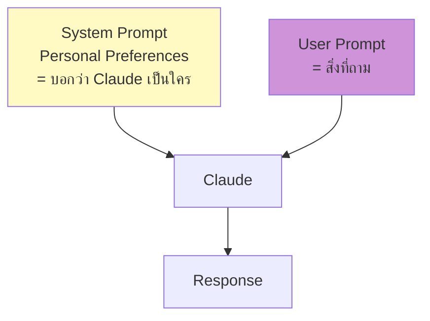

# Day 3: Prompting 101 — เขียน prompt ให้ได้คำตอบดี ✍️

<div class="lesson-meta" markdown>
**⏱️ เวลา:** 4 ชั่วโมง · **📊 ระดับ:** Beginner · **📋 ต้องรู้มาก่อน:** [Day 1](day-01.md), [Day 2](day-02.md)
</div>

## 🎯 เป้าหมายของบทนี้

<ul class="objectives">
<li>เข้าใจว่า prompt ที่ดีกับไม่ดีต่างกันยังไง</li>
<li>ใช้ CRISP framework เขียน prompt ได้</li>
<li>รู้ 5 หลักการ Anthropic แนะนำสำหรับ prompting</li>
<li>เขียน system prompt และ user prompt ได้ถูก</li>
</ul>

---

## 1. ทำไม Prompting ถึงสำคัญ? 🎯

LLM ทำนายคำถัดไป — **คุณภาพคำถาม = คุณภาพคำตอบ**

ลองเปรียบเทียบ 2 prompts ต่อไปนี้:

=== "❌ Prompt แย่"

    ```
    เขียนอีเมล
    ```

    ผลลัพธ์: Claude เดาว่าคุณต้องการอะไรไม่ได้ → ตอบกลางๆ ไม่ตรงใจ

=== "✅ Prompt ดี"

    ```
    เขียนอีเมลให้ลูกค้า:
    - บริบท: เขาถามเรื่องเลื่อน meeting จากวันจันทร์ไปอังคาร
    - โทน: เป็นทางการแต่อบอุ่น
    - ภาษา: ไทย
    - ความยาว: 3-4 บรรทัด
    - ลงท้ายเป็นภาษาอังกฤษ "Best regards, [my name]"
    ```

    ผลลัพธ์: ใช้ได้เลย!

**Insight:** Claude ไม่ใช่นักโทรจิต — บอกชัดเจนว่าต้องการอะไร

---

## 2. CRISP Framework 📐

วิธีจำง่ายๆ ในการเขียน prompt ที่ดี — มาจาก 5 องค์ประกอบหลัก



### 2.1 Context — บริบท

อธิบายสถานการณ์, ผู้ฟัง, ข้อมูลพื้นฐาน

```
ฉันเป็น Solution Architect กำลังเขียน proposal ให้ลูกค้าที่ไม่มีพื้นฐานเทคโนโลยี
```

### 2.2 Role — บทบาทของ Claude

บอก Claude ให้สวมบทบาทที่เหมาะ

```
ทำตัวเป็น senior consultant ที่เก่งการอธิบายเรื่องเทคนิคให้คนนอกวงการเข้าใจ
```

### 2.3 Instruction — คำสั่งหลัก

ให้ชัดว่าต้องการอะไร

```
ช่วยเขียนย่อหน้าอธิบาย Kubernetes
```

### 2.4 Specifics — รายละเอียด/ข้อจำกัด

ความยาว, คำที่ต้องห้าม, ข้อมูลที่ต้องรวม

```
- ห้ามใช้คำว่า "container" "pod" "orchestration" โดยไม่อธิบาย
- ใช้ analogy กับสิ่งในชีวิตประจำวัน
- ยาวไม่เกิน 150 คำ
```

### 2.5 Polish/Format — รูปแบบที่ต้องการ

Markdown? Bullet? Table? JSON? ภาษา?

```
- ตอบเป็น markdown
- มี header "What is Kubernetes?"
- ใช้ bullet 3 จุด
- ภาษาไทย
```

### รวมเป็น Prompt เต็ม

```text title="ตัวอย่าง CRISP prompt ที่สมบูรณ์"
[Context]
ฉันเป็น Solution Architect กำลังเขียน proposal ให้ลูกค้าธุรกิจ retail
ที่ไม่มีพื้นฐานเทคโนโลยี เขาถามว่า "Kubernetes คืออะไร ทำไมเราต้องใช้"

[Role]
ทำตัวเป็น senior consultant ที่เก่งการอธิบายเทคโนโลยีให้คนนอกวงการ
เห็นภาพและรู้สึกอยากใช้

[Instruction]
ช่วยเขียนย่อหน้าตอบคำถามนี้ในมุมที่ลูกค้าเข้าใจ

[Specifics]
- ใช้ analogy เปรียบเทียบกับสิ่งในชีวิตประจำวัน (เช่น ระบบจัดการพนักงานใน mall)
- ห้ามใช้คำเทคนิคโดยไม่อธิบาย เช่น container, orchestration
- ยาว 150-200 คำ
- มี business value ของลูกค้าที่ชัดเจน

[Polish/Format]
- ภาษาไทย
- format เป็น markdown
- เริ่มด้วย heading "Kubernetes คืออะไร และทำไมร้าน retail ของคุณควรสนใจ"
- ลงท้ายด้วย "Next step" ที่ propose ได้เลย
```

ลองส่งให้ Claude ดู — คำตอบจะแม่นยำและใช้ได้เลย ⚡

---

## 3. หลักการ 5 ข้อจาก Anthropic 📋

[Anthropic แนะนำหลักการเหล่านี้](https://docs.claude.com/en/docs/build-with-claude/prompt-engineering/overview):

### 3.1 Be Clear and Specific

ระบุ context, ระบุ goal, ระบุ audience

❌ "เขียนเกี่ยวกับ AI"
✅ "เขียน blog post 500 คำ อธิบาย AI ให้ผู้บริหารธุรกิจที่ไม่มีพื้น tech ใช้ตัวอย่างจากธุรกิจ retail"

### 3.2 Use Positive Examples (Few-shot)

แสดงตัวอย่างที่ต้องการ → Claude เลียนแบบ pattern ได้ดี (เราจะลงลึกที่ Day 5)

```
แปลคำต่อไปนี้เป็นภาษาไทย โดยรักษาความเป็น technical term:

API → API
Database → ฐานข้อมูล
Cloud → คลาวด์

คำที่ต้องแปล: Microservice, Container, Pipeline
```

### 3.3 Encourage Step-by-Step Reasoning

ขอให้ Claude "คิดทีละขั้น" — โดยเฉพาะปัญหา reasoning

```
แก้โจทย์ต่อไปนี้ทีละขั้นตอน อธิบายเหตุผลของแต่ละขั้น ก่อนสรุปคำตอบ:

ร้านอาหาร A มีรายได้เดือนละ 200,000 บาท ต้นทุน 60% ค่าเช่า 25,000
เจ้าของเอาเงินเดือนตัวเอง 30,000 ที่เหลือเป็นกำไรสุทธิ
ถ้าอยากเพิ่มกำไรสุทธิอีก 30% โดยไม่เพิ่มราคา ต้องทำยังไง?
```

### 3.4 Use XML Tags for Structure

Claude train มาให้รู้จัก XML — ใช้ tag แยก section ในข้อความยาวๆ

```xml
<context>
ลูกค้าคือร้านอาหารชื่อ ABC Restaurant มี 3 สาขา
</context>

<task>
ช่วยเขียน proposal ระบบจัดการ inventory
</task>

<requirements>
- ใช้งานง่าย พนักงานไม่ต้องเก่ง tech
- แจ้งเตือนของจะหมด
- รายงาน weekly
</requirements>
```

### 3.5 Specify Output Format

JSON? Table? Markdown? บอกให้ชัด

```
ตอบเป็น JSON format ตาม schema:
{
  "summary": "string ขนาดไม่เกิน 100 คำ",
  "key_points": ["string"],
  "action_items": [{"priority": "high|medium|low", "task": "string"}]
}
```

---

## 4. System Prompt vs User Prompt 🎭

ใน Claude.ai เราพิมพ์แค่ user prompt — แต่ Personal Preferences ทำหน้าที่คล้าย system prompt



| | System Prompt | User Prompt |
|---|---|---|
| **ใช้ทำอะไร** | กำหนด role, style, rules ของ Claude | คำถาม/คำสั่งของคุณ |
| **ใส่ที่ไหน (Claude.ai)** | Personal Preferences / Project instructions | ช่องพิมพ์ข้อความ |
| **ใส่ที่ไหน (API)** | parameter `system` | parameter `messages` |
| **เปลี่ยนบ่อยไหม** | ไม่ค่อย — เป็น context ถาวร | ทุกครั้ง |

!!! example "เปรียบเทียบ"

    **System Prompt:**
    "ทำตัวเป็น senior code reviewer ที่ strict — ตรวจ security, performance, readability"

    **User Prompt:**
    "ตรวจโค้ดนี้: [paste code]"

    → Claude จะ review ในมุม code reviewer อัตโนมัติ ไม่ต้องบอกซ้ำในแต่ละ chat

---

## 🛠️ Hands-on Exercise

### Exercise 1: Refactor Prompt ที่แย่

ลองแปลง prompt แย่ๆ ต่อไปนี้ ให้เป็น CRISP prompt:

```
❌ ช่วยสรุปเอกสารหน่อย
```

??? success "Sample CRISP version"

    ```
    [Context]
    ฉันเป็น Solution Architect ต้อง present executive summary ให้ CEO ใน 5 นาที

    [Role]
    ทำตัวเป็น management consultant ที่เก่งการสรุปเอกสารยาวๆ ให้เหลือประเด็นสำคัญ

    [Instruction]
    สรุปเอกสารต่อไปนี้

    [Specifics]
    - 3-5 bullet points
    - เน้น business impact ไม่ใช่ technical detail
    - ภาษาไทย
    - แต่ละ bullet ไม่เกิน 1 ประโยค

    [Format]
    Markdown bullet list

    [Document]
    <doc>
    [paste เอกสารตรงนี้]
    </doc>
    ```

### Exercise 2: ใช้ XML Tags

ลองส่ง prompt นี้ไปที่ Claude.ai:

```xml
<context>
ฉันกำลังออกแบบระบบ e-commerce ใหม่
ใช้ Kubernetes บน AWS EKS
</context>

<question>
ระหว่าง Istio service mesh และ Linkerd ฉันควรเลือกตัวไหน?
</question>

<consideration>
- ทีมเรามี 3 คน ไม่เชี่ยวชาญ Kubernetes มาก
- ต้องการ mTLS และ observability
- งบประมาณจำกัด
</consideration>

<output_format>
- ตอบเป็น markdown
- มี comparison table
- มี recommendation พร้อมเหตุผล
</output_format>
```

สังเกตว่าผลลัพธ์มีโครงสร้างชัดเจนเพราะ Claude เข้าใจ section ทั้งหมด

### Exercise 3: Step-by-Step Reasoning

```
ร้านขายของ A มีปัญหา: ยอดขาย online ลดลง 20% ในไตรมาสนี้
ขณะที่คู่แข่งที่ใช้ tech แบบเดียวกันยังโตอยู่

ช่วยวิเคราะห์สาเหตุเป็นขั้นๆ:
1. ก่อนวิเคราะห์ ตั้งคำถามที่ต้องรู้คำตอบเพิ่ม 5 ข้อ
2. assume คำตอบของแต่ละคำถาม (ทำเป็น scenario)
3. ในแต่ละ scenario สรุปสาเหตุที่เป็นไปได้
4. จัดอันดับ scenario ที่น่าจะเป็นมากที่สุด พร้อมเหตุผล
5. แนะนำ action plan สำหรับ scenario ที่น่าจะใช่ที่สุด
```

ดูว่า Claude คิดเป็นขั้นเป็นตอนจริงๆ ไม่กระโจนตอบเลย

---

## ✅ Self-Check Quiz

<div class="quiz" markdown>

**Q1:** CRISP ย่อมาจากอะไร และทำไมต้องครบทุกตัว?

??? success "Answer"
    - **C**ontext
    - **R**ole
    - **I**nstruction
    - **S**pecifics
    - **P**olish/Format

    ครบหมายความว่า Claude เข้าใจทั้งบริบท, สวมบทบาทถูก, รู้ว่าต้องทำอะไร, รู้ข้อจำกัด และรู้ว่าตอบในรูปแบบไหน → คำตอบใช้ได้เลยไม่ต้องแก้

**Q2:** ทำไม Anthropic แนะนำให้ใช้ XML tags ในแทนที่จะใช้ markdown หรือเว้นบรรทัด?

??? success "Answer"
    Claude **train ด้วย XML format** เยอะ → จำ pattern ได้ดีเป็นพิเศษ ใช้ tags ทำให้ Claude แยก section ในข้อความยาวๆ ได้แม่นยำกว่าวิธีอื่น

**Q3:** ตัวอย่างเมื่อไรควรใช้ "step-by-step" instruction?

??? success "Answer"
    - งานที่ต้อง reasoning (โจทย์เชิงคณิตศาสตร์, logic)
    - การวิเคราะห์ปัญหาที่ซับซ้อน
    - การ debug code
    - เมื่อต้องการให้ Claude แสดงเหตุผล (ไม่ใช่แค่คำตอบ)

**Q4:** System prompt ใน Claude.ai อยู่ที่ไหน?

??? success "Answer"
    - **Personal Preferences** (ใช้ทุก chat)
    - **Project instructions** (ใช้เฉพาะ chat ใน project นั้น — เรียน Day 4)

**Q5:** Few-shot prompting คืออะไร?

??? success "Answer"
    การใส่ตัวอย่าง input/output 2-3 ตัวอย่างใน prompt → Claude เลียนแบบ pattern ของตัวอย่างได้ดี เป็นเทคนิคที่ทำให้ได้ output ตาม format ที่เราต้องการแม่นยำมาก (จะเรียนละเอียดที่ Day 5)

</div>

---

## 🔍 Cross-check & References

1. **Anthropic — Prompt Engineering Overview**: [https://docs.claude.com/en/docs/build-with-claude/prompt-engineering/overview](https://docs.claude.com/en/docs/build-with-claude/prompt-engineering/overview)
2. **Anthropic Prompt Library**: [https://docs.claude.com/en/resources/prompt-library/library](https://docs.claude.com/en/resources/prompt-library/library)
3. **Prompt Engineering Guide**: [https://www.promptingguide.ai](https://www.promptingguide.ai)
4. **Anthropic Console — Prompt Generator**: [https://console.anthropic.com](https://console.anthropic.com)

---

## :material-check-decagram: สรุป

- Prompt ดี = Context + Role + Instruction + Specifics + Format (**CRISP**)
- ใช้ XML tags แบ่ง section
- ขอ step-by-step reasoning สำหรับโจทย์ยาก
- System prompt = บอก Claude เป็นใคร, User prompt = ถามอะไร

พรุ่งนี้: จัดระเบียบงานบน Claude.ai ด้วย **Projects, Artifacts, Memory**

[Day 4: Projects, Artifacts, Memory :material-arrow-right:](day-04.md){ .md-button .md-button--primary }
