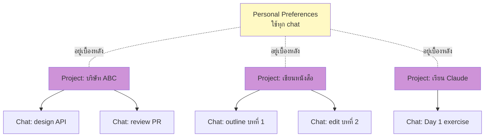
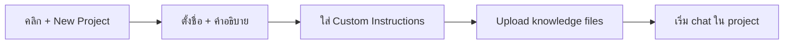
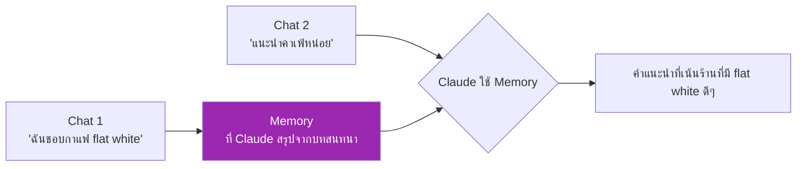
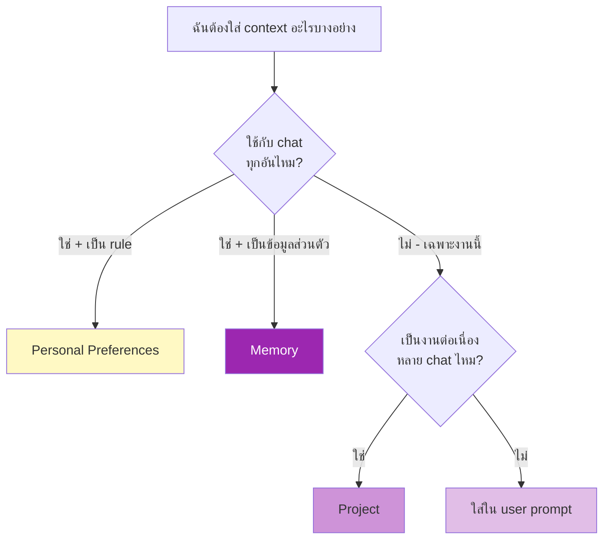

# Day 4: Projects, Artifacts, Memory 🗂️

<div class="lesson-meta" markdown>
**⏱️ เวลา:** 4 ชั่วโมง · **📊 ระดับ:** Beginner · **📋 ต้องรู้มาก่อน:** [Day 3](day-03.md)
</div>

## 🎯 เป้าหมายของบทนี้

<ul class="objectives">
<li>สร้าง Project แยกตามงาน — Claude จะ "จำ context" ในกลุ่ม chat ของ Project</li>
<li>เข้าใจ Artifact types ทุกแบบ — HTML, React, SVG, Mermaid, code, doc</li>
<li>ใช้ Memory เพื่อให้ Claude จำคุณข้าม chat</li>
<li>รู้เมื่อไรควรใช้ Project vs Memory vs Personal Preferences</li>
</ul>

---

## 1. Projects — Workspace สำหรับงานเฉพาะ 📁

**ปัญหา:** ถ้าคุณคุยกับ Claude หลายเรื่อง — chat มันปนๆ กัน
**แก้:** Projects = workspace แยกตามงาน



### ส่วนประกอบของ Project

1. **Custom instructions** — system prompt ของ project นี้
2. **Project knowledge** — file/text ที่ทุก chat ใน project นี้เข้าถึงได้ (เช่น API spec, brand guideline)
3. **Chats** — ทุก chat ที่อยู่ใน project นี้

### Workflow



!!! example "ตัวอย่าง Project: 'บริษัท ABC API Design'"

    **Custom Instructions:**
    ```
    ฉันออกแบบ REST API สำหรับบริษัท ABC ระบบเป็น microservices
    ทุก API ต้อง:
    - ตาม OpenAPI 3.0 spec
    - มี versioning ใน path (/v1/...)
    - response เป็น JSON ตาม JSend pattern
    - ใช้ camelCase
    ```

    **Knowledge files (upload):**
    - `api-spec.yaml` — OpenAPI ที่มีอยู่
    - `brand-guideline.pdf` — code style
    - `existing-endpoints.md` — endpoint ที่ทำไปแล้ว

    **Chats:**
    - "ออกแบบ /users endpoints"
    - "Review /orders pull request"
    - "สร้าง error response สำหรับ payment failure"

### เมื่อไรควรใช้ Project?

✅ ใช้เมื่อ:
- งานยาวๆ ที่มี context ต่อเนื่อง
- ต้อง upload doc/spec/code repeatedly
- มีหลาย chat ที่เกี่ยวกับเรื่องเดียวกัน

❌ ไม่ต้องใช้เมื่อ:
- ถามเรื่องครั้งเดียว
- เรื่องทั่วๆ ไป

---

## 2. Artifacts — ลงลึก ✨

Artifact = ผลงาน standalone ที่ Claude แยกออกมา preview ได้ทันที

### Artifact Types

| ประเภท | ใช้เมื่อ | ตัวอย่าง |
|---|---|---|
| **HTML** | landing page, prototype | `เขียนหน้า login HTML สวยๆ` |
| **React (JSX)** | interactive component | `สร้าง todo app component` |
| **SVG** | กราฟิก, logo, icon | `สร้าง logo สำหรับ coffee shop` |
| **Mermaid** | diagram, flowchart, ERD | `วาด ER diagram สำหรับ blog system` |
| **Markdown** | document, blog post | `เขียน technical doc สำหรับ API X` |
| **Code (Python/JS/...)** | script, snippet | `เขียน Python script ดึง weather` |

### ลองทำ Artifact หลายแบบ

#### 2.1 Interactive React Component

```
สร้าง React component: Pomodoro Timer
- 25 นาทีทำงาน, 5 นาทีพัก
- ปุ่ม Start/Pause/Reset
- ใช้ Tailwind ออกแบบให้สวย minimal
- มี sound เมื่อเวลาหมด (ใช้ Web Audio API)
```

ลองคลิก preview — มันใช้งานได้จริง!

#### 2.2 Architecture Diagram (Mermaid)

```
สร้าง architecture diagram สำหรับระบบ:
- Frontend: Next.js
- Backend: Node.js microservices (auth, products, orders)
- Database: PostgreSQL per service
- Message bus: RabbitMQ
- Cache: Redis
- Hosted on AWS EKS

ใช้ mermaid graph ที่อ่านเข้าใจง่าย
```

#### 2.3 Working Prototype

```
สร้าง landing page HTML สำหรับ SaaS ชื่อ "TaskFlow"
- Hero section พร้อม headline
- 3 feature cards
- Pricing 3 tiers
- Footer
- ใช้ Tailwind CSS (จาก CDN)
- ออกแบบ modern, สีน้ำเงิน-ขาว
```

### Artifact Features

- ✏️ **Edit** — แก้ใน artifact ได้โดยตรง หรือบอก Claude ให้แก้
- ⬇️ **Download** — บันทึกเป็นไฟล์
- 📋 **Copy** — copy code
- 👁️ **Preview / Code toggle** — สลับดูหน้าจริงกับโค้ด

!!! tip "Artifact ผิด? ให้บอก Claude"

    แทนที่จะแก้เอง ให้บอก Claude เช่น:
    - "เปลี่ยนสีปุ่มเป็นสีเขียว"
    - "เพิ่ม validation: email ต้อง valid"
    - "ทำให้ responsive บนมือถือด้วย"

    Claude จะอัพเดท artifact ให้ทันที (ไม่ใช่สร้างใหม่ทั้งหมด ถ้า Claude ใช้ `update` แทน `rewrite`)

---

## 3. Memory — Claude จำคุณข้าม Chat 🧠

**ปัญหา:** ทุก chat ใหม่ Claude เริ่มจาก zero — ไม่จำว่าคุณเป็นใคร
**แก้:** เปิด **Memory** ใน Settings → Features

### Memory ทำงานยังไง



### Memory vs Personal Preferences vs Project

| | Personal Preferences | Memory | Project |
|---|---|---|---|
| **ขอบเขต** | ทุก chat | ทุก chat | เฉพาะใน project |
| **สร้างยังไง** | คุณเขียนเอง | Claude สรุปจาก chat | คุณตั้งค่า + Claude สรุปได้ |
| **ใช้เมื่อ** | rule ถาวร (เช่น "ตอบเป็นภาษาไทย") | ข้อมูลส่วนตัวที่ Claude เรียนรู้ตามเวลา | งานเฉพาะ |
| **เห็น/แก้ได้ไหม** | เห็นและแก้ได้ | เห็นและลบได้ใน Settings | เห็นและแก้ได้ |

### ทดลองใช้ Memory

1. เปิด Memory ที่ Settings → Features → Memory
2. Chat 1: "ฉันชื่อ Pong เป็น Solution Architect ที่ Marlo ทำงานกับ Red Hat OpenShift"
3. เปิด Chat ใหม่: "ช่วยแนะนำ certificate ที่ควรเรียนต่อ"
4. สังเกตว่า Claude จำงานคุณได้ → แนะนำ Red Hat certifications

!!! warning "ความเป็นส่วนตัว"

    Memory เก็บข้อมูลที่คุณคุยกับ Claude — ดูได้ที่ Settings และ **ลบได้ทุกเมื่อ** หากไม่ต้องการให้ Claude จำเรื่องใด

---

## 4. Decision Tree: ใช้อันไหนเมื่อไร 🤔



---

## 🛠️ Hands-on Exercise

### Exercise 1: สร้าง Project ส่วนตัว

สร้าง project ชื่อ **"Claude Mastery Learning"** สำหรับเก็บ chat ที่คุณใช้ระหว่างเรียน

**Custom Instructions:**
```
ฉันกำลังเรียนคอร์ส Claude Mastery 30 วัน
- ตอนนี้อยู่ Week 1 Day 4
- พื้นฐาน: Solution Architect รู้เรื่อง cloud, k8s, AWS, Red Hat
- เวลาอธิบาย ขอแบบ step-by-step มี diagram
- cross-check ข้อมูลที่อาจล้าสมัย
```

**Upload knowledge:**
- ไฟล์ note ที่คุณจดจากบทเรียน Day 1-3 (ถ้ามี)

### Exercise 2: Artifact Challenge

ลองให้ Claude สร้าง artifacts หลายแบบ:

1. **HTML**: "สร้าง resume page HTML สำหรับ Solution Architect"
2. **React**: "สร้าง calculator app ที่ทำเลขพื้นฐานได้ พร้อม dark mode toggle"
3. **Mermaid**: "วาด sequence diagram OAuth 2.0 authorization code flow"
4. **SVG**: "วาด logo บริษัทสำหรับ DevOps consulting ชื่อ 'OpsCraft'"

### Exercise 3: Memory Test

1. เปิด Memory
2. Chat A: บอก Claude ว่าคุณเป็นใคร ชอบอะไร ทำงานอะไร อย่างน้อย 5 ประโยค
3. รอ 5 นาที, เปิด chat ใหม่
4. ถาม "ฉันคือใคร" — Claude ควรตอบได้

---

## ✅ Self-Check Quiz

<div class="quiz" markdown>

**Q1:** ความแตกต่างหลักของ Project, Personal Preferences, Memory คืออะไร?

??? success "Answer"
    - **Personal Preferences**: rule คงที่ ทุก chat
    - **Memory**: ข้อมูลที่ Claude **เรียนรู้** จากการ chat
    - **Project**: workspace ที่มี context และ knowledge เฉพาะ — แยก chat ตามงาน

**Q2:** ถ้าคุณกำลังออกแบบ system architecture สำหรับลูกค้า A และ B ที่ละลูกค้าใช้ stack ต่างกัน ควรใช้อะไร?

??? success "Answer"
    สร้าง **Project แยก** สำหรับลูกค้าแต่ละราย — ใส่ knowledge และ rule เฉพาะของลูกค้าไว้ใน project ของตัวเอง

**Q3:** เมื่อแก้ Artifact ควรใช้วิธีไหน?

??? success "Answer"
    **บอก Claude** ให้แก้ดีกว่าแก้เอง — Claude จะอัพเดท artifact ที่มีอยู่ (เก็บ history) ถ้าแก้เอง history ไม่ track

**Q4:** Memory เห็นได้ไหม ลบได้ไหม?

??? success "Answer"
    เห็นและลบได้ที่ **Settings → Features → Memory → Manage** — ดู transparency และ control ที่ user มีอย่างเต็มที่

</div>

---

## 🔍 Cross-check & References

1. **Claude Help — Projects**: [https://support.claude.com](https://support.claude.com)
2. **Claude — Artifacts**: [https://www.anthropic.com/news/claude-3-5-sonnet](https://www.anthropic.com/news/claude-3-5-sonnet)
3. **Claude — Memory**: ดูที่ Settings ในแอป

---

## :material-check-decagram: สรุป

- **Project** = workspace ที่มี context + knowledge เฉพาะ → จัดระเบียบงาน
- **Artifact** = output แยกที่ preview ได้ → HTML, React, SVG, Mermaid, doc, code
- **Memory** = Claude จำคุณข้าม chat — เปิด/ปิด/ลบได้
- ใช้ทั้ง 3 อย่างให้ถูก → workflow มี productivity สูง

พรุ่งนี้: **Advanced Prompting** — เทคนิคที่ทำให้ได้คำตอบดีขึ้นไปอีกระดับ

[Day 5: Advanced Prompting :material-arrow-right:](day-05.md){ .md-button .md-button--primary }
