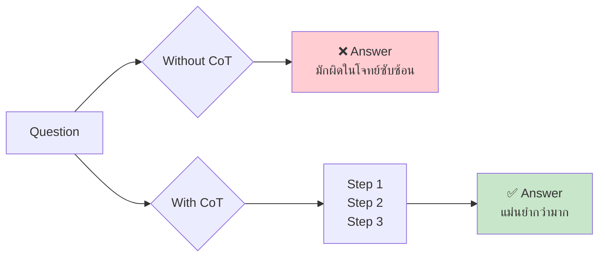
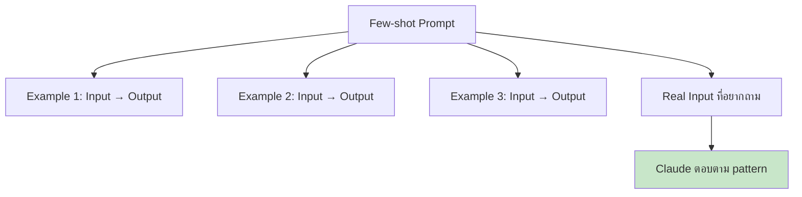
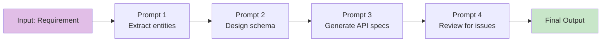

# Day 5: Advanced Prompting Techniques 🚀

<div class="lesson-meta">
⏱️ <strong>เวลาเรียน:</strong> 3–4 ชั่วโมง &nbsp;|&nbsp; 📊 <strong>ระดับ:</strong> Intermediate &nbsp;|&nbsp; 📋 <strong>Prerequisites:</strong> Day 3 (Prompting 101), Day 4 (Projects)
</div>

## 🎯 Learning Objectives

<ul class="objectives">
<li>เข้าใจและใช้เทคนิค <strong>Chain-of-Thought (CoT)</strong> ให้ Claude คิดทีละขั้น</li>
<li>ใช้ <strong>Few-shot prompting</strong> สอน Claude ด้วยตัวอย่าง</li>
<li>ใช้ <strong>Role-play / Persona</strong> เพื่อปรับโทนคำตอบ</li>
<li>ทำ <strong>Prompt Chaining</strong> แบ่งงานใหญ่เป็นขั้นตอน</li>
<li>เข้าใจ <strong>Prefill</strong> และ <strong>Output formatting</strong></li>
</ul>

---

## 1. ทบทวน: ทำไมต้อง Advanced Prompting?

จากบทที่ 3 เราได้รู้จัก **CRISP framework** แล้ว แต่บางงานยังต้องการเทคนิคเพิ่มเติม:

| สถานการณ์ | เทคนิคที่เหมาะ |
|----------|----------------|
| โจทย์คณิต/Logic ที่ Claude ตอบผิดบ่อย | **Chain-of-Thought** |
| ต้องการ output รูปแบบเฉพาะ (เช่น JSON ที่ถูกต้อง 100%) | **Few-shot** + **Prefill** |
| ต้องการโทน/มุมมองเฉพาะ (เช่น "ตอบแบบ Senior Architect") | **Role-play / Persona** |
| งานใหญ่ มีหลายขั้นตอน (analyze → design → review) | **Prompt Chaining** |

---

## 2. Chain-of-Thought (CoT) Prompting

### แนวคิด

CoT คือการบอกให้ Claude **"คิดออกมาเป็นขั้นๆ ก่อนตอบ"** เหมือนเด็กที่ครูบอกว่า *"แสดงวิธีทำด้วยนะ ไม่ใช่แค่เขียนคำตอบ"*



### ตัวอย่างที่ 1: โจทย์คณิต

❌ **Without CoT:**
```
ถ้าระบบรับ request 1,200 req/sec แต่ละ request ใช้ memory 4MB
และ response time เฉลี่ย 250ms ต้องใช้ RAM กี่ GB?
```

✅ **With CoT:**
```
ถ้าระบบรับ request 1,200 req/sec แต่ละ request ใช้ memory 4MB
และ response time เฉลี่ย 250ms ต้องใช้ RAM กี่ GB?

คิดทีละขั้น:
1. หา concurrent requests ที่ค้างในระบบพร้อมกัน
2. คูณ memory ต่อ request
3. แปลงเป็น GB
```

### ตัวอย่างที่ 2: Architecture Decision

```
เปรียบเทียบ Kafka vs RabbitMQ สำหรับ event-driven microservices
ที่มี throughput 50K msg/sec

โปรดคิดทีละขั้น:
1. List requirements ที่สำคัญต่อ throughput นี้
2. Map แต่ละ requirement กับ Kafka และ RabbitMQ
3. ระบุข้อดี-ข้อเสียของแต่ละตัว
4. สรุปคำแนะนำพร้อมเหตุผล
```

!!! tip "Pro Tip"
    คำสั่งที่ trigger CoT ได้ดี: *"Think step by step"*, *"คิดทีละขั้น"*, *"แสดงวิธีคิด"*, *"Let's work through this carefully"*

---

## 3. Few-shot Prompting (สอนด้วยตัวอย่าง)

### แนวคิด

แทนที่จะอธิบายเป็นคำพูดยาวๆ ให้ **โชว์ตัวอย่าง 2–5 ตัวอย่าง** Claude จะจับ pattern เอง



### ตัวอย่างที่ 1: แปลง User Story → Acceptance Criteria

```
แปลง User Story เป็น Acceptance Criteria แบบ Given-When-Then

ตัวอย่าง 1:
User Story: As a customer, I want to reset my password via email
Acceptance Criteria:
- Given user clicks "Forgot Password"
- When user enters registered email
- Then system sends reset link within 60 seconds

ตัวอย่าง 2:
User Story: As an admin, I want to deactivate user accounts
Acceptance Criteria:
- Given admin is on user management page
- When admin clicks "Deactivate" on a user
- Then user status changes to "Inactive" and user cannot login

ตอนนี้แปลงอันนี้ให้:
User Story: As a developer, I want to view API logs filtered by status code
```

### ตัวอย่างที่ 2: Classify Support Ticket

```
แบ่งประเภท ticket เป็น: [BUG, FEATURE_REQUEST, QUESTION, BILLING]

Ticket: "Login button ไม่ทำงานบน Safari"
Category: BUG

Ticket: "อยากให้มี dark mode"
Category: FEATURE_REQUEST

Ticket: "บัตรเครดิตถูกตัดเงินสองรอบ"
Category: BILLING

Ticket: "ใช้ API key ที่ไหน?"
Category: ?
```

!!! info "กี่ตัวอย่างถึงพอ?"
    - **2–3 ตัวอย่าง** = พอสำหรับ pattern ง่ายๆ
    - **5+ ตัวอย่าง** = สำหรับ pattern ซับซ้อน หรือ edge case เยอะ
    - **ใส่ตัวอย่างที่หลากหลาย** (ไม่ใช่ซ้ำๆ pattern เดียว)

---

## 4. Role-play / Persona Prompting

### แนวคิด

บอก Claude ว่า *"คุณคือ ___"* เพื่อปรับน้ำเสียง ความลึก และมุมมอง

### ตัวอย่างที่ 1: Code Review

```
You are a senior backend engineer with 15 years of experience in
high-throughput distributed systems. Your code reviews are thorough,
direct, and focus on: performance, security, and maintainability.

Review this code:

[paste code here]
```

### ตัวอย่างที่ 2: Explain เด็ก vs ผู้เชี่ยวชาญ

```
อธิบาย Kubernetes Pod ให้ฟัง 3 รอบ ด้วย persona ที่ต่างกัน:

1. ในฐานะคุณครูประถม อธิบายให้เด็ก 10 ขวบฟัง
2. ในฐานะ DevOps Engineer อธิบายให้ junior dev ที่เพิ่งเรียน Docker
3. ในฐานะ Solution Architect อธิบายให้ CTO ที่กำลังตัดสินใจ migrate
```

!!! warning "ระวัง"
    Role-play ไม่ใช่การ "หลอกให้ Claude ทำสิ่งผิดกติกา" — Claude จะคงค่านิยมของตัวเองไม่ว่า role ไหน

---

## 5. Prompt Chaining (แบ่งงานใหญ่เป็นขั้น)

### แนวคิด

แทนที่จะใช้ prompt ยาวเดียวให้ทำทุกอย่าง ให้ **แบ่งเป็นหลาย prompt ต่อเนื่อง** แต่ละ prompt มีหน้าที่ชัดเจน



### ตัวอย่าง: Design API ของ E-commerce

| Step | Prompt | Output |
|------|--------|--------|
| 1 | "List entities สำหรับ e-commerce: cart, order, payment..." | Entity list |
| 2 | "จาก entities ข้างบน design ER diagram" | ER diagram |
| 3 | "จาก ER diagram สร้าง REST API endpoints" | API spec |
| 4 | "Review API spec ตาม REST best practices" | Review notes |
| 5 | "Refine API spec ตาม review" | Final spec |

### ทำไมต้อง Chain?

- **คุณภาพดีกว่า**: แต่ละ step focus ได้ลึก
- **ตรวจสอบกลางทางได้**: แก้ไขตรงไหนผิดก่อนเดินต่อ
- **เหมาะกับ Project**: ใช้ Project ใน Claude.ai เป็น "memory" ระหว่าง step

---

## 6. Prefill (กรอกคำตอบล่วงหน้า)

ใน Claude API คุณสามารถ **เริ่ม assistant message ให้** เช่น:

```python
# Force JSON output
messages = [
    {"role": "user", "content": "List 3 Thai foods as JSON"},
    {"role": "assistant", "content": "{"}  # <-- Prefill!
]
```

ผลลัพธ์ Claude จะต่อจาก `{` ทันที ทำให้ได้ JSON เป็นนายแน่นอน

ใน Claude.ai ใช้ XML tags แทน:
```
ตอบในรูปแบบ JSON ภายใน <json>...</json> เท่านั้น
```

---

## 🛠️ Hands-on Exercise

!!! example "Exercise 1: CoT vs No-CoT"
    ลองถาม Claude คำถามเดียวกัน 2 รอบ:
    
    **รอบที่ 1 (no CoT):**
    > "Service A เรียก B เรียก C ใช้เวลา 100ms, 200ms, 150ms ตามลำดับ
    > ถ้า cache 60% จะลด total latency ได้กี่ %?"
    
    **รอบที่ 2 (with CoT):**
    > เพิ่ม: "คิดทีละขั้น แสดงการคำนวณ"
    
    **เปรียบเทียบ:** คำตอบไหนน่าเชื่อถือกว่ากัน?

!!! example "Exercise 2: Few-shot Classifier"
    สร้าง prompt ที่จำแนก commit message เป็น `feat`, `fix`, `docs`, `refactor`, `chore` ด้วยตัวอย่าง 4 ตัวอย่าง
    
    ทดสอบกับ commit messages 3 อันต่อไปนี้:
    
    1. "Added new payment provider integration"
    2. "Update README with deployment steps"
    3. "Replace `for` loop with `map` for readability"

!!! example "Exercise 3: Prompt Chain"
    ใช้ Project ใน Claude.ai สร้าง chain 4 ขั้น สำหรับงาน:
    
    > "Design a URL shortener service"
    
    **Steps:**
    1. List requirements (functional + non-functional)
    2. Design high-level architecture
    3. Design database schema
    4. Identify potential bottlenecks

---

## ✅ Self-Check Quiz

<div class="quiz">

**Q1:** เมื่อไหร่ควรใช้ Chain-of-Thought (CoT)?

??? success "ดูคำตอบ"
    เมื่อโจทย์ต้องใช้เหตุผลเชิงตรรกะ คณิตศาสตร์ หรือ multi-step reasoning ที่ Claude มักตอบผิดถ้าตอบทันที

**Q2:** Few-shot ใช้ตัวอย่างกี่อันถึงเพียงพอ?

??? success "ดูคำตอบ"
    โดยทั่วไป **2–5 ตัวอย่าง** ก็เพียงพอ ขึ้นกับความซับซ้อนของ pattern และความหลากหลายของ edge case

**Q3:** Prompt Chaining แตกต่างจาก long prompt อย่างไร?

??? success "ดูคำตอบ"
    - **Long prompt**: ทำทุกอย่างใน turn เดียว → คุณภาพมักลดลงเมื่องานซับซ้อน
    - **Prompt Chaining**: แบ่งเป็น turn ย่อย แต่ละ turn focus ทำ subtask เดียว → ตรวจสอบและแก้ไขกลางทางได้

**Q4:** Role-play prompting มีข้อจำกัดอะไร?

??? success "ดูคำตอบ"
    Claude จะคงค่านิยมหลัก (safety, accuracy, ethics) ไม่ว่าถูกขอให้สวม role อะไร — ไม่สามารถใช้ role-play ให้ Claude ทำสิ่งที่ผิดกติกาได้

**Q5:** ถ้าต้องการ output เป็น JSON 100% แน่นอน ใน API ใช้เทคนิคอะไร?

??? success "ดูคำตอบ"
    **Prefill** — ส่ง `{"role": "assistant", "content": "{"}` เป็น message สุดท้าย Claude จะต่อจาก `{` ทำให้ได้ JSON ที่ valid แน่นอน

</div>

---

## 🔍 Cross-check & References

- 📘 [Anthropic Prompt Engineering: Chain-of-Thought](https://docs.claude.com/en/docs/build-with-claude/prompt-engineering/chain-of-thought)
- 📘 [Anthropic Prompt Engineering: Multishot Prompting](https://docs.claude.com/en/docs/build-with-claude/prompt-engineering/multishot-prompting)
- 📘 [Anthropic Prompt Engineering: Prompt Chaining](https://docs.claude.com/en/docs/build-with-claude/prompt-engineering/chain-prompts)
- 📄 [Wei et al. (2022) — Chain-of-Thought Prompting Elicits Reasoning in LLMs](https://arxiv.org/abs/2201.11903)

---

:material-check-decagram: **สรุป:** ตอนนี้คุณมี **5 เครื่องมือใหม่** ในกล่องเครื่องมือ prompting — CoT, Few-shot, Role-play, Prompt Chaining, และ Prefill ใช้ผสมกันได้!

[ต่อไป → Day 6: Multimodal :material-arrow-right:](day-06.md){ .md-button .md-button--primary }
