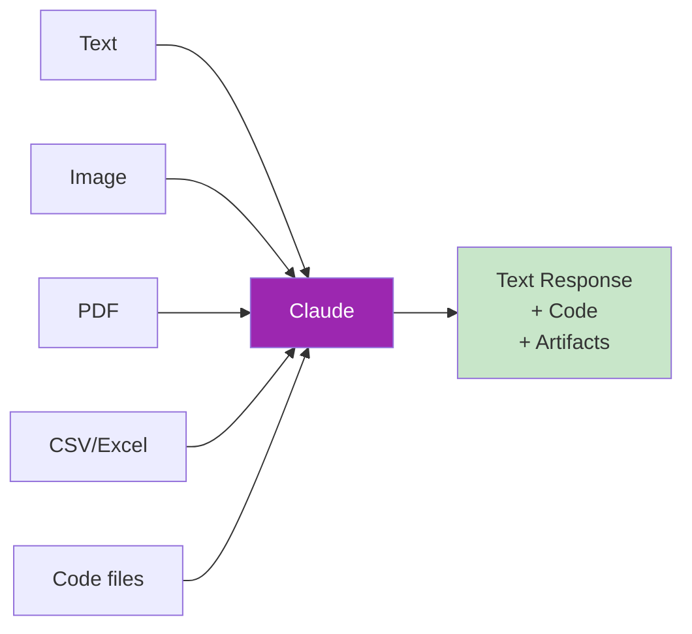
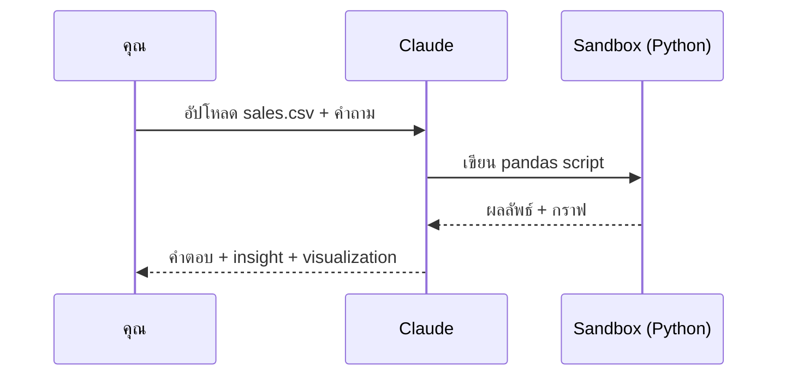

# Day 6: Multimodal Capabilities 🖼️📄

<div class="lesson-meta">
⏱️ <strong>เวลาเรียน:</strong> 3 ชั่วโมง &nbsp;|&nbsp; 📊 <strong>ระดับ:</strong> Intermediate &nbsp;|&nbsp; 📋 <strong>Prerequisites:</strong> Day 1–5
</div>

## 🎯 Learning Objectives

<ul class="objectives">
<li>เข้าใจว่า Claude สามารถรับ input ประเภทใดได้บ้าง</li>
<li>วิเคราะห์รูปภาพ — diagram, screenshot, photo</li>
<li>อ่านและดึงข้อมูลจาก PDF</li>
<li>ทำ data analysis บน CSV/Excel ด้วย Code Execution</li>
<li>วิเคราะห์ source code หลายไฟล์พร้อมกัน</li>
</ul>

---

## 1. Multimodal คืออะไร?

**Multimodal** = รับ input ได้หลาย "modality" (รูปแบบ) ไม่ใช่แค่ข้อความ



ใน Claude.ai คุณสามารถ **drag-and-drop** หรือ **paste** ไฟล์ลงในช่องแชทได้เลย รองรับ:

| Type | Format | Max size |
|------|--------|----------|
| Image | PNG, JPEG, GIF, WebP | 30MB/file |
| Document | PDF, DOCX, TXT, MD | 30MB/file |
| Spreadsheet | CSV, XLSX | 30MB/file |
| Code | .py, .js, .ts, .java, ฯลฯ | text-based |

!!! info
    ขนาดและจำนวนไฟล์อาจเปลี่ยนตามแพลน ดูใน [Claude.com Pricing](https://www.claude.com/pricing)

---

## 2. Image Understanding

### ตัวอย่างที่ 1: อ่าน Architecture Diagram

อัปโหลดรูป architecture diagram แล้วถาม:

```
รูปนี้คือ architecture อะไร?
- มี components อะไรบ้าง?
- ระบุ data flow ระหว่าง components
- หา potential single point of failure
- เสนอ improvements 2–3 ข้อ
```

### ตัวอย่างที่ 2: Screenshot Debugging

อัปโหลด screenshot ของ error ใน terminal:

```
นี่คือ error ที่เจอ:
- ระบุสาเหตุที่เป็นไปได้
- เสนอวิธีแก้ทีละขั้น
- ระบุคำสั่งที่ใช้ตรวจสอบเพิ่มเติม
```

### ตัวอย่างที่ 3: UI Mockup → HTML/React

อัปโหลดรูป mockup แล้วขอ:

```
จากรูป mockup นี้ สร้างเป็น React component
ที่ใช้ Tailwind CSS — รวม responsive layout
```

!!! tip "Pro Tip"
    Claude เห็นรูปได้เลย — ไม่ต้อง OCR ก่อน วาด diagram บนกระดาษ ถ่ายรูป ส่งให้ Claude แปลงเป็น mermaid/draw.io ได้!

---

## 3. PDF Processing

### ความสามารถ

- ดึง text + ตาราง
- เข้าใจ layout (header, columns, footer)
- อ้างอิงหน้า page number ได้
- รูปใน PDF ก็เห็น (Claude อ่านเหมือนคนเลื่อนดู)

### ตัวอย่าง: สรุป Whitepaper

```
อัปโหลด: AWS Well-Architected Framework whitepaper (PDF)

Prompt:
"สรุป 6 pillars ของ Well-Architected Framework
แต่ละ pillar ให้
- คำจำกัดความสั้น
- 3 key design principles
- 1 ตัวอย่างที่ใช้ในงานจริง

ตอบเป็นตาราง"
```

### ตัวอย่าง: ดึงข้อมูลจาก Invoice

```
อัปโหลด invoice PDF 5 ใบ

Prompt:
"ดึงข้อมูล: invoice number, date, vendor, total amount
รวมเป็น table แล้ว export เป็น CSV"
```

---

## 4. Data Analysis (CSV / Excel)

ใน Claude.ai เปิดฟีเจอร์ **Code Execution** (Settings → Tools) แล้ว Claude สามารถ:

1. อ่าน CSV/Excel ของคุณ
2. รัน Python (pandas, matplotlib) ในแซนด์บ็อกซ์
3. สร้างกราฟ
4. ตอบคำถามเชิงสถิติ



### ตัวอย่าง: Sales Analysis

```
อัปโหลด: sales_2024.csv (มี date, product, region, revenue)

Prompt:
"วิเคราะห์ sales 2024:
1. Top 3 products by revenue
2. Region ไหนโต % สูงสุด YoY
3. หา outlier transactions
4. สร้างกราฟ monthly revenue trend
5. ทำนาย revenue เดือนหน้าโดยใช้ moving average"
```

---

## 5. Code Files (หลายไฟล์พร้อมกัน)

อัปโหลด source code หลายไฟล์ (zip ก็ได้บางครั้ง หรือ paste ทีละไฟล์)

### ตัวอย่าง: Code Audit

```
อัปโหลด: auth.py, user_service.py, db.py

Prompt:
"ตรวจสอบ:
1. Security vulnerabilities (SQL injection, hardcoded secrets, weak hashing)
2. Code smells / anti-patterns
3. ที่ขาด error handling
4. เสนอ refactor พร้อม code ที่แก้แล้ว"
```

---

## 🛠️ Hands-on Exercise

!!! example "Exercise 1: Architecture from Photo"
    1. วาด diagram เล็กๆ บนกระดาษ (เช่น microservices 3 ตัวคุยกับ database)
    2. ถ่ายรูป upload ให้ Claude
    3. ขอให้แปลงเป็น **Mermaid diagram** + ระบุ improvements

!!! example "Exercise 2: PDF Summarizer"
    หา PDF whitepaper เกี่ยวกับ cloud/AI (1 ฉบับ) แล้วทำ:
    
    1. ขอ executive summary 200 คำ
    2. ขอ 5 takeaways สำคัญ
    3. ขอ glossary ของศัพท์เทคนิค
    4. ขอ critique ของจุดอ่อนใน argument

!!! example "Exercise 3: CSV Insight"
    หา CSV ตัวอย่างฟรี (เช่น [Kaggle Datasets](https://www.kaggle.com/datasets)) แล้ว:
    
    1. ขอ Claude วิเคราะห์ basic stats
    2. ขอ 3 charts ที่เล่า "story" ของข้อมูล
    3. ขอ business insights ที่ actionable
    
    > เปิด Code Execution ก่อน!

---

## ✅ Self-Check Quiz

<div class="quiz">

**Q1:** Claude รับ input รูปแบบไหนได้บ้าง?

??? success "ดูคำตอบ"
    Text, Images (PNG/JPEG/GIF/WebP), PDFs, Office docs (DOCX, XLSX), CSV, และ code files

**Q2:** ทำไม Code Execution ถึงช่วย data analysis?

??? success "ดูคำตอบ"
    เพราะ Claude สามารถ **รัน Python จริง** ในแซนด์บ็อกซ์ ทำให้คำนวณตัวเลขแม่นยำกว่าการ "เดา" และยังสร้างกราฟได้

**Q3:** ถ้ามี architecture diagram บนกระดาษ จะให้ Claude แปลงเป็น code/diagram digital ได้อย่างไร?

??? success "ดูคำตอบ"
    ถ่ายรูปแล้ว upload ให้ Claude วิเคราะห์ → ขอให้ output เป็น Mermaid syntax / draw.io XML / PlantUML

**Q4:** ทำไมการอัปโหลด invoice PDF จึงดีกว่าการ copy-paste text?

??? success "ดูคำตอบ"
    Claude เห็น **layout** ของ PDF (ตาราง, ตำแหน่งของจำนวนเงิน, header/footer) ทำให้ดึงข้อมูลแม่นยำกว่า text ที่ถูก flatten

</div>

---

## 🔍 Cross-check & References

- 📘 [Anthropic — Vision](https://docs.claude.com/en/docs/build-with-claude/vision)
- 📘 [Anthropic — PDF support](https://docs.claude.com/en/docs/build-with-claude/pdf-support)
- 📘 [Claude.ai — Analyze files & data](https://support.claude.com/)

---

:material-check-decagram: **สรุป:** ตอนนี้คุณสามารถใช้ Claude วิเคราะห์ "อะไรก็ได้" ไม่จำกัดแค่ข้อความ — รูป, PDF, ตาราง, source code

[ต่อไป → Day 7: Mini Project :material-arrow-right:](day-07.md){ .md-button .md-button--primary }
