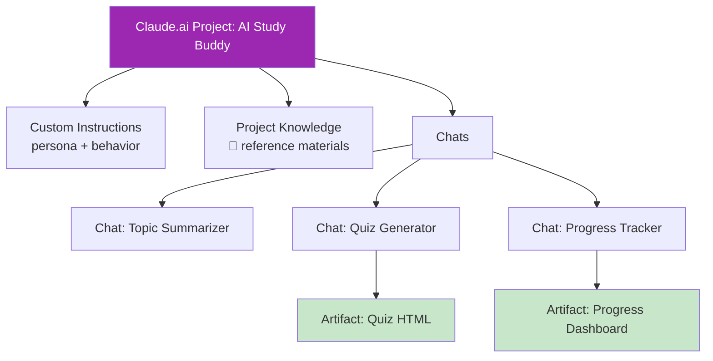

# Day 7: Mini Project — AI Study Buddy 🎓

<div class="lesson-meta">
⏱️ <strong>เวลาเรียน:</strong> 4–5 ชั่วโมง &nbsp;|&nbsp; 📊 <strong>ระดับ:</strong> Project &nbsp;|&nbsp; 📋 <strong>Prerequisites:</strong> Day 1–6
</div>

## 🎯 Project Goals

สร้าง **AI Study Buddy** — ผู้ช่วยเรียนรู้ส่วนตัวบน Claude.ai ที่:

<ul class="objectives">
<li>มี personality ที่ตรงกับสไตล์การเรียนของคุณ</li>
<li>รับ source material (PDF, slide, รูป) แล้วสรุปได้</li>
<li>สร้าง quiz ทดสอบความเข้าใจ</li>
<li>มี artifact ติดตามความก้าวหน้า</li>
<li>ปรับการสอนตาม level ผู้ใช้</li>
</ul>

---

## 1. Project Architecture



---

## 2. Step-by-Step Build

### Step 1: สร้าง Project

1. เปิด Claude.ai → คลิก **+ Project** → ตั้งชื่อ `AI Study Buddy`
2. ใส่ description: "ผู้ช่วยเรียนรู้เรื่อง [หัวข้อที่คุณสนใจ เช่น Kubernetes / AWS / Microservices]"

### Step 2: เขียน Custom Instructions

ลอกไปแก้ตามสไตล์ตัวเอง:

```text
คุณคือ "AI Study Buddy" ผู้ช่วยการเรียนรู้ส่วนตัว

PERSONA:
- เป็นเพื่อนผู้ใหญ่ที่อดทน ใจดี และมีความรู้
- พูดด้วยน้ำเสียงเป็นกันเอง แต่จริงจังกับเนื้อหา
- ชอบยกตัวอย่าง real-world ในงานวิศวกรรม

TEACHING STYLE:
1. เริ่มจาก concept พื้นฐานก่อน แล้วค่อยเพิ่มความซับซ้อน
2. ใช้ analogy เช่น "Kubernetes Pod เหมือนกล่องอาหารกลางวัน..."
3. ใส่ diagram (Mermaid) เมื่อเหมาะ
4. หลังอธิบาย ถามคำถามทดสอบความเข้าใจ 1–2 ข้อ

OUTPUT RULES:
- ตอบเป็นภาษาไทย ผสมศัพท์เทคนิคภาษาอังกฤษ
- ใส่ emoji เป็นจุดๆ ไม่เยอะ
- ถ้าฉันตอบผิด อย่าเฉลยทันที — ใบ้ก่อน
- เมื่อฉันขอ "quiz me" ให้สร้าง 5 ข้อ multiple choice + คำเฉลย collapsible
```

### Step 3: เพิ่ม Project Knowledge

อัปโหลด 2–4 แหล่งอ้างอิง เช่น:

- PDF whitepaper (เช่น CNCF Landscape, AWS Well-Architected)
- Markdown notes ของคุณเอง
- รูป architecture diagram

### Step 4: ทดลอง 3 use cases

#### 4.1 Topic Summarizer

```
สรุปเรื่อง "Service Mesh" จาก knowledge ที่ฉันให้
- ระดับ: senior engineer
- ความยาว: 300 คำ
- รวม mermaid diagram เปรียบเทียบ with/without service mesh
```

#### 4.2 Quiz Generator

```
quiz me on Kubernetes networking — 5 ข้อ multiple choice
ทำเป็น HTML artifact ที่ click แล้วเฉลยได้
```

#### 4.3 Progress Dashboard

```
สร้าง artifact (HTML) เป็น study progress dashboard
- รายการหัวข้อที่ฉันเรียนจบ (Day 1–6)
- % ความก้าวหน้า
- รายการหัวข้อถัดไป
```

---

## 3. Deliverables (สิ่งที่ต้องส่ง)

!!! example "ส่งเป็น screenshot หรือ GitHub Gist"
    1. **Custom Instructions** ของ Project (ปรับให้เป็นตัวเอง)
    2. **3 chats** ครบ use case ข้างบน
    3. **Quiz artifact** (interactive HTML)
    4. **Reflection** 200 คำ: ใช้เทคนิคอะไรจาก Day 1–6 บ้าง?

---

## 4. Scoring Rubric (ให้คะแนนตัวเอง)

| เกณฑ์ | คะแนน |
|------|------|
| Custom Instructions มี persona ชัด + teaching style | / 20 |
| Project Knowledge มี source ≥ 2 | / 10 |
| Topic Summarizer ทำงานได้ดี | / 20 |
| Quiz artifact interactive | / 20 |
| Progress Dashboard ดูเข้าใจง่าย | / 20 |
| Reflection สะท้อนเทคนิคที่ใช้ | / 10 |
| **รวม** | **/ 100** |

ผ่าน = 70+

---

## 🛠️ Bonus Challenges

!!! tip "Challenge 1: Spaced Repetition"
    ขอ Claude สร้าง quiz ที่หมุนเวียนเรื่องเก่ามา rev อีก (เลียนแบบ Anki / SuperMemo)

!!! tip "Challenge 2: Multi-Persona"
    ทำให้ Buddy เปลี่ยน persona ได้: "Mode beginner", "Mode interview prep", "Mode deep-dive"

!!! tip "Challenge 3: Generate Flashcards"
    ขอให้สร้าง flashcards จาก source material → export เป็น CSV import เข้า Anki

---

## ✅ Week 1 Self-Check

ก่อนไป Week 2 ลองตอบ:

<div class="quiz">

- [ ] อธิบาย token, context window, hallucination ได้
- [ ] แยกแยะ Haiku, Sonnet, Opus 4.7 ได้
- [ ] เขียน prompt ตาม CRISP framework ได้
- [ ] ใช้ Project + Custom Instructions + Knowledge ได้คล่อง
- [ ] ใช้ CoT, Few-shot, Role-play, Prompt Chaining เป็น
- [ ] วิเคราะห์ PDF, รูป, CSV กับ Claude ได้
- [ ] สร้าง Artifact (HTML, React, Mermaid) ได้

ครบ 7 ข้อ → พร้อมไป Week 2! 🚀

</div>

---

## 🔍 Cross-check & References

- 📘 [Anthropic — Projects](https://www.anthropic.com/news/projects)
- 📺 [DeepLearning.AI — Prompt Engineering Short Course](https://www.deeplearning.ai/short-courses/)
- 📘 [Anthropic Prompt Library](https://docs.claude.com/en/resources/prompt-library/)

---

:material-check-decagram: **จบ Week 1!** คุณใช้ Claude.ai เป็นแล้ว — ตอนนี้พร้อมเข้าสู่งานจริง

[ต่อไป → Week 2: Applied Claude :material-arrow-right:](../week-02/index.md){ .md-button .md-button--primary }
