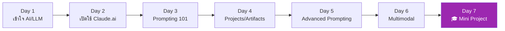

# Week 1 — Foundation 🎯

> **เป้าหมายสัปดาห์นี้:** เข้าใจว่า Claude คืออะไร, ใช้ Claude.ai ได้เก่ง, prompt ได้ดี

## ภาพรวม

สัปดาห์แรกเน้น **ความเข้าใจพื้นฐาน** เพื่อให้คุณไม่สับสนเวลาเจอ concept ขั้นสูงในสัปดาห์ต่อๆ ไป เนื้อหาเริ่มจาก zero ไม่ต้องมีพื้น AI มาก่อน

## บทเรียนทั้งหมด

| Day | หัวข้อ | เวลา | สิ่งที่ได้ |
|:---:|---|:---:|---|
| 1 | [AI และ LLM คืออะไร](day-01.md) | 3 ชม. | เข้าใจ concept พื้นฐาน |
| 2 | [เริ่มต้นกับ Claude.ai](day-02.md) | 3 ชม. | สำรวจ UI, settings |
| 3 | [Prompting 101](day-03.md) | 4 ชม. | เขียน prompt แบบมีโครงสร้าง |
| 4 | [Projects, Artifacts, Memory](day-04.md) | 4 ชม. | จัดระเบียบงานบน Claude.ai |
| 5 | [Advanced Prompting](day-05.md) | 4 ชม. | CoT, Few-shot, Role |
| 6 | [Multimodal (PDF, รูป, CSV)](day-06.md) | 4 ชม. | วิเคราะห์ไฟล์หลายชนิด |
| 7 | [🎓 Mini Project: AI Study Buddy](day-07.md) | 5 ชม. | รวมทุกอย่างเป็น project |

**รวม:** ~27 ชั่วโมง

## ทักษะหลังจบสัปดาห์นี้

หลังจบ Week 1 คุณจะ:

- ✅ อธิบายได้ว่า LLM ทำงานอย่างไร (ระดับ intuition)
- ✅ ใช้ Claude.ai ได้คล่อง — รู้ว่า Project, Artifact, Memory คืออะไร
- ✅ เขียน prompt ที่ได้คำตอบดีๆ ได้
- ✅ วิเคราะห์ PDF / รูป / CSV ได้
- ✅ สร้าง "AI Study Buddy" ส่วนตัวบน Claude.ai

[เริ่ม Day 1 :material-arrow-right:](day-01.md){ .md-button .md-button--primary }
