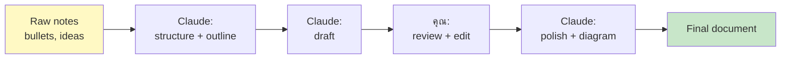

# Day 8: Writing & Documentation Workflows ✍️

<div class="lesson-meta">
⏱️ 3 ชั่วโมง &nbsp;|&nbsp; 📊 Intermediate &nbsp;|&nbsp; 📋 Prerequisites: Week 1
</div>

## 🎯 Learning Objectives

<ul class="objectives">
<li>ใช้ Claude เขียน technical document (ADR, RFC, runbook)</li>
<li>แก้ไข tone, voice, audience ได้</li>
<li>ใช้ Claude เป็น editor — proofread, restructure, simplify</li>
<li>สร้าง diagram (Mermaid) ประกอบเอกสาร</li>
</ul>

---

## 1. กรอบความคิด: Claude เป็นเพื่อนนักเขียน ไม่ใช่ ghostwriter

Claude ทำงานเขียนได้ดี เมื่อคุณ:

| สิ่งที่ดี | สิ่งที่ควรหลีกเลี่ยง |
|---------|------------------|
| ให้ context (audience, purpose, tone) | "เขียน blog เรื่อง X" แห้งๆ |
| ใส่ source material (bullet, notes) | คาดหวังให้คิดเองทั้งหมด |
| Review + edit หลายรอบ | รับ output ครั้งแรกแล้วใช้เลย |
| ใช้ persona เฉพาะ (engineer, marketer) | ใช้ default tone |

---

## 2. Workflow: Notes → Draft → Polished



---

## 3. ตัวอย่างที่ 1: Architecture Decision Record (ADR)

```
Persona: คุณคือ Senior Architect ที่เขียน ADR clear, structured

ผมตัดสินใจ:
- เลือก Kafka แทน RabbitMQ
- สำหรับ event-driven microservices
- ที่มี throughput 50K msg/sec
- ต้องการ replay capability
- ทีมไม่มีประสบการณ์ Kafka

เขียน ADR ตาม template Michael Nygard:
1. Title
2. Status (Proposed/Accepted/Deprecated)
3. Context
4. Decision
5. Consequences (positive + negative)
6. Alternatives considered

ใช้ Markdown และ Mermaid diagram ประกอบ
```

---

## 4. ตัวอย่างที่ 2: Runbook

```
สร้าง runbook สำหรับสถานการณ์: "Production database connection pool exhausted"

ใส่:
- Symptoms (สิ่งที่เห็นใน alert / log)
- Severity & SLA
- Diagnosis steps (commands ที่ใช้)
- Resolution steps
- Verification
- Postmortem template

Audience: On-call engineer ระดับ mid-level
Format: Markdown ที่ paste ลง Confluence ได้เลย
```

---

## 5. ตัวอย่างที่ 3: Tone Adjustment

prompt ชุดเดียวกัน แต่เปลี่ยน audience:

| Audience | คำสั่งเสริม |
|----------|------------|
| C-level executive | "เน้น business impact, ตัดศัพท์เทคนิค, รวม cost figures" |
| Engineering team | "เน้น implementation detail, code snippet, trade-offs" |
| Marketing team | "เน้น storytelling, ใช้ analogy, คำสั้น" |

---

## 6. เทคนิค Editing

### 6.1 Restructure
```
อ่าน document นี้ → เสนอ outline ใหม่ที่ flow ดีกว่า
อย่าเขียน content ใหม่ แค่จัดลำดับหัวข้อ
```

### 6.2 Tighten (ลดความเยิ่นเย้อ)
```
ตัด document นี้ให้สั้นลง 40% โดยรักษา key message
หา passive voice → เปลี่ยนเป็น active
```

### 6.3 Tone Check
```
อ่าน document นี้ → ระบุประโยคที่ดู:
- จริงจังเกินไป
- คลุมเครือ
- ใช้ jargon ที่คน junior ไม่เข้าใจ
ไม่ต้องแก้ แค่บอกที่ต้องดู
```

---

## 🛠️ Hands-on Exercise

!!! example "Exercise 1: ADR"
    เลือก decision จริงที่คุณเคยทำ → ให้ Claude ช่วยเขียน ADR

!!! example "Exercise 2: 3 Tone Versions"
    เขียน announcement "เราจะ migrate database จาก MySQL → PostgreSQL"
    3 versions: สำหรับ exec, dev team, customer

!!! example "Exercise 3: Editing Drill"
    หา blog ของตัวเอง (หรือ doc เก่า) → ให้ Claude วิเคราะห์ปัญหาและเสนอ rewrite

---

## ✅ Self-Check Quiz

<div class="quiz">

**Q1:** ทำไมการให้ context (audience, purpose) ก่อนเขียน ถึงได้ output ดีกว่า?

??? success "ดูคำตอบ"
    เพราะ Claude ปรับ vocabulary, depth, tone ตาม audience ได้ — ไม่ได้เขียน "generic" content

**Q2:** ความต่างระหว่าง "rewrite" และ "restructure" คืออะไร?

??? success "ดูคำตอบ"
    - **Rewrite**: เปลี่ยนคำ/ประโยค ขณะเดิม structure
    - **Restructure**: เปลี่ยน ordering ของหัวข้อ/sections (content เดิม)

**Q3:** Mermaid diagram ช่วย document อย่างไร?

??? success "ดูคำตอบ"
    Mermaid render เป็น diagram บน Markdown viewer (GitHub, MkDocs, Notion) — ผู้อ่านเห็นภาพ flow โดยไม่ต้องวาดด้วยมือ

</div>

---

## 🔍 Cross-check & References

- 📘 [Anthropic Use Cases — Writing](https://docs.claude.com/en/docs/about-claude/use-case-guides)
- 📚 [Architectural Decision Records](https://adr.github.io/)
- 📚 [Google Technical Writing Course](https://developers.google.com/tech-writing)

[ต่อไป → Day 9 :material-arrow-right:](day-09.md){ .md-button .md-button--primary }
