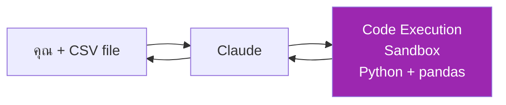
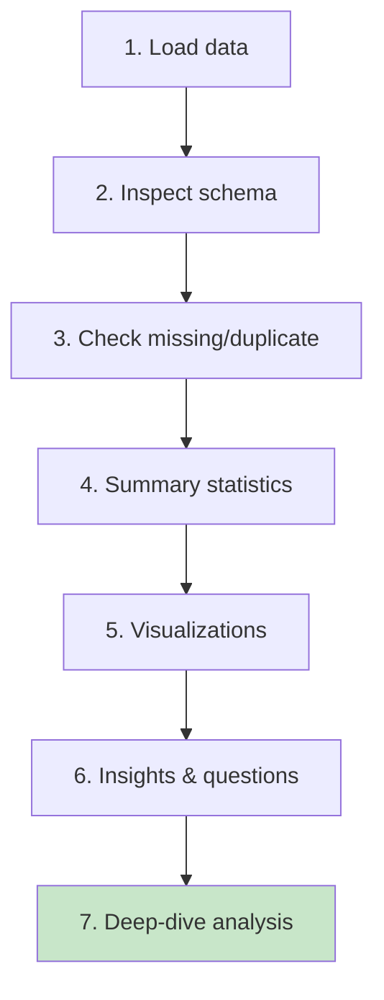

# Day 9: Data Analysis & Code Execution 📊

<div class="lesson-meta">
⏱️ 3 ชั่วโมง &nbsp;|&nbsp; 📊 Intermediate &nbsp;|&nbsp; 📋 Prerequisites: Day 6
</div>

## 🎯 Learning Objectives

<ul class="objectives">
<li>เปิดใช้และเข้าใจ Code Execution sandbox</li>
<li>วิเคราะห์ CSV/Excel ด้วย Claude + pandas</li>
<li>สร้าง visualization (matplotlib, plotly)</li>
<li>ทำ exploratory data analysis (EDA) อย่างเป็นระบบ</li>
</ul>

---

## 1. Code Execution คืออะไร?

Code Execution คือ **Python sandbox** ที่ Claude เรียกใช้ในแซนด์บ็อกซ์ (ไม่กระทบเครื่องคุณ)



**เปิดใช้:** Settings → Tools → Toggle "Code Execution"

**Library ที่ใช้ได้:** pandas, numpy, matplotlib, plotly, scipy, scikit-learn, openpyxl ฯลฯ

---

## 2. EDA Workflow



---

## 3. ตัวอย่างที่ 1: Sales Dataset

อัปโหลด `sales.csv` (cols: date, product, region, qty, price)

**Prompt:**
```
ใช้ Code Execution วิเคราะห์ sales.csv ตาม EDA workflow:

1. Schema + dtypes
2. Missing values, duplicates
3. Summary stats (mean, median, std)
4. Top 5 products by revenue (bar chart)
5. Monthly trend (line chart)
6. Region distribution (pie chart)
7. สรุป 3 insights ที่ business นำไปใช้ได้
```

---

## 4. ตัวอย่างที่ 2: Log Analysis

อัปโหลด `nginx-access.log` (export to CSV ก่อน)

**Prompt:**
```
วิเคราะห์ log:
1. Top 10 endpoints by request count
2. Error rate by hour (heatmap)
3. P50/P95/P99 latency
4. Suspicious IP (>1000 req/min)
5. หา pattern ของ 5xx errors
```

---

## 5. ตัวอย่างที่ 3: Forecasting

```
จาก sales.csv:
1. ทำ time-series decomposition (trend, seasonal, residual)
2. Forecast 3 เดือนข้างหน้าด้วย Prophet
3. แสดง confidence interval ในกราฟ
4. สรุปความเสี่ยงของ forecast นี้
```

---

## 6. Best Practices

| Do | Don't |
|----|-------|
| บอก schema ก่อน ถ้า column name ไม่ชัด | ส่ง CSV ที่ใหญ่มาก (>30MB) |
| Verify ผลลัพธ์กับการคำนวณด้วยมือ | เชื่อตัวเลข Claude 100% โดยไม่ตรวจ |
| ขอให้ Claude **แสดง code** ที่ใช้ | รับ chart โดยไม่ดู logic |
| ทำทีละ chunk (load → clean → analyze) | ใส่ prompt ยาวเดียวทำทุกอย่าง |

---

## 🛠️ Hands-on Exercise

!!! example "Exercise 1: Public Dataset"
    Download [Titanic dataset (Kaggle)](https://www.kaggle.com/c/titanic/data) → ให้ Claude:
    
    1. EDA ตาม workflow
    2. หา feature ที่สัมพันธ์กับ survival rate
    3. สร้าง simple decision tree classifier
    4. รายงาน accuracy บน test set

!!! example "Exercise 2: ของจริง"
    หา CSV ของงานคุณ (sanitize ข้อมูล PII ก่อน) → ขอ Claude:
    
    1. หา 3 anomalies ที่ดูแปลก
    2. เสนอ business action

!!! example "Exercise 3: Chart Polish"
    ขอ Claude refactor chart ของ Exercise 1 ให้:
    
    - ใช้ Tailwind-friendly colors
    - มี title, labels, legend ครบ
    - Export เป็น PNG พร้อมใช้บน slide

---

## ✅ Self-Check Quiz

<div class="quiz">

**Q1:** Code Execution sandbox มีข้อจำกัดอะไร?

??? success "ดูคำตอบ"
    - File size limit (ราว 30MB)
    - ไม่มี internet access (ดึงข้อมูลจากเว็บไม่ได้)
    - Reset ทุก session — ต้อง re-upload ไฟล์ทุกครั้ง

**Q2:** ทำไมต้องขอให้ Claude "แสดง code" ที่ใช้?

??? success "ดูคำตอบ"
    เพื่อ **verify** ว่า logic ถูก, ทำ reproducibility, และเรียนรู้จาก Claude

**Q3:** ขั้นตอนแรกของ EDA คืออะไร?

??? success "ดูคำตอบ"
    Inspect schema และ dtypes — ก่อนคำนวณอะไรต้องรู้ก่อนว่าข้อมูลคืออะไร

</div>

---

## 🔍 Cross-check & References

- 📘 [Anthropic — Tools and Code Execution](https://docs.claude.com/)
- 📚 [Wes McKinney — Python for Data Analysis](https://wesmckinney.com/book/)
- 📺 [Kaggle Learn — Data Visualization](https://www.kaggle.com/learn/data-visualization)

[ต่อไป → Day 10 :material-arrow-right:](day-10.md){ .md-button .md-button--primary }
