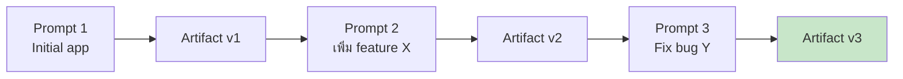

# Day 10: Coding บน Claude.ai (Artifacts) 💻

<div class="lesson-meta">
⏱️ 3 ชั่วโมง &nbsp;|&nbsp; 📊 Intermediate &nbsp;|&nbsp; 📋 Prerequisites: Day 4, Day 5
</div>

## 🎯 Learning Objectives

<ul class="objectives">
<li>สร้าง interactive Artifact (HTML, React)</li>
<li>เรียก Claude API จาก Artifact (Claudeception)</li>
<li>Iterate กับ Artifact หลายรอบ</li>
<li>เข้าใจข้อจำกัด — ไม่มี localStorage, ไม่มี backend</li>
</ul>

---

## 1. Artifact คืออะไร? (ทบทวน)

Artifact = **standalone code/document** ที่เปิด preview ทางขวาของหน้าจอ Claude.ai

ประเภทที่ render ได้:

| Type | Extension | ใช้ทำอะไร |
|------|-----------|----------|
| Markdown | `.md` | document, report |
| HTML | `.html` | landing page, dashboard |
| React | `.jsx` | interactive component |
| SVG | `.svg` | logo, icon, diagram |
| Mermaid | `.mermaid` | flowchart, sequence |

---

## 2. ตัวอย่างที่ 1: Calculator (HTML+JS)

```
สร้าง calculator แบบ scientific
- HTML + CSS + JS ใน file เดียว
- สวยงาม dark mode
- รองรับ sin, cos, log, sqrt, x^y
- History panel ดู expression เก่า
```

→ Claude สร้าง Artifact ที่กดได้จริงในแชท

---

## 3. ตัวอย่างที่ 2: Architecture Diagram Tool (React)

```
สร้าง React app:
- เพิ่ม/ลบ node (service)
- ลาก line เชื่อม node
- เลือก color theme
- Export เป็น JSON

ใช้:
- Tailwind core utilities
- lucide-react สำหรับ icons
- ห้ามใช้ localStorage (ไม่ support ในแซนด์บ็อกซ์)
- ห้าม <form> tag
```

---

## 4. ตัวอย่างที่ 3: AI-Powered App (Claudeception)

Artifact สามารถ **เรียก Claude API** ได้! (จาก system prompt ที่ Anthropic จัดการ key ให้)

```javascript
const response = await fetch("https://api.anthropic.com/v1/messages", {
  method: "POST",
  headers: { "Content-Type": "application/json" },
  body: JSON.stringify({
    model: "claude-sonnet-4-20250514",
    max_tokens: 1000,
    messages: [{ role: "user", content: prompt }]
  })
});
const data = await response.json();
const text = data.content[0].text;
```

**ตัวอย่าง prompt:**

```
สร้าง React app "Idea Brainstormer"
- ผู้ใช้พิมพ์ topic
- เรียก Claude API ขอ 5 ideas
- แสดงเป็น cards เลือกได้
- กดบน card → ขอ Claude expand เป็น plan

ใช้ claude-sonnet-4-20250514, max_tokens 1000
```

---

## 5. Iteration Pattern



Claude จะ **อัปเดต artifact เดิม** ไม่ใช่สร้างใหม่ทุกครั้ง → revision history ตามดูได้

---

## 6. ข้อจำกัดที่ต้องรู้

| สิ่งที่ทำไม่ได้ | ทำไม | ทางออก |
|-------------|-----|--------|
| localStorage / sessionStorage | Sandbox ไม่ support | ใช้ React useState |
| HTTP fetch ภายนอก (ที่ไม่ใช่ Claude API หรือ cdnjs) | CORS | คัด API ที่จำเป็น |
| File upload ใน artifact | Sandbox isolation | ใช้ Claude.ai chat แทน |
| `<form>` tag ใน React | Hydration issue | ใช้ onClick handler |
| Routing (react-router) | Single page | ใช้ state-based view |

---

## 🛠️ Hands-on Exercise

!!! example "Exercise 1: Todo App"
    สร้าง todo app ที่:
    - เพิ่ม, ลบ, mark complete
    - filter (all / active / done)
    - Priority tags (color-coded)

!!! example "Exercise 2: Markdown Editor"
    สร้าง markdown editor:
    - 2 panes (input | preview)
    - Live preview
    - Export button (copy to clipboard)

!!! example "Exercise 3: AI-Powered Tool"
    สร้าง "ADR Generator":
    - User กรอก: title, context, decision
    - กดปุ่ม → เรียก Claude API → ได้ ADR เต็ม
    - Render ใน preview pane

---

## ✅ Self-Check Quiz

<div class="quiz">

**Q1:** ทำไม artifact ใช้ localStorage ไม่ได้?

??? success "ดูคำตอบ"
    เพราะ sandbox ถูก isolate — browser storage APIs ไม่ทำงาน ใช้ useState/useReducer แทน

**Q2:** "Claudeception" คืออะไร?

??? success "ดูคำตอบ"
    Artifact ที่เรียก Claude API ภายในตัวเอง → สร้าง AI-powered app ที่ end user คุยกับ Claude อีกตัว

**Q3:** ถ้าอยาก add feature ใหม่ใน artifact ที่มีอยู่ ทำอย่างไร?

??? success "ดูคำตอบ"
    พิมพ์ prompt ใหม่ในแชทเดียวกัน Claude จะ update artifact เดิม — ไม่ต้อง paste โค้ดทั้งหมดกลับเข้าไป

</div>

---

## 🔍 Cross-check & References

- 📘 [Anthropic — Artifacts](https://www.anthropic.com/news/artifacts)
- 📺 [Anthropic — Building with Claude in Claude](https://www.youtube.com/@anthropic-ai)

[ต่อไป → Day 11 :material-arrow-right:](day-11.md){ .md-button .md-button--primary }
