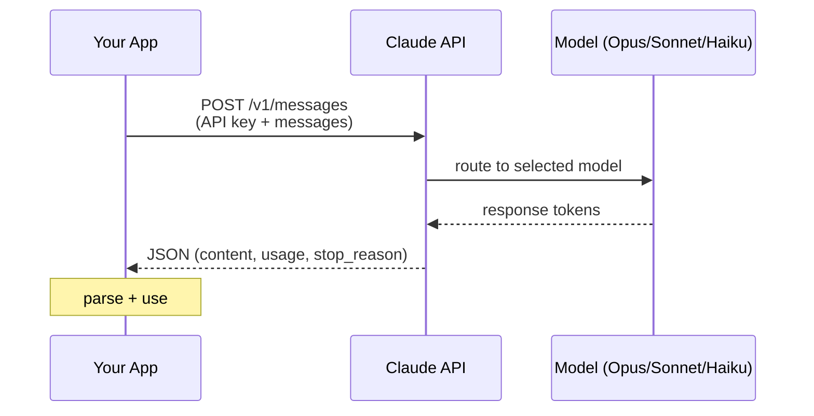
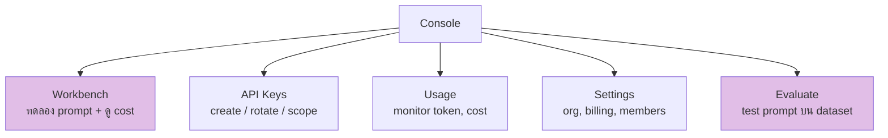

# Day 11: Claude API & Console พื้นฐาน 🔌

<div class="lesson-meta">
⏱️ 4 ชั่วโมง &nbsp;|&nbsp; 📊 Intermediate &nbsp;|&nbsp; 📋 Prerequisites: Day 10
</div>

## 🎯 Learning Objectives

<ul class="objectives">
<li>เข้าใจสถาปัตยกรรม Claude API (request/response)</li>
<li>ใช้ Anthropic Console — Workbench, Evaluate, Cost</li>
<li>เรียก API ด้วย Python SDK</li>
<li>เข้าใจ models, pricing, rate limit, token counting</li>
</ul>

---

## 1. Claude API Architecture



### Endpoint หลัก

| Endpoint | Use |
|---------|-----|
| `POST /v1/messages` | สนทนา (main) |
| `POST /v1/messages/count_tokens` | นับ tokens ก่อนส่ง |
| `POST /v1/messages/batches` | Batch (50% ถูกกว่า) |
| `POST /v1/files` | Upload PDF/image |

---

## 2. Anthropic Console Tour

เปิด [console.anthropic.com](https://console.anthropic.com)



### ของที่ต้องทำก่อนเริ่ม

1. สร้าง **API key** (Settings → API Keys → Create Key)
2. ตรวจ **Free credits** (Anthropic ให้เครดิตเริ่มต้น)
3. ตั้ง **Spending limit** (กันค่าใช้จ่ายเกิน)

---

## 3. Models & Pricing (May 2026)

ดู [docs.claude.com/en/docs/about-claude/models](https://docs.claude.com/en/docs/about-claude/models) เสมอ เพราะราคา/ชื่อรุ่นมีการอัปเดต

| Model | Model String | Use |
|-------|--------------|-----|
| Claude Opus 4.7 | `claude-opus-4-7` | งานซับซ้อนสุด, agent, deep reasoning |
| Claude Opus 4.6 | `claude-opus-4-6` | งานหนัก คุณภาพสูง |
| Claude Sonnet 4.6 | `claude-sonnet-4-6` | งานทั่วไป จุดสมดุล quality/cost |
| Claude Haiku 4.5 | `claude-haiku-4-5-20251001` | งานเร็ว ถูก สำหรับ volume |

!!! tip "เลือก model อย่างไร"
    เริ่มที่ **Haiku** → ถ้าคุณภาพไม่พอค่อยขยับเป็น **Sonnet** → จำเป็นจริงๆ ถึงใช้ **Opus**

---

## 4. First API Call (Python)

### Setup
```bash
pip install anthropic python-dotenv
```

### `.env`
```
ANTHROPIC_API_KEY=sk-ant-xxxxx
```

### `hello_claude.py`
```python
import os
from dotenv import load_dotenv
from anthropic import Anthropic

load_dotenv()
client = Anthropic()  # auto reads ANTHROPIC_API_KEY

response = client.messages.create(
    model="claude-haiku-4-5-20251001",
    max_tokens=300,
    messages=[
        {"role": "user", "content": "ทักทายเป็นภาษาไทย และอธิบายว่า REST API คืออะไรใน 3 ประโยค"}
    ]
)

print(response.content[0].text)
print(f"\n📊 Tokens: input={response.usage.input_tokens}, output={response.usage.output_tokens}")
```

### Run
```bash
python hello_claude.py
```

---

## 5. Anatomy ของ Response

```python
response = client.messages.create(...)
# response.id              -> "msg_xxx"
# response.model           -> "claude-haiku-4-5-20251001"
# response.role            -> "assistant"
# response.content         -> [{"type": "text", "text": "..."}, ...]
# response.stop_reason     -> "end_turn" / "max_tokens" / "tool_use"
# response.usage           -> {"input_tokens": N, "output_tokens": M}
```

---

## 6. System Prompt

```python
response = client.messages.create(
    model="claude-sonnet-4-6",
    max_tokens=1000,
    system="คุณคือ Senior Solution Architect ที่ตอบกระชับและอ้างอิงจริง",
    messages=[
        {"role": "user", "content": "อธิบาย eventual consistency"}
    ]
)
```

System prompt แยกจาก messages → ใช้กำหนด persona, rules, format

---

## 7. Streaming (พิมพ์ทีละคำ)

```python
with client.messages.stream(
    model="claude-sonnet-4-6",
    max_tokens=500,
    messages=[{"role": "user", "content": "เล่าเรื่อง startup สั้นๆ"}]
) as stream:
    for text in stream.text_stream:
        print(text, end="", flush=True)
```

ใช้สำหรับ chatbot UI ที่ต้องเห็น response real-time

---

## 8. Rate Limit & Cost Awareness

- **RPM** = Requests Per Minute
- **TPM** = Tokens Per Minute (input + output)
- **TPD** = Tokens Per Day

เริ่มต้น tier ต่ำสุด — เพิ่ม spending → tier ขึ้นอัตโนมัติ

### นับ tokens ก่อนส่ง

```python
count = client.messages.count_tokens(
    model="claude-sonnet-4-6",
    messages=[{"role": "user", "content": "very long input..."}]
)
print(count.input_tokens)  # ตัดสินใจส่งหรือ chunk
```

---

## 🛠️ Hands-on Exercise

!!! example "Exercise 1: API Setup + First Call"
    1. สร้าง API key
    2. ตั้ง spending limit $5
    3. รัน `hello_claude.py`
    4. ลองเปลี่ยน 3 models (Haiku, Sonnet, Opus) — เปรียบเทียบ output + cost

!!! example "Exercise 2: Workbench"
    บน Console → Workbench:
    - ใส่ system prompt: "คุณคือ Linux expert"
    - User: "อธิบาย iptables NAT chain"
    - Copy "Generate code" ออกมาเป็น Python script

!!! example "Exercise 3: Streaming"
    ทำ CLI app: รับ input → stream response (เห็นพิมพ์ทีละคำ) → จบแล้วโชว์ token count

---

## ✅ Self-Check Quiz

<div class="quiz">

**Q1:** ใช้ model ไหนสำหรับ chatbot ที่ต้องตอบ FAQ ง่ายๆ?

??? success "ดูคำตอบ"
    **Claude Haiku 4.5** — เร็วและถูก เหมาะกับ FAQ ที่ไม่ต้อง reasoning ซับซ้อน

**Q2:** ความต่างระหว่าง `system` และ `messages`?

??? success "ดูคำตอบ"
    - **system**: instructions สำหรับ Claude (persona, rules) — top-level field
    - **messages**: บทสนทนา (alternating user/assistant)

**Q3:** Batch API ช่วยอะไร?

??? success "ดูคำตอบ"
    ลดราคา **50%** เมื่อยอมรอ batch process (สูงสุด 24 ชม.) เหมาะกับงาน offline เช่น classify ข้อมูลล้านแถว

**Q4:** ทำไมต้อง count tokens ก่อนส่ง?

??? success "ดูคำตอบ"
    - ประมาณ cost ล่วงหน้า
    - กันเกิน context window
    - ตัดสินใจ chunk ก่อนถ้ายาวเกิน

</div>

---

## 🔍 Cross-check & References

- 📘 [Anthropic API — Getting Started](https://docs.claude.com/en/api/getting-started)
- 📘 [Models & Pricing](https://docs.claude.com/en/docs/about-claude/models)
- 📘 [Rate Limits](https://docs.claude.com/en/api/rate-limits)
- 🛠️ [Console](https://console.anthropic.com)

[ต่อไป → Day 12 :material-arrow-right:](day-12.md){ .md-button .md-button--primary }
