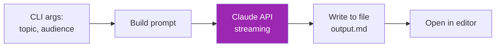
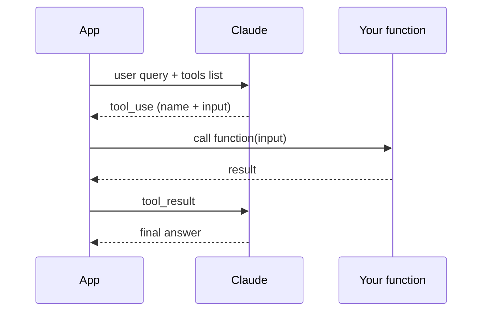

# Day 12: สร้าง App ตัวแรกด้วย Claude API 🚀

<div class="lesson-meta">
⏱️ 4 ชั่วโมง &nbsp;|&nbsp; 📊 Intermediate &nbsp;|&nbsp; 📋 Prerequisites: Day 11
</div>

## 🎯 Learning Objectives

<ul class="objectives">
<li>สร้าง CLI app ที่ stream output</li>
<li>จัดการ multi-turn conversation</li>
<li>ใช้ tool use (function calling) เบื้องต้น</li>
<li>Error handling & retry</li>
</ul>

---

## 1. Project: Markdown Doc Writer CLI

### Goal

CLI tool: รับ topic → ส่งให้ Claude → output เป็น Markdown doc พร้อม mermaid

### Architecture



### Code: `doc_writer.py`

```python
import os
import sys
import argparse
from anthropic import Anthropic
from dotenv import load_dotenv

load_dotenv()
client = Anthropic()

SYSTEM_PROMPT = """คุณคือ Senior Technical Writer ที่เขียน document ดีมาก
- ใช้ Markdown
- มี mermaid diagram อย่างน้อย 1 อัน
- มี code example
- กระชับ ไม่เยิ่นเย้อ
- ภาษาไทย ผสมศัพท์เทคนิคอังกฤษ"""

def write_doc(topic: str, audience: str, output_path: str):
    prompt = f"เขียน technical document เรื่อง: {topic}\nสำหรับ audience: {audience}"
    
    with open(output_path, "w", encoding="utf-8") as f:
        with client.messages.stream(
            model="claude-sonnet-4-6",
            max_tokens=4000,
            system=SYSTEM_PROMPT,
            messages=[{"role": "user", "content": prompt}]
        ) as stream:
            for text in stream.text_stream:
                print(text, end="", flush=True)
                f.write(text)
    
    print(f"\n\n✅ เขียนเสร็จ: {output_path}")

if __name__ == "__main__":
    parser = argparse.ArgumentParser()
    parser.add_argument("--topic", required=True)
    parser.add_argument("--audience", default="senior engineer")
    parser.add_argument("--out", default="output.md")
    args = parser.parse_args()
    write_doc(args.topic, args.audience, args.out)
```

### Run
```bash
python doc_writer.py --topic "Kafka consumer groups" --audience "junior backend dev" --out kafka.md
```

---

## 2. Project: Multi-turn Chat

```python
from anthropic import Anthropic

client = Anthropic()
history = []

print("Chatbot พร้อม! พิมพ์ /quit เพื่อออก\n")

while True:
    user_input = input("You: ").strip()
    if user_input == "/quit":
        break
    
    history.append({"role": "user", "content": user_input})
    
    response = client.messages.create(
        model="claude-sonnet-4-6",
        max_tokens=1000,
        system="คุณคือผู้ช่วยทั่วไป ตอบกระชับ",
        messages=history
    )
    
    assistant_text = response.content[0].text
    history.append({"role": "assistant", "content": assistant_text})
    print(f"Claude: {assistant_text}\n")
```

**สำคัญ:** ต้องส่ง history ทั้งหมดกลับไปทุกครั้ง — API stateless

---

## 3. Tool Use (Function Calling) เบื้องต้น

ให้ Claude เรียก function ของคุณได้

```python
tools = [{
    "name": "get_weather",
    "description": "Get current weather for a city",
    "input_schema": {
        "type": "object",
        "properties": {
            "city": {"type": "string", "description": "city name"},
            "unit": {"type": "string", "enum": ["celsius", "fahrenheit"]}
        },
        "required": ["city"]
    }
}]

def get_weather(city: str, unit: str = "celsius"):
    # mock — จริงๆ ก็เรียก weather API
    return {"city": city, "temp": 32, "unit": unit, "condition": "sunny"}

# 1st call
response = client.messages.create(
    model="claude-sonnet-4-6",
    max_tokens=1000,
    tools=tools,
    messages=[{"role": "user", "content": "อากาศกรุงเทพวันนี้?"}]
)

# Claude ตอบกลับด้วย tool_use block
if response.stop_reason == "tool_use":
    tool_block = next(b for b in response.content if b.type == "tool_use")
    result = get_weather(**tool_block.input)
    
    # 2nd call — ส่งผลลัพธ์กลับให้ Claude
    response = client.messages.create(
        model="claude-sonnet-4-6",
        max_tokens=1000,
        tools=tools,
        messages=[
            {"role": "user", "content": "อากาศกรุงเทพวันนี้?"},
            {"role": "assistant", "content": response.content},
            {"role": "user", "content": [{
                "type": "tool_result",
                "tool_use_id": tool_block.id,
                "content": str(result)
            }]}
        ]
    )

print(response.content[0].text)
```

### Tool use Flow



---

## 4. Error Handling & Retry

```python
import time
from anthropic import APIError, RateLimitError

def call_with_retry(messages, max_retries=3):
    for attempt in range(max_retries):
        try:
            return client.messages.create(
                model="claude-sonnet-4-6",
                max_tokens=1000,
                messages=messages
            )
        except RateLimitError:
            wait = 2 ** attempt  # exponential backoff
            print(f"Rate limit. รออีก {wait}s")
            time.sleep(wait)
        except APIError as e:
            print(f"API Error: {e}")
            if attempt == max_retries - 1:
                raise
    raise Exception("All retries failed")
```

---

## 🛠️ Hands-on Exercise

!!! example "Exercise 1: Doc Writer แบบขยาย"
    เพิ่ม flag `--style` (formal / casual / academic) — เปลี่ยน system prompt ตาม

!!! example "Exercise 2: Chatbot + History Save"
    เพิ่ม:
    - `/save filename.json` — save history
    - `/load filename.json` — load history
    - `/clear` — clear history

!!! example "Exercise 3: Calculator Tool"
    สร้าง tool `calculate(expression: str)` ที่ใช้ `ast.literal_eval` หรือ `numexpr`
    ทดสอบ: "คำนวณ (45 * 12) + sqrt(144) ให้หน่อย"

---

## ✅ Self-Check Quiz

<div class="quiz">

**Q1:** ทำไม multi-turn chat ต้องส่ง history ทุกครั้ง?

??? success "ดูคำตอบ"
    เพราะ Claude API stateless — ไม่มี session ฝั่ง server ต้องส่ง context ทั้งหมดในทุก request

**Q2:** เมื่อ `stop_reason == "tool_use"` หมายความว่าอะไร?

??? success "ดูคำตอบ"
    Claude ตัดสินใจว่าต้องเรียก function จาก tools list — แอปต้องรัน function แล้วส่ง tool_result กลับ

**Q3:** Exponential backoff คืออะไร?

??? success "ดูคำตอบ"
    Retry pattern ที่รอเวลาเพิ่มขึ้นเป็น exponential (1s, 2s, 4s, 8s...) ป้องกัน thunder herd และลด load บน server

</div>

---

## 🔍 Cross-check & References

- 📘 [Anthropic — Tool Use](https://docs.claude.com/en/docs/build-with-claude/tool-use)
- 📘 [Streaming](https://docs.claude.com/en/api/messages-streaming)
- 📘 [Errors and Rate Limits](https://docs.claude.com/en/api/errors)

[ต่อไป → Day 13 :material-arrow-right:](day-13.md){ .md-button .md-button--primary }
