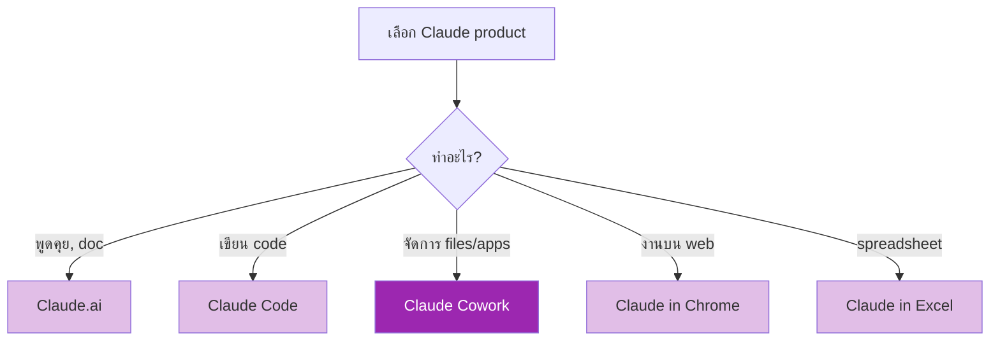

# Day 13: Claude Cowork 🖥️

<div class="lesson-meta">
⏱️ 3 ชั่วโมง &nbsp;|&nbsp; 📊 Intermediate &nbsp;|&nbsp; 📋 Prerequisites: Day 1–12
</div>

## 🎯 Learning Objectives

<ul class="objectives">
<li>เข้าใจว่า Claude Cowork คืออะไร และต่างจาก Claude.ai/Claude Code อย่างไร</li>
<li>ติดตั้งและตั้งค่า Cowork</li>
<li>ใช้ Cowork ทำงานกับ files, folders, desktop apps</li>
<li>เปรียบเทียบกับ Claude in Chrome และ Claude in Excel</li>
</ul>

---

## 1. Claude Cowork คืออะไร?

**Cowork** = desktop tool (beta) ที่ให้ Claude ทำงานกับ **files และ apps บนเครื่องคุณ** เหมาะกับ non-developer ที่ต้องการ automate งาน file/task

```mermaid
graph LR
    A[คุณพูด/พิมพ์<br/>คำสั่ง] --> B[Cowork<br/>Desktop App]
    B --> C[File System]
    B --> D[Desktop Apps<br/>Excel, Word, Browser]
    B --> E[Claude<br/>(API behind)]
    style B fill:#9c27b0,color:#fff
```

### ตัวอย่างคำสั่ง

- "จัด folder Downloads — แยกตาม file type"
- "รวม PDF ทุกใบใน folder นี้เป็นไฟล์เดียว"
- "เปิด invoice ล่าสุด ดึงตัวเลข total แล้วใส่ใน Excel"
- "อ่าน meeting note แล้วสร้าง follow-up email สำหรับทุก action item"

---

## 2. Claude ทั้ง 3 ตระกูล (เปรียบเทียบ)

| Product | สำหรับใคร | จุดเด่น | จุดที่ไม่เหมาะ |
|--------|---------|--------|---------------|
| **Claude.ai** | ทุกคน | สนทนา, document, artifact | งาน OS-level |
| **Claude Code** | Developer | terminal, code agentic | non-dev |
| **Claude Cowork** | Knowledge worker | File/app automation บน desktop | งาน code-heavy |
| **Claude in Chrome** | All | browse + action ใน web (beta) | งาน offline |
| **Claude in Excel** | Analyst | spreadsheet manipulation (beta) | งานนอก spreadsheet |



---

## 3. ติดตั้ง Cowork

!!! info "หมายเหตุ"
    Cowork เป็น beta — ขั้นตอนอัปเดตได้ ดู [docs.claude.com](https://docs.claude.com) เสมอ

ขั้นตอนทั่วไป:

1. ไป [claude.com/cowork](https://claude.com) (หรือเช็ค availability บน account)
2. Download installer (macOS/Windows)
3. Login ด้วย Anthropic account
4. Grant permissions:
   - File system access (เลือก folder ที่ allow)
   - Accessibility (ให้ control แอปอื่นได้)

---

## 4. ตัวอย่างการใช้งาน

### ตัวอย่างที่ 1: File Organization

```
จัด folder ~/Downloads:
- แยกเป็น 5 folders: Documents, Images, Videos, Audio, Archives
- ย้ายไฟล์ตาม extension
- ลบไฟล์ที่ size = 0
- รายงานสรุปจำนวนไฟล์แต่ละประเภท
```

### ตัวอย่างที่ 2: Batch PDF Processing

```
ใน folder ~/Documents/invoices:
- สำหรับทุก PDF
- ดึง: invoice number, date, vendor, total
- รวมเป็น Excel ที่ ~/Documents/invoice_summary.xlsx
- highlight invoice ที่ amount > 50000 ด้วย bold สีแดง
```

### ตัวอย่างที่ 3: Meeting → Email

```
อ่าน meeting-notes-2026-05-21.md
สำหรับทุก action item:
- ระบุ owner
- เขียน follow-up email สั้นๆ ในโทนสุภาพ
- save เป็น draft ใน Outlook (หรือ Mail.app)
```

---

## 5. Best Practices & Safety

| ✅ ควรทำ | ❌ ไม่ควรทำ |
|---------|----------|
| Grant permission เฉพาะ folder ที่ต้องใช้ | Grant full disk access แบบ blanket |
| ดู preview/plan ของ action ก่อน confirm | ปิด confirmation dialogs |
| ทำ backup folder ก่อน batch operations | รัน destructive command บน production data |
| ทดลองกับ test folder ก่อน | ใช้ครั้งแรกกับ folder สำคัญ |

---

## 🛠️ Hands-on Exercise

!!! example "Exercise 1: Organize Downloads"
    ใช้ Cowork จัด folder Downloads ของคุณ (หรือสร้าง test folder)

!!! example "Exercise 2: Photo Albums"
    บอก Cowork: "จัดรูปใน Photos folder แยกตามเดือนถ่าย"
    
    หลังจากเสร็จ — verify ว่าผลลัพธ์ถูก

!!! example "Exercise 3: Compare 3 Tools"
    เลือก 1 งาน ทำ 3 รอบด้วย:
    1. Claude.ai (chat)
    2. Claude Code (CLI)
    3. Claude Cowork (desktop)
    
    เปรียบเทียบ: ใช้เวลานานเท่าไหร่, ผลลัพธ์ต่างกันไหม, เครื่องมือไหนเหมาะกับงานนี้

---

## ✅ Self-Check Quiz

<div class="quiz">

**Q1:** Cowork ต่างจาก Claude Code อย่างไร?

??? success "ดูคำตอบ"
    - **Claude Code**: CLI สำหรับ developer ที่ทำ coding tasks ใน terminal
    - **Claude Cowork**: Desktop tool สำหรับ non-developer จัดการ files + desktop apps

**Q2:** ทำไมต้อง grant permission แค่ folder ที่จำเป็น?

??? success "ดูคำตอบ"
    Principle of least privilege — กัน Cowork (และ Claude) ไม่ให้เข้าถึง/เปลี่ยนแปลงไฟล์สำคัญโดยไม่ตั้งใจ

**Q3:** เมื่อไหร่ใช้ Cowork vs Claude.ai?

??? success "ดูคำตอบ"
    - **Claude.ai**: สนทนา, generate content, single-task analysis
    - **Cowork**: เมื่อต้องการ "ทำ" บน file/app จริงบนเครื่อง — automation, batch ops

</div>

---

## 🔍 Cross-check & References

- 📘 [Anthropic — Cowork](https://docs.claude.com/) (ตรวจ section ล่าสุด)
- 📘 [Claude products overview](https://www.claude.com/)

[ต่อไป → Day 14 :material-arrow-right:](day-14.md){ .md-button .md-button--primary }
