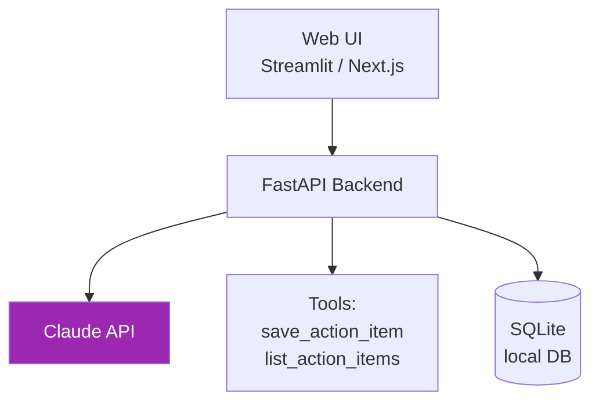

# Day 14: Mini Project — Productivity Assistant ⚡

<div class="lesson-meta">
⏱️ 5 ชั่วโมง &nbsp;|&nbsp; 📊 Project &nbsp;|&nbsp; 📋 Prerequisites: Day 8–13
</div>

## 🎯 Project Goal

สร้าง **Productivity Assistant** ที่:

<ul class="objectives">
<li>Web app (เรียก Claude API)</li>
<li>มี 4 features: Doc Writer, Data Analyzer, Email Drafter, Action Item Tracker</li>
<li>ใช้ tool use สำหรับ Action Item Tracker</li>
<li>Streaming response</li>
<li>Deploy ได้ (local แล้วเลือก Vercel/Railway ถ้าอยาก)</li>
</ul>

---

## 1. Architecture



---

## 2. Tech Stack (เลือกอย่างใดอย่างหนึ่ง)

### Stack A: Python + Streamlit (ง่ายสุด)
- Backend = Streamlit
- DB = SQLite
- เหมาะกับ Solution Architect ที่ไม่อยากตั้ง frontend

### Stack B: FastAPI + Next.js
- Backend = FastAPI
- Frontend = Next.js
- เหมาะกับคน comfortable กับ TypeScript

แนะนำ **Stack A** สำหรับ project นี้

---

## 3. Step-by-Step Build (Stack A)

### Step 1: Setup

```bash
mkdir productivity-assistant && cd productivity-assistant
python -m venv venv
source venv/bin/activate  # mac/linux
# venv\Scripts\activate    # windows

pip install streamlit anthropic python-dotenv
echo "ANTHROPIC_API_KEY=sk-ant-xxx" > .env
```

### Step 2: `app.py` (skeleton)

```python
import streamlit as st
from anthropic import Anthropic
from dotenv import load_dotenv
import sqlite3, json

load_dotenv()
client = Anthropic()

# DB setup
conn = sqlite3.connect("tasks.db", check_same_thread=False)
conn.execute("""CREATE TABLE IF NOT EXISTS tasks
    (id INTEGER PRIMARY KEY, title TEXT, owner TEXT, due TEXT, done INTEGER)""")
conn.commit()

st.set_page_config(page_title="Productivity Assistant", page_icon="⚡")
st.title("⚡ Productivity Assistant")

tab1, tab2, tab3, tab4 = st.tabs(["📝 Doc Writer", "📊 Data Analyzer", "📧 Email Drafter", "✅ Action Tracker"])
```

### Step 3: Doc Writer Tab

```python
with tab1:
    topic = st.text_input("Topic")
    audience = st.selectbox("Audience", ["junior dev", "senior dev", "exec", "customer"])
    if st.button("Generate", key="doc"):
        with st.spinner("กำลังเขียน..."):
            placeholder = st.empty()
            output = ""
            with client.messages.stream(
                model="claude-sonnet-4-6",
                max_tokens=2000,
                system=f"Senior technical writer. Audience: {audience}. ใช้ Markdown + mermaid.",
                messages=[{"role": "user", "content": f"เขียน doc เรื่อง: {topic}"}]
            ) as stream:
                for text in stream.text_stream:
                    output += text
                    placeholder.markdown(output)
            st.download_button("Download .md", output, file_name=f"{topic}.md")
```

### Step 4: Data Analyzer Tab

```python
with tab2:
    uploaded = st.file_uploader("Upload CSV", type="csv")
    question = st.text_area("คำถาม", placeholder="หา top 3 products by revenue")
    if uploaded and st.button("Analyze"):
        import pandas as pd
        df = pd.read_csv(uploaded)
        st.dataframe(df.head())
        
        prompt = f"Dataset columns: {list(df.columns)}\nSample:\n{df.head().to_string()}\n\nคำถาม: {question}\n\nเขียน pandas code (เป็น text เท่านั้น ไม่ต้องรัน) และอธิบายผลลัพธ์ที่คาดหวัง"
        
        resp = client.messages.create(
            model="claude-sonnet-4-6",
            max_tokens=1500,
            messages=[{"role": "user", "content": prompt}]
        )
        st.markdown(resp.content[0].text)
```

### Step 5: Email Drafter Tab

```python
with tab3:
    context = st.text_area("Context (notes / bullet points)")
    tone = st.radio("Tone", ["formal", "friendly", "urgent"])
    if st.button("Draft Email"):
        resp = client.messages.create(
            model="claude-sonnet-4-6",
            max_tokens=800,
            system=f"คุณคือ email writer ระดับมืออาชีพ tone={tone}",
            messages=[{"role": "user", "content": f"Draft email จาก context นี้:\n{context}"}]
        )
        st.text_area("Draft", resp.content[0].text, height=300)
```

### Step 6: Action Tracker Tab (with Tool Use)

```python
TOOLS = [
    {
        "name": "save_action_item",
        "description": "Save action item to DB",
        "input_schema": {
            "type": "object",
            "properties": {
                "title": {"type": "string"},
                "owner": {"type": "string"},
                "due": {"type": "string", "description": "YYYY-MM-DD"}
            },
            "required": ["title", "owner"]
        }
    }
]

def save_action_item(title, owner, due=None):
    conn.execute("INSERT INTO tasks(title, owner, due, done) VALUES (?,?,?,0)",
                 (title, owner, due))
    conn.commit()
    return {"ok": True, "title": title}

with tab4:
    notes = st.text_area("Meeting notes")
    if st.button("Extract Action Items"):
        msgs = [{"role": "user", "content": f"Extract action items จาก notes นี้ แล้วเรียก save_action_item สำหรับแต่ละข้อ:\n{notes}"}]
        
        # Loop until Claude หยุดเรียก tool
        while True:
            resp = client.messages.create(
                model="claude-sonnet-4-6",
                max_tokens=1500,
                tools=TOOLS,
                messages=msgs
            )
            
            if resp.stop_reason != "tool_use":
                break
            
            msgs.append({"role": "assistant", "content": resp.content})
            
            tool_results = []
            for block in resp.content:
                if block.type == "tool_use":
                    result = save_action_item(**block.input)
                    tool_results.append({
                        "type": "tool_result",
                        "tool_use_id": block.id,
                        "content": json.dumps(result)
                    })
            msgs.append({"role": "user", "content": tool_results})
        
        st.success("✅ Saved!")
    
    st.subheader("Action Items")
    rows = conn.execute("SELECT id, title, owner, due, done FROM tasks").fetchall()
    for r in rows:
        st.write(f"- [{'x' if r[4] else ' '}] **{r[1]}** ({r[2]}) — due {r[3] or 'N/A'}")
```

### Step 7: Run

```bash
streamlit run app.py
```

เปิด browser ที่ `http://localhost:8501`

---

## 4. Deliverables

!!! example "ส่งเป็น GitHub repo"
    1. `app.py` ที่รัน 4 tabs ได้
    2. `README.md` — setup, usage, screenshots
    3. `requirements.txt`
    4. `.env.example` (ไม่ commit key จริง!)
    5. Demo video 2 นาที

---

## 5. Scoring Rubric

| เกณฑ์ | คะแนน |
|------|------|
| 4 tabs ทำงานได้ครบ | / 40 |
| Tool use ใน Action Tracker | / 20 |
| Streaming ใน Doc Writer | / 10 |
| Code clean + comments | / 10 |
| README + demo | / 10 |
| Error handling (rate limit, missing key) | / 10 |
| **รวม** | **/ 100** |

---

## 🛠️ Bonus Challenges

!!! tip "Bonus 1: Auth"
    เพิ่ม login ด้วย Streamlit authenticator

!!! tip "Bonus 2: Deploy"
    Deploy บน [Streamlit Cloud](https://streamlit.io/cloud) ฟรี

!!! tip "Bonus 3: Multi-user"
    เพิ่ม user_id ใน DB — แยกข้อมูลแต่ละ user

---

## ✅ Week 2 Self-Check

- [ ] เขียน technical doc ด้วย Claude ได้
- [ ] วิเคราะห์ CSV ด้วย Code Execution
- [ ] สร้าง artifact (HTML/React) ได้
- [ ] เรียก Claude API ใน Python ได้
- [ ] Multi-turn conversation
- [ ] Streaming
- [ ] Tool use เบื้องต้น
- [ ] รู้จัก Cowork

---

## 🔍 Cross-check & References

- 📘 [Streamlit Docs](https://docs.streamlit.io/)
- 📘 [Anthropic Cookbook (GitHub)](https://github.com/anthropics/anthropic-cookbook)

---

:material-check-decagram: **จบ Week 2!** คุณสร้าง app จริงๆ ด้วย Claude แล้ว

[ต่อไป → Week 3: Developer Tools :material-arrow-right:](../week-03/index.md){ .md-button .md-button--primary }
