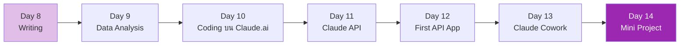

# Week 2: Applied Claude 🛠️

ก้าวจาก "ใช้ Claude เป็น" → "ใช้ Claude ทำงานจริงทุกวัน"

## รายวิชา

| Day | หัวข้อ | สกิลที่ได้ | เวลา |
|-----|--------|-----------|------|
| 8 | Writing & Documentation Workflows | สร้าง doc, report, blog ที่มีคุณภาพ | 3h |
| 9 | Data Analysis & Code Execution | วิเคราะห์ข้อมูล + สร้าง chart | 3h |
| 10 | Coding บน Claude.ai (Artifacts) | สร้าง app ง่ายๆ ใน chat | 3h |
| 11 | Claude API & Console พื้นฐาน | เรียก API ครั้งแรก | 4h |
| 12 | สร้าง App ตัวแรกด้วย Claude API | Python script ที่เรียก Claude | 4h |
| 13 | Claude Cowork | Desktop AI assistant สำหรับ non-dev | 3h |
| 14 | Mini Project: Productivity Assistant | นำทุกอย่างใน Week 2 มาประกอบ | 5h |

## หลังจบ Week 2 คุณจะ

- [x] เขียน technical doc ด้วย Claude ที่อ่านแล้วลื่นไหล
- [x] วิเคราะห์ data + สร้าง dashboard ได้
- [x] เขียน Python script ที่เรียก Claude API ได้
- [x] เข้าใจ pricing, rate limit, model selection
- [x] รู้ว่าเมื่อไหร่ใช้ Claude.ai vs API vs Cowork

[เริ่ม Day 8 :material-arrow-right:](day-08.md){ .md-button .md-button--primary }
