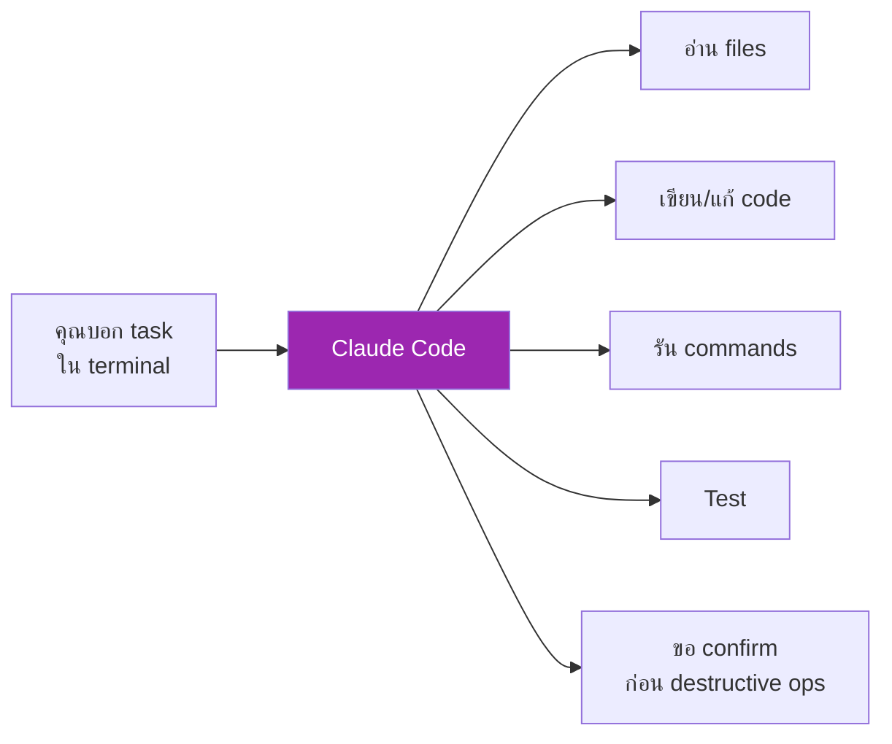

# Day 15: Claude Code — Setup & First Use ⌨️

<div class="lesson-meta">
⏱️ 4 ชั่วโมง &nbsp;|&nbsp; 📊 Intermediate &nbsp;|&nbsp; 📋 Prerequisites: Day 11
</div>

## 🎯 Learning Objectives

<ul class="objectives">
<li>เข้าใจว่า Claude Code คืออะไร และต่างจาก IDE Copilot อย่างไร</li>
<li>ติดตั้ง Claude Code ผ่าน npm</li>
<li>ทำ first coding task แบบ agentic</li>
<li>รู้จัก commands พื้นฐาน (/init, /clear, /memory, /agents)</li>
</ul>

---

## 1. Claude Code คืออะไร?

**Claude Code** = CLI tool ที่ทำงานเหมือนมี **junior engineer ใน terminal** — รับ task แล้วลงมือเอง



### ต่างจาก GitHub Copilot อย่างไร?

| Feature | GitHub Copilot | Claude Code |
|---------|----------------|------------|
| รูปแบบ | IDE plugin (autocomplete) | CLI agentic |
| ทำงานเอง | แนะนำ code (คุณตัดสินใจ) | ลงมือทำเอง multi-step |
| Scope | ไฟล์ที่เปิด | ทั้ง repo |
| Tasks | เขียน function | refactor, debug, add feature, write tests |
| Best for | quick autocomplete | bigger tasks |

---

## 2. ติดตั้ง

### Requirements
- Node.js 20+
- API key จาก Anthropic Console

### Install
```bash
npm install -g @anthropic-ai/claude-code
```

### Verify
```bash
claude --version
```

### ตั้งค่า API key
```bash
export ANTHROPIC_API_KEY="sk-ant-xxx"
# หรือ ใส่ใน ~/.zshrc / ~/.bashrc
```

!!! tip "ตัวเลือก: Claude.ai subscription"
    ถ้ามี Claude Pro/Max plan สามารถ login ผ่าน OAuth แทนใช้ API key ได้ — ราคารวมอยู่ใน subscription

---

## 3. First Run

```bash
cd ~/projects/my-app
claude
```

จะเห็น interactive prompt:

```
> Welcome to Claude Code!
> Working directory: ~/projects/my-app
> Type your task or /help
```

### ทดลอง task ง่ายๆ

```
> สร้างไฟล์ hello.py ที่ print "Hello from Claude Code" และ run มัน
```

Claude Code จะ:
1. สร้าง file
2. ขอ confirm
3. รัน python hello.py
4. รายงานผลลัพธ์

---

## 4. Commands พื้นฐาน

| Command | ใช้ทำอะไร |
|---------|----------|
| `/help` | ดู commands ทั้งหมด |
| `/init` | สร้าง `CLAUDE.md` (project memory) |
| `/clear` | clear context (เริ่มใหม่) |
| `/memory` | จัดการ memory |
| `/agents` | จัดการ subagents (เรียนวันที่ 17) |
| `/model` | เปลี่ยน model (Opus/Sonnet/Haiku) |
| `/cost` | ดู usage และ cost |
| `/exit` | ออก |

---

## 5. ทดลอง Workflow ครั้งแรก

### Scenario: เพิ่ม REST endpoint ใน Express app

```bash
mkdir test-api && cd test-api
npm init -y
npm install express
claude
```

```
> /init
```

Claude จะสร้าง `CLAUDE.md` ที่บันทึก:
- Project structure
- Tech stack
- Conventions

```
> สร้าง Express server ใน server.js
> ที่มี GET /health (return {"ok": true})
> และ POST /echo (return body กลับ)
> มี Jest tests พร้อม
> รัน tests ให้ผ่าน
```

Claude Code จะ:
1. เขียน `server.js`
2. ติดตั้ง dev dependencies (jest, supertest)
3. เขียน `server.test.js`
4. รัน `npm test`
5. ถ้า fail → debug + fix + run again
6. รายงานสรุป

---

## 6. ขอ Permission Pattern

Claude Code จะ **ขอ confirm** ก่อนทำ destructive operations:

```
Claude wants to run: rm -rf node_modules
[a]llow once | [d]eny | [y]es, always allow this command
```

!!! warning "ระวัง"
    อย่ากด "y, always allow" สำหรับคำสั่งที่ destructive โดยไม่ตั้งใจ — ตั้ง granular ตาม command

---

## 7. CLAUDE.md (Project Memory)

`CLAUDE.md` = file ที่ Claude Code อ่านทุกครั้งที่เริ่ม session มี:

```markdown
# Project: my-app

## Stack
- Node.js 20
- Express 4
- Jest for testing

## Conventions
- Use ESM (import/export, not require)
- Tests in `*.test.js`
- Lint with ESLint + Prettier

## Important
- Database = PostgreSQL on port 5432
- Don't commit `.env`
```

→ ครั้งต่อไป Claude Code จะ "รู้" project ของคุณโดยไม่ต้องอธิบายซ้ำ

---

## 🛠️ Hands-on Exercise

!!! example "Exercise 1: Install + First Task"
    1. ติดตั้ง Claude Code
    2. สร้าง folder ใหม่ → รัน `claude`
    3. ทำ task: "สร้าง Python script ที่ download wikipedia page และนับคำที่ unique"
    4. ดูว่า Claude ทำกี่ steps

!!! example "Exercise 2: Existing Repo"
    เปิด project เก่าของคุณ → รัน:
    ```
    /init
    > วิเคราะห์ project นี้ และเสนอ improvements 3 อย่าง
    ```

!!! example "Exercise 3: Compare Models"
    รัน task เดียวกัน 3 รอบ ด้วย Haiku, Sonnet, Opus
    
    เปรียบเทียบ: เวลา, จำนวน steps, คุณภาพ, cost

---

## ✅ Self-Check Quiz

<div class="quiz">

**Q1:** Claude Code ต่างจาก IDE autocomplete อย่างไร?

??? success "ดูคำตอบ"
    Claude Code เป็น **agentic** — ลงมือทำ multi-step tasks เอง (อ่าน, เขียน, รัน, test) ไม่ใช่แค่แนะนำ code ทีละบรรทัด

**Q2:** `CLAUDE.md` คืออะไร?

??? success "ดูคำตอบ"
    Project memory file ที่ Claude Code อ่านทุก session — บอก project structure, stack, conventions ให้ Claude รู้

**Q3:** ทำไม Claude Code ต้องขอ confirm ก่อน destructive operations?

??? success "ดูคำตอบ"
    Safety — ลบไฟล์, rm -rf, drop database เป็นการกระทำ irreversible ต้องให้ผู้ใช้รับรู้และอนุมัติก่อน

</div>

---

## 🔍 Cross-check & References

- 📘 [Claude Code Documentation](https://docs.claude.com/en/docs/claude-code/overview)
- 📺 [Claude Code Quickstart](https://www.youtube.com/@anthropic-ai)
- 📘 [CLAUDE.md best practices](https://docs.claude.com/en/docs/claude-code/memory)

[ต่อไป → Day 16 :material-arrow-right:](day-16.md){ .md-button .md-button--primary }
