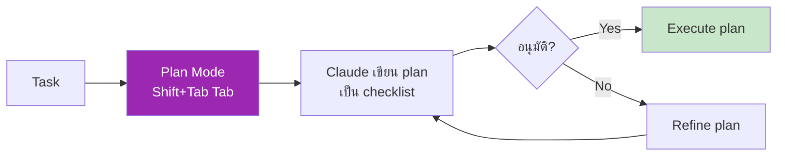
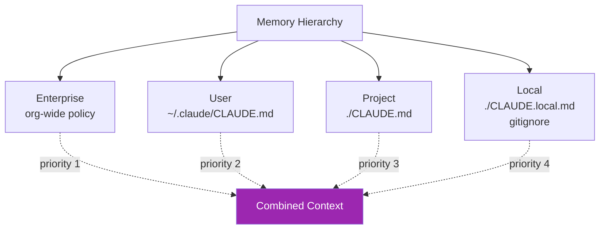

# Day 16: Claude Code — Advanced 🧙

<div class="lesson-meta">
⏱️ 4 ชั่วโมง &nbsp;|&nbsp; 📊 Advanced &nbsp;|&nbsp; 📋 Prerequisites: Day 15
</div>

## 🎯 Learning Objectives

<ul class="objectives">
<li>ใช้ Plan Mode — วางแผนก่อนเขียน code</li>
<li>จัดการ Memory layers (project / user / session)</li>
<li>ใช้ Hooks — automate การตรวจสอบก่อน/หลัง action</li>
<li>เขียน Custom slash commands</li>
<li>ใช้ Headless mode ใน CI/CD</li>
</ul>

---

## 1. Plan Mode — คิดก่อนทำ

**ปัญหา:** บางครั้ง Claude Code "พุ่ง" ทำเลย → ทำผิด → ต้องแก้

**Plan Mode** บังคับให้ Claude **เขียนแผน** ก่อน → ขออนุมัติ → ค่อยลงมือ



### ทำให้เข้า Plan Mode

ใน Claude Code prompt กด `Shift+Tab Tab` (2 ครั้ง) จะเห็น:

```
[plan mode] >
```

ใส่ task — Claude จะแสดง plan แต่ยังไม่ลงมือ

### ตัวอย่าง

```
[plan mode] > refactor src/auth.py
- แยก class AuthService ออกจาก endpoints
- เพิ่ม unit tests
- ใช้ pytest fixtures
```

Claude จะตอบ plan แบบ:

```markdown
## Plan
1. Read src/auth.py → understand current structure
2. Identify endpoint handlers vs business logic
3. Create src/services/auth_service.py
4. Move logic into AuthService class
5. Update endpoints to call AuthService
6. Write tests/test_auth_service.py with pytest
7. Run pytest → verify all green

**Estimated tool calls:** 12
**Files to modify:** 3
**Files to create:** 2
```

→ คุณอ่าน plan → กด Enter อนุมัติ → Claude ลงมือ

---

## 2. Memory Layers

Claude Code มี memory 3 ระดับ:



### `~/.claude/CLAUDE.md` (User-level)

ใส่ preference ส่วนตัวที่ใช้ทุก project:

```markdown
# Personal Preferences

- ตอบเป็นภาษาไทยผสมศัพท์เทคนิคอังกฤษ
- ใช้ TypeScript ดีกว่า JavaScript เสมอ
- เขียน comment เฉพาะที่จำเป็น ไม่ใส่ comment อธิบายสิ่งที่ obvious
- Prefer ES modules over CommonJS
```

### `./CLAUDE.md` (Project-level, commit)

```markdown
# Project: payment-service

## Stack
- Python 3.12, FastAPI, PostgreSQL, Redis
- Pytest for tests, Black for formatting

## Architecture
- Hexagonal (ports & adapters)
- src/domain/ — core logic, no external deps
- src/adapters/ — DB, HTTP, message bus

## Don't
- Don't commit secrets
- Don't bypass Pydantic validation
- Don't add dependencies without team approval
```

### `./CLAUDE.local.md` (Personal in project, gitignored)

```markdown
# Local notes

- My test DB password is in .env.local
- Tunnel to staging: `ssh -L 5432:db:5432 jump-host`
```

### `/memory` command

```
> /memory
```

แสดง memory layers ที่ active

---

## 3. Hooks — Automation รอบ action

Hooks = scripts ที่ run อัตโนมัติก่อน/หลัง Claude ทำ action เช่น:

- ก่อน edit file → check ว่าไม่ใช่ protected file
- หลัง edit Python → run `black` format
- หลัง commit → run linter
- ก่อนรัน destructive command → backup

### ติดตั้ง Hook

สร้าง `.claude/hooks.json` ใน project:

```json
{
  "hooks": {
    "PostToolUse": [
      {
        "matcher": {"tool_name": "str_replace", "file_paths": ["*.py"]},
        "command": "black {file_path}"
      },
      {
        "matcher": {"tool_name": "str_replace", "file_paths": ["*.ts", "*.tsx"]},
        "command": "prettier --write {file_path}"
      }
    ],
    "PreToolUse": [
      {
        "matcher": {"tool_name": "bash", "command_pattern": "rm -rf"},
        "command": "echo 'BLOCKED: rm -rf'",
        "block": true
      }
    ]
  }
}
```

!!! warning "ตรวจ syntax กับ docs"
    Hooks API อัปเดตได้ — ดู [Claude Code Hooks docs](https://docs.claude.com/en/docs/claude-code/hooks) เสมอ

---

## 4. Custom Slash Commands

สร้าง `.claude/commands/` ใน project:

`./claude/commands/review.md`:
```markdown
# /review

ทำ code review บน last commit:
1. Run `git diff HEAD~1`
2. ตรวจสอบ:
   - Security vulnerabilities
   - Performance issues
   - Test coverage
3. ตอบเป็น checklist + suggested fixes
```

→ ใน Claude Code:
```
> /review
```

→ Claude run ตาม template

---

## 5. Headless Mode (CI/CD)

รัน Claude Code แบบไม่ interactive — เหมาะกับ pipeline

```bash
claude --headless --prompt "Run tests, fix any failures, commit if green"
```

### ตัวอย่าง GitHub Actions

```yaml
name: AI Code Review
on: [pull_request]
jobs:
  review:
    runs-on: ubuntu-latest
    steps:
      - uses: actions/checkout@v4
      - run: npm install -g @anthropic-ai/claude-code
      - run: |
          claude --headless --prompt "
          Review the PR diff. Comment on:
          - Security issues
          - Bug risks
          - Style violations
          Output as GitHub-flavored markdown.
          " > review.md
        env:
          ANTHROPIC_API_KEY: ${{ secrets.ANTHROPIC_API_KEY }}
      - uses: actions/github-script@v7
        with:
          script: |
            const fs = require('fs');
            const body = fs.readFileSync('review.md', 'utf8');
            github.rest.issues.createComment({
              issue_number: context.issue.number,
              owner: context.repo.owner,
              repo: context.repo.repo,
              body
            });
```

---

## 🛠️ Hands-on Exercise

!!! example "Exercise 1: Plan Mode"
    ลอง refactor function ใหญ่ๆ ของคุณ ใน Plan Mode → อ่าน plan → ปรับ plan → execute

!!! example "Exercise 2: Memory Setup"
    1. สร้าง `~/.claude/CLAUDE.md` ใส่ personal preferences
    2. สร้าง `./CLAUDE.md` ใน project ใส่ stack & conventions
    3. ทดสอบ — บอก Claude Code ทำ task → ดูว่าตามที่ระบุไหม

!!! example "Exercise 3: Custom Command"
    สร้าง `/security-audit` ที่:
    - Scan dependencies for CVEs
    - หา hardcoded secrets
    - Suggest fixes

!!! example "Exercise 4: GitHub Actions"
    Setup workflow ที่ใช้ Claude Code comment บน PR เมื่อมี diff

---

## ✅ Self-Check Quiz

<div class="quiz">

**Q1:** เมื่อไหร่ควรใช้ Plan Mode?

??? success "ดูคำตอบ"
    เมื่องาน:
    - Multi-step ซับซ้อน (refactor, migration)
    - Touch หลาย files
    - ต้องการให้ทีม review approach ก่อน
    - มี risk ของการทำผิดแล้วต้อง revert

**Q2:** ความต่างระหว่าง `CLAUDE.md` และ `CLAUDE.local.md`?

??? success "ดูคำตอบ"
    - **CLAUDE.md** = project-level, commit ลง git, share กับทีม
    - **CLAUDE.local.md** = personal notes ใน project นั้น, gitignored

**Q3:** Hooks ใช้ทำอะไร?

??? success "ดูคำตอบ"
    Automate การกระทำก่อน/หลัง Claude เรียก tool — เช่น format code อัตโนมัติ, block dangerous commands, run linter

**Q4:** Headless mode ใช้ที่ไหน?

??? success "ดูคำตอบ"
    CI/CD pipelines, automated jobs, scheduled tasks ที่ไม่มีคน sit watching

</div>

---

## 🔍 Cross-check & References

- 📘 [Claude Code — Memory](https://docs.claude.com/en/docs/claude-code/memory)
- 📘 [Claude Code — Hooks](https://docs.claude.com/en/docs/claude-code/hooks)
- 📘 [Claude Code — Slash Commands](https://docs.claude.com/en/docs/claude-code/slash-commands)
- 📘 [Claude Code in CI/CD](https://docs.claude.com/en/docs/claude-code/headless)

[ต่อไป → Day 17 :material-arrow-right:](day-17.md){ .md-button .md-button--primary }
