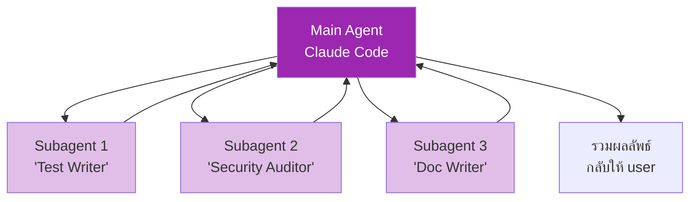
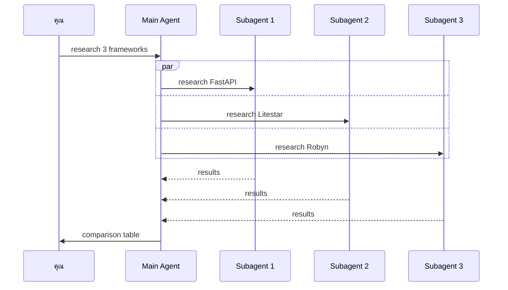

# Day 17: Subagents 🪆

<div class="lesson-meta">
⏱️ 3 ชั่วโมง &nbsp;|&nbsp; 📊 Advanced &nbsp;|&nbsp; 📋 Prerequisites: Day 16
</div>

## 🎯 Learning Objectives

<ul class="objectives">
<li>เข้าใจว่า Subagent คืออะไร</li>
<li>เห็นความต่างกับ "เปิดอีก chat"</li>
<li>Configure subagent ที่มี persona เฉพาะ</li>
<li>รู้ pattern: parallel research, specialist roles, scoped context</li>
</ul>

---

## 1. Subagent คืออะไร?

**Subagent** = agent ตัวลูกที่ agent หลักเรียกออกไปทำ task เฉพาะ — มี **context window แยก** และ **persona/tools แตกต่าง**



### ทำไมไม่ "เปิดอีก chat แทน"?

| Subagent | เปิดอีก chat |
|---------|------------|
| Main agent control flow | คนต้อง coordinate เอง |
| Run **parallel** ได้ | Sequential |
| Share project memory | คนต้อง re-paste context |
| Spawn ในระหว่าง task | ต้อง switch tab |

---

## 2. เมื่อไหร่ควรใช้ Subagent?

### ✅ Use cases ที่ดี

1. **Parallel research** — "ดู repo 3 อันพร้อมกัน หาตัวอย่าง implementation pattern"
2. **Specialist roles** — task ต้องใช้ persona เฉพาะ (security, performance, accessibility)
3. **Long task with sub-questions** — main agent ไม่เสีย context กับรายละเอียดยิบย่อย
4. **Verification step** — main agent เขียน → subagent ตรวจสอบ

### ❌ ไม่ควรใช้

- Task ง่ายๆ ที่ main agent ทำได้
- Task ที่ต้องการ shared state ต่อเนื่อง
- เพิ่ม subagent เพราะ "ดูเท่" โดยไม่จำเป็น → เพิ่ม cost ไม่จำเป็น

---

## 3. Configure Subagent ใน Claude Code

### โครงสร้าง

`./.claude/agents/security-auditor.md`:

```markdown
---
name: security-auditor
description: ตรวจสอบ security vulnerabilities ใน code
tools: [Read, Grep, Bash]
---

You are a senior security engineer. When given code or a repo:

1. Scan for:
   - SQL injection
   - Hardcoded secrets / API keys
   - Weak crypto (MD5, SHA1)
   - Auth/authz issues
   - Input validation gaps
   - Unsafe deserialization

2. Output:
   - Severity (Critical/High/Medium/Low)
   - File:line reference
   - Suggested fix (code snippet)

3. Do NOT modify files — only report.
```

### เรียก subagent

```
> ตรวจ src/auth.py ด้วย security-auditor
```

หรือ Claude Code อาจ auto-delegate ถ้า matched description

### View / Manage

```
> /agents
```

แสดง subagents ที่มี

---

## 4. ตัวอย่าง: Parallel Research

```
> ใช้ 3 subagents พร้อมกัน:
> 1. research-1: หาว่า FastAPI ใช้ async อย่างไร
> 2. research-2: หาว่า Litestar ใช้ async อย่างไร  
> 3. research-3: หาว่า Robyn ใช้ async อย่างไร
> รวมเป็นตาราง comparison
```

Main agent spawn 3 subagents พร้อมกัน → รอผลลัพธ์ → รวม → ตอบ



---

## 5. Best Practices

| ✅ Do | ❌ Don't |
|------|---------|
| Subagent มี description ชัด → main agent เลือกถูก | description คลุมเครือ |
| จำกัด tools ที่ subagent ใช้ได้ (least privilege) | give all tools |
| Subagent คืน structured output | คืน free-form ยาวๆ |
| Test subagent แยกก่อน | spawn ในงานสำคัญทันที |
| ใช้ Haiku/Sonnet เป็น subagent → คุม cost | ใช้ Opus เสมอ |

---

## 6. Cost Consideration

Subagent มี cost แยก! แต่ละ subagent = new conversation = new tokens

**ตัวอย่าง:**
- Main agent (Opus): 10K tokens × 5 turns
- 3 subagents (Sonnet): 3K tokens × 1 turn each

→ คุม cost: ใช้ model ถูกกว่าใน subagent ที่ทำ task ง่าย

---

## 🛠️ Hands-on Exercise

!!! example "Exercise 1: สร้าง 3 Subagents"
    ใน project ของคุณ สร้าง:
    
    1. `test-writer` — เขียน unit tests
    2. `doc-writer` — เขียน docstring + README sections
    3. `code-reviewer` — review code style + best practices

!!! example "Exercise 2: Parallel Research"
    ขอ Claude Code:
    > "ใช้ subagents เปรียบเทียบ 3 message queue (Kafka, RabbitMQ, NATS) — ดึงจาก official docs"

!!! example "Exercise 3: Verification Pattern"
    Workflow:
    1. Main agent เขียน feature
    2. Spawn `code-reviewer` subagent → ตรวจ
    3. Spawn `test-writer` subagent → เขียน tests
    4. Main agent รัน tests + report

---

## ✅ Self-Check Quiz

<div class="quiz">

**Q1:** Subagent vs new chat ต่างกันที่อะไร?

??? success "ดูคำตอบ"
    Subagent ถูก spawn โดย main agent ใน task เดียวกัน, run parallel ได้, share project memory; new chat ต้อง coordinate เอง

**Q2:** ทำไมต้องจำกัด tools ของ subagent?

??? success "ดูคำตอบ"
    Principle of least privilege — Subagent ที่อ่านอย่างเดียว ไม่ควรมี write tool; ลด blast radius ถ้า prompt injection

**Q3:** ควรใช้ model อะไรใน subagent?

??? success "ดูคำตอบ"
    เริ่มจาก Haiku/Sonnet — เปลี่ยนเป็น Opus เฉพาะถ้า task ซับซ้อนพอ ใช้ cheaper model เพื่อ scale parallel calls

</div>

---

## 🔍 Cross-check & References

- 📘 [Claude Code — Subagents](https://docs.claude.com/en/docs/claude-code/sub-agents)
- 📘 [Anthropic — Building Effective Agents](https://www.anthropic.com/research/building-effective-agents)

[ต่อไป → Day 18: MCP :material-arrow-right:](day-18.md){ .md-button .md-button--primary }
