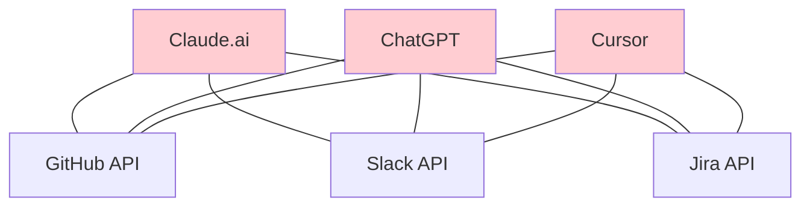
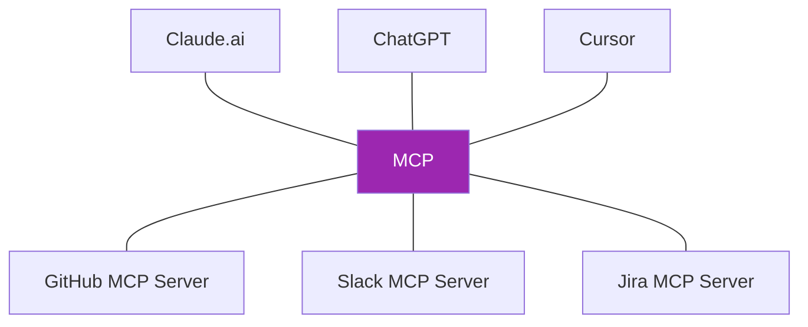
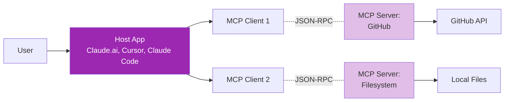
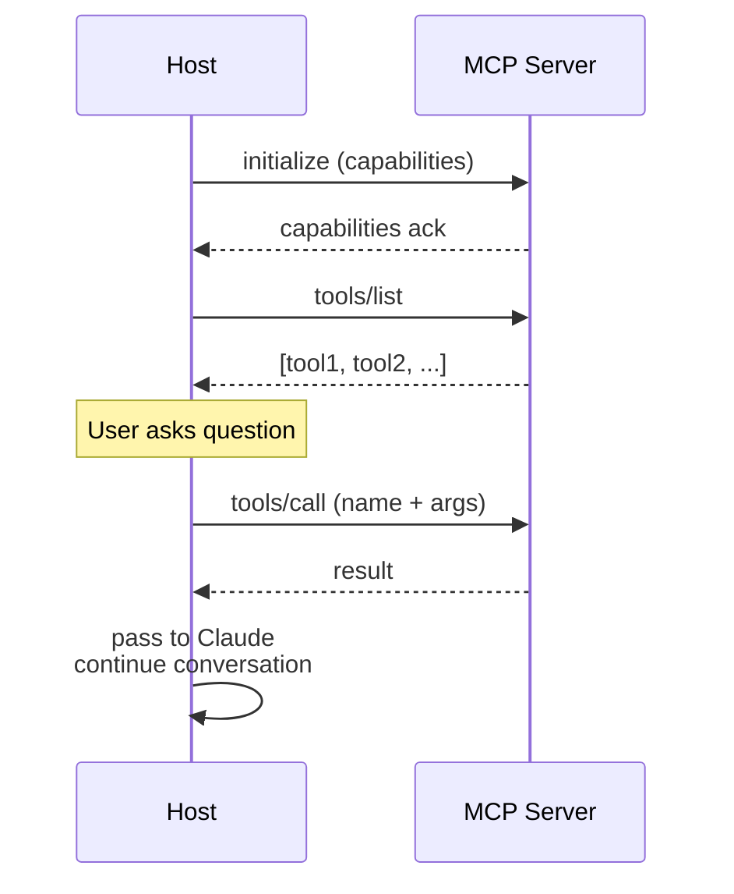

# Day 18: MCP Fundamentals 🔌

<div class="lesson-meta">
⏱️ 3 ชั่วโมง &nbsp;|&nbsp; 📊 Intermediate &nbsp;|&nbsp; 📋 Prerequisites: Day 12 (Tool Use)
</div>

## 🎯 Learning Objectives

<ul class="objectives">
<li>เข้าใจปัญหาที่ MCP มาแก้</li>
<li>เข้าใจ architecture: Host, Client, Server</li>
<li>รู้จัก primitives: Tools, Resources, Prompts</li>
<li>เห็นภาพ data flow ผ่าน MCP</li>
</ul>

---

## 1. ปัญหาก่อนมี MCP

ก่อน MCP — ทุก AI app ต้องเขียน integration ของตัวเอง:



→ **N × M problem** — N AI apps × M tools = N×M integrations

### MCP แก้ปัญหา



→ **N + M problem** — เขียน MCP server ครั้งเดียว ใช้ได้ทุก AI app

---

## 2. MCP คืออะไร?

**Model Context Protocol (MCP)** = open protocol โดย Anthropic (Nov 2024) เพื่อให้ AI ต่อกับ tools/data ในมาตรฐานเดียวกัน — เหมือน "USB-C for AI"

- **Open standard** — spec ที่ใครๆ ก็ implement ได้
- **Bidirectional** — server ส่ง notification กลับ client ได้
- **Stateful** — รักษา session
- **Type-safe** — schema-based

---

## 3. Architecture: Host / Client / Server



| Component | Role |
|-----------|------|
| **Host** | App ที่ user ใช้ (Claude.ai, Claude Code, Cursor) |
| **Client** | Library ใน Host ที่คุยกับ Server (1:1 กับ server) |
| **Server** | Process ที่ expose tools/data — เขียนโดย dev คนใดก็ได้ |

---

## 4. MCP Primitives — 3 ของหลัก

### 4.1 Tools (Functions ให้ AI เรียก)

เหมือน function calling ใน API — แต่ standardize

```json
{
  "name": "create_issue",
  "description": "Create a GitHub issue",
  "inputSchema": {
    "type": "object",
    "properties": {
      "repo": {"type": "string"},
      "title": {"type": "string"},
      "body": {"type": "string"}
    },
    "required": ["repo", "title"]
  }
}
```

### 4.2 Resources (Data ที่ AI อ่าน)

```json
{
  "uri": "file:///project/README.md",
  "name": "Project README",
  "mimeType": "text/markdown"
}
```

→ AI อ่าน README โดยไม่ต้องเรียก tool

### 4.3 Prompts (Templates สำเร็จรูป)

```json
{
  "name": "review_pr",
  "description": "Review a pull request",
  "arguments": [
    {"name": "pr_number", "required": true}
  ]
}
```

→ ผู้ใช้เลือก prompt จาก dropdown → server ประกอบเป็น prompt ให้

---

## 5. Transport — สอง modes

### 5.1 stdio (local)

Server run เป็น child process ของ Host

```
Host ──stdin/stdout──> MCP Server (local process)
```

ใช้สำหรับ tools ที่ run บนเครื่องเดียวกัน (filesystem, git)

### 5.2 HTTP/SSE (remote)

```
Host ──HTTPS + SSE──> MCP Server (remote URL)
```

ใช้สำหรับ SaaS integrations (GitHub MCP, Slack MCP, hosted services)

---

## 6. Lifecycle



---

## 7. Why ต่างจาก plain API/SDK?

| Concern | Plain API | MCP |
|---------|-----------|-----|
| Discovery | คน อ่าน docs เอง | AI ขอ list ผ่าน `tools/list` |
| Auth | each API แตกต่าง | Standard OAuth/token flow |
| Multi-step | คนเขียน orchestration | AI เรียกอัตโนมัติ |
| Switch host | rewrite | reuse server |
| Permissions | API key scope | Per-tool consent |

---

## 🛠️ Hands-on Exercise

!!! example "Exercise 1: MCP Server Registry"
    Browse [MCP Servers list](https://github.com/modelcontextprotocol/servers)
    
    เลือก 5 servers ที่น่าจะใช้ในงานคุณ — note ไว้ลง CLAUDE.md

!!! example "Exercise 2: เปรียบเทียบ Architecture"
    วาด diagram (Mermaid):
    - Without MCP: 3 AI apps × 3 tools
    - With MCP: เหมือนเดิม แต่ผ่าน MCP layer

!!! example "Exercise 3: Reading Spec"
    เปิด [MCP Spec](https://modelcontextprotocol.io/specification) → อ่าน Tools section
    
    ตอบ:
    - tool schema field ใดบ้างที่จำเป็น?
    - tools/call response format คืออะไร?

---

## ✅ Self-Check Quiz

<div class="quiz">

**Q1:** ปัญหาหลักที่ MCP แก้?

??? success "ดูคำตอบ"
    N × M integration problem — ทุก AI app เคยต้องเขียน integration กับทุก tool แยกกัน MCP ทำให้เขียน server ครั้งเดียวใช้ได้ทุก AI

**Q2:** Tool vs Resource ต่างกันอย่างไร?

??? success "ดูคำตอบ"
    - **Tool**: function ที่ AI **เรียกทำ action** (side effect)
    - **Resource**: data ที่ AI **อ่าน** (read-only context)

**Q3:** เมื่อไหร่ใช้ stdio vs HTTP transport?

??? success "ดูคำตอบ"
    - **stdio**: local tool, run บนเครื่อง user (filesystem, git, sqlite)
    - **HTTP**: remote/SaaS service (GitHub, Slack, hosted API)

**Q4:** Host, Client, Server หมายถึงอะไร?

??? success "ดูคำตอบ"
    - **Host**: App ที่ user ใช้ (Claude.ai, IDE)
    - **Client**: library ใน Host ที่คุย MCP (1:1 with server)
    - **Server**: process แยกที่ expose tools/data

</div>

---

## 🔍 Cross-check & References

- 📘 [Model Context Protocol — Official](https://modelcontextprotocol.io/)
- 📘 [MCP Specification](https://modelcontextprotocol.io/specification)
- 📦 [MCP Servers (GitHub)](https://github.com/modelcontextprotocol/servers)
- 📺 [Anthropic — Introducing MCP](https://www.anthropic.com/news/model-context-protocol)

[ต่อไป → Day 19 :material-arrow-right:](day-19.md){ .md-button .md-button--primary }
