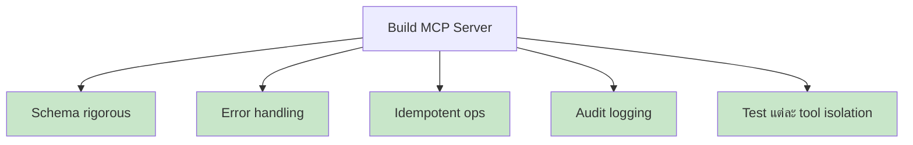

# Day 20: สร้าง MCP Server เอง 🏗️

<div class="lesson-meta">
⏱️ 5 ชั่วโมง &nbsp;|&nbsp; 📊 Advanced &nbsp;|&nbsp; 📋 Prerequisites: Day 18, 19
</div>

## 🎯 Learning Objectives

<ul class="objectives">
<li>Setup Python MCP SDK</li>
<li>เขียน Tools, Resources, Prompts</li>
<li>Test ด้วย MCP Inspector</li>
<li>Connect กับ Claude Desktop / Claude Code</li>
</ul>

---

## 1. Project: "Notes MCP Server"

**Goal:** MCP server ที่จัดการ note ส่วนตัวใน SQLite

**Tools:**
- `create_note(title, body, tags)`
- `search_notes(query)`
- `get_note(id)`
- `delete_note(id)`

**Resources:**
- `notes://recent` — note ล่าสุด 10 อัน

**Prompts:**
- `summarize_notes(tag)` — สรุป notes ตาม tag

---

## 2. Setup

```bash
mkdir notes-mcp && cd notes-mcp
python -m venv venv
source venv/bin/activate
pip install mcp
```

โครงสร้าง:
```
notes-mcp/
├── server.py
├── db.py
├── pyproject.toml
└── notes.db   (สร้างอัตโนมัติ)
```

---

## 3. `db.py` — SQLite layer

```python
import sqlite3
from contextlib import contextmanager

DB_PATH = "notes.db"

def init_db():
    conn = sqlite3.connect(DB_PATH)
    conn.execute("""CREATE TABLE IF NOT EXISTS notes (
        id INTEGER PRIMARY KEY AUTOINCREMENT,
        title TEXT NOT NULL,
        body TEXT NOT NULL,
        tags TEXT,
        created_at TIMESTAMP DEFAULT CURRENT_TIMESTAMP
    )""")
    conn.commit()
    conn.close()

@contextmanager
def get_conn():
    conn = sqlite3.connect(DB_PATH)
    conn.row_factory = sqlite3.Row
    try:
        yield conn
    finally:
        conn.close()

def create_note(title, body, tags=""):
    with get_conn() as c:
        cur = c.execute("INSERT INTO notes (title, body, tags) VALUES (?,?,?)",
                        (title, body, tags))
        c.commit()
        return cur.lastrowid

def search_notes(query):
    with get_conn() as c:
        rows = c.execute(
            "SELECT * FROM notes WHERE title LIKE ? OR body LIKE ? OR tags LIKE ?",
            (f"%{query}%", f"%{query}%", f"%{query}%")
        ).fetchall()
        return [dict(r) for r in rows]

def get_note(note_id):
    with get_conn() as c:
        row = c.execute("SELECT * FROM notes WHERE id=?", (note_id,)).fetchone()
        return dict(row) if row else None

def delete_note(note_id):
    with get_conn() as c:
        c.execute("DELETE FROM notes WHERE id=?", (note_id,))
        c.commit()
        return c.total_changes > 0

def recent_notes(limit=10):
    with get_conn() as c:
        rows = c.execute(
            "SELECT * FROM notes ORDER BY created_at DESC LIMIT ?",
            (limit,)
        ).fetchall()
        return [dict(r) for r in rows]

def notes_by_tag(tag):
    with get_conn() as c:
        rows = c.execute(
            "SELECT * FROM notes WHERE tags LIKE ?",
            (f"%{tag}%",)
        ).fetchall()
        return [dict(r) for r in rows]
```

---

## 4. `server.py` — MCP Server

```python
import json
from mcp.server.fastmcp import FastMCP
import db

db.init_db()
mcp = FastMCP("notes")

# ---------- Tools ----------
@mcp.tool()
def create_note(title: str, body: str, tags: str = "") -> str:
    """Create a new note.
    
    Args:
        title: Note title
        body: Note content (markdown supported)
        tags: Comma-separated tags
    """
    note_id = db.create_note(title, body, tags)
    return f"✅ Created note #{note_id}: {title}"

@mcp.tool()
def search_notes(query: str) -> str:
    """Search notes by title, body, or tag."""
    results = db.search_notes(query)
    if not results:
        return "No notes found."
    return json.dumps(results, indent=2, default=str)

@mcp.tool()
def get_note(note_id: int) -> str:
    """Get a single note by ID."""
    note = db.get_note(note_id)
    return json.dumps(note, indent=2, default=str) if note else "Not found"

@mcp.tool()
def delete_note(note_id: int) -> str:
    """Delete a note. ⚠️ irreversible."""
    ok = db.delete_note(note_id)
    return f"Deleted #{note_id}" if ok else "Not found"

# ---------- Resources ----------
@mcp.resource("notes://recent")
def recent_notes():
    """Recent 10 notes."""
    return json.dumps(db.recent_notes(10), indent=2, default=str)

@mcp.resource("notes://tag/{tag}")
def notes_by_tag(tag: str):
    """All notes with a specific tag."""
    return json.dumps(db.notes_by_tag(tag), indent=2, default=str)

# ---------- Prompts ----------
@mcp.prompt()
def summarize_notes(tag: str) -> str:
    """Generate a prompt to summarize notes with a given tag."""
    notes = db.notes_by_tag(tag)
    notes_text = "\n\n".join(f"### {n['title']}\n{n['body']}" for n in notes)
    return f"สรุป notes ต่อไปนี้ (tag={tag}) เป็น executive summary 200 คำ:\n\n{notes_text}"

if __name__ == "__main__":
    mcp.run()
```

---

## 5. ทดสอบด้วย MCP Inspector

```bash
npx @modelcontextprotocol/inspector python server.py
```

เปิด browser → ทดลอง:
1. List tools → เห็น 4 tools
2. Call `create_note` → ใส่ title, body
3. Call `search_notes` → ดูผลลัพธ์
4. List resources → เห็น `notes://recent`

---

## 6. เชื่อม Claude Code

แก้ `~/.claude/mcp.json`:

```json
{
  "mcpServers": {
    "notes": {
      "command": "python",
      "args": ["/path/to/notes-mcp/server.py"]
    }
  }
}
```

Restart Claude Code → ทดลอง:

```
> สร้าง note ชื่อ "MCP learning Day 20" 
> body = "วันนี้สร้าง MCP server ของตัวเองเสร็จ!"
> tags = mcp,learning,milestone
```

```
> ค้นหา notes ที่มี tag = learning
```

---

## 7. เชื่อม Claude Desktop (Claude.ai App)

เปิด config file:
- macOS: `~/Library/Application Support/Claude/claude_desktop_config.json`
- Windows: `%APPDATA%\Claude\claude_desktop_config.json`

ใส่ MCP server config เดียวกัน → Restart app

---

## 8. Best Practices



| Practice | ทำไม |
|---------|------|
| **Schema rigorous** | AI ใช้ schema เพื่อตัดสินใจ ส่ง type/required ที่ถูก |
| **Error handling** | Return user-friendly error message, ไม่ใช่ stack trace |
| **Idempotent** | `create_user_v2(email)` ถ้า email มีอยู่ → return existing แทน duplicate |
| **Audit logging** | Log ทุก tool call เพื่อ debug + security |
| **Test isolation** | ใช้ Inspector test ก่อน plug เข้า Claude |

---

## 🛠️ Hands-on Exercise

!!! example "Exercise 1: Complete the Server"
    Implement notes-mcp ตาม code ข้างบน → ทดสอบกับ Inspector

!!! example "Exercise 2: เพิ่ม Update tool"
    เพิ่ม `update_note(note_id, title, body, tags)` — partial update OK

!!! example "Exercise 3: สร้าง MCP ของคุณเอง"
    คิด domain ที่คุณใช้บ่อย แล้วสร้าง MCP เช่น:
    - **Tasks MCP** — เชื่อมกับ TickTick / Todoist API
    - **AWS MCP** — list resources, cost analysis
    - **K8s MCP** — get pods, logs, events

!!! example "Exercise 4: Publish"
    Push notes-mcp ขึ้น GitHub พร้อม README + install instructions

---

## ✅ Self-Check Quiz

<div class="quiz">

**Q1:** ความต่างระหว่าง Tool และ Resource ใน MCP?

??? success "ดูคำตอบ"
    - **Tool**: action (อาจมี side effect) — AI เรียกเมื่อจำเป็น
    - **Resource**: data ที่อ่านได้ (read-only context) — Host อาจ pre-load ให้ AI

**Q2:** ทำไมต้อง schema rigorous?

??? success "ดูคำตอบ"
    AI ใช้ schema เพื่อตัดสินใจว่าจะเรียก tool ไหน + ส่ง argument อะไร schema ไม่ดี → AI สับสน → ผลลัพธ์ผิด

**Q3:** MCP Inspector ใช้ทำอะไร?

??? success "ดูคำตอบ"
    GUI สำหรับ test MCP server แบบ standalone — เห็น tools/resources/prompts ที่ expose, ทดสอบเรียกได้ก่อน plug เข้า Claude

</div>

---

## 🔍 Cross-check & References

- 📘 [MCP Python SDK](https://github.com/modelcontextprotocol/python-sdk)
- 📘 [MCP Build Servers Guide](https://modelcontextprotocol.io/quickstart/server)
- 🛠️ [MCP Inspector](https://github.com/modelcontextprotocol/inspector)

[ต่อไป → Day 21 :material-arrow-right:](day-21.md){ .md-button .md-button--primary }
