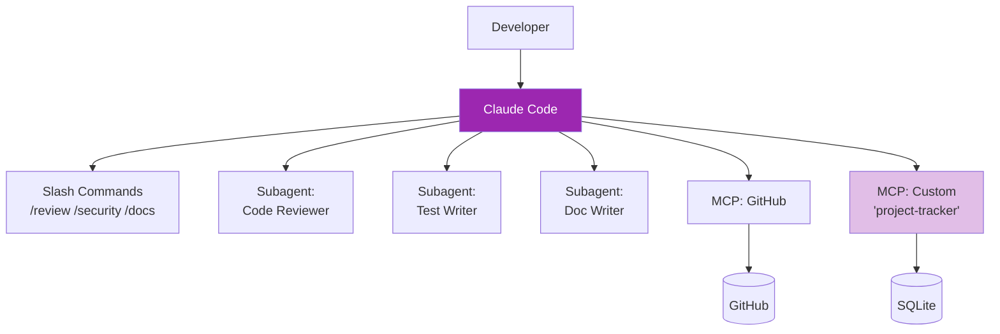

# Day 21: Mini Project — Dev Workflow Automation 🤖

<div class="lesson-meta">
⏱️ 5 ชั่วโมง &nbsp;|&nbsp; 📊 Project &nbsp;|&nbsp; 📋 Prerequisites: Day 15–20
</div>

## 🎯 Project Goal

สร้าง **Automated Dev Workflow** ที่:

<ul class="objectives">
<li>ใช้ Claude Code + Custom MCP server + Subagents ผสมกัน</li>
<li>Automate งาน: PR review, security scan, doc update, changelog</li>
<li>มี `CLAUDE.md` ที่ชัดเจน</li>
<li>มี slash commands ที่ทีมใช้ได้</li>
</ul>

---

## 1. Architecture



---

## 2. Build Steps

### Step 1: Setup Project

```bash
mkdir dev-workflow && cd dev-workflow
git init
echo "node_modules/\n.env\nCLAUDE.local.md" > .gitignore
```

### Step 2: CLAUDE.md

```markdown
# Project: dev-workflow

## Description
Automated dev workflow tools using Claude Code + MCP

## Conventions
- Commit messages: conventional commits (feat/fix/docs/refactor/chore)
- Branch: feature/<ticket>-<description>
- Tests: pytest, ≥80% coverage

## Common Tasks
- "/review" — review uncommitted changes
- "/security" — security scan
- "/docs" — update docs from code

## Don't
- Don't commit secrets
- Don't bypass tests
- Don't merge without 1 reviewer
```

### Step 3: Subagents

`./.claude/agents/code-reviewer.md`:
```markdown
---
name: code-reviewer
description: Review code for bugs, style, performance
tools: [Read, Grep, Bash]
---

You are a senior engineer. Review code:
1. Bugs & logic errors
2. Performance issues
3. Style violations
4. Missing edge cases

Output: markdown checklist with file:line refs
Do NOT modify code.
```

`./.claude/agents/security-scanner.md`:
```markdown
---
name: security-scanner
description: Scan code for vulnerabilities
tools: [Read, Grep, Bash]
---

Scan for OWASP top 10:
- Injection
- Auth issues
- Sensitive data exposure
- XXE
- Broken access control
- Security misconfiguration

Severity: Critical / High / Medium / Low
```

`./.claude/agents/doc-writer.md`:
```markdown
---
name: doc-writer
description: Update README and inline docstrings
tools: [Read, str_replace, create_file]
---

Update docs:
- README.md sections
- Module/function docstrings
- ADRs for major changes
Maintain markdown style; use mermaid for diagrams.
```

### Step 4: Slash Commands

`./.claude/commands/review.md`:
```markdown
# /review

Spawn `code-reviewer` subagent to review:
- Run: `git diff main...HEAD`
- Send diff to subagent
- Output: PR review comment (markdown)
```

`./.claude/commands/security.md`:
```markdown
# /security

Spawn `security-scanner` subagent to scan repo
- Focus on changed files in last commit
- Output: severity-sorted list with fix suggestions
```

`./.claude/commands/docs.md`:
```markdown
# /docs

Spawn `doc-writer` to:
1. Diff last 5 commits
2. Identify which docs need updating
3. Make updates
4. Show preview before committing
```

`./.claude/commands/changelog.md`:
```markdown
# /changelog

Generate CHANGELOG.md entry:
1. Get commits since last tag (`git log <last-tag>..HEAD`)
2. Group by type (feat/fix/docs/etc.)
3. Format Keep-a-Changelog style
4. Prepend to CHANGELOG.md
```

### Step 5: Custom MCP — Project Tracker

`./mcp/project-tracker/server.py`:
```python
from mcp.server.fastmcp import FastMCP
import sqlite3, json
from datetime import datetime

DB = "project-tracker.db"

def init():
    c = sqlite3.connect(DB)
    c.execute("""CREATE TABLE IF NOT EXISTS tickets (
        id INTEGER PRIMARY KEY,
        title TEXT, status TEXT, priority TEXT,
        assignee TEXT, created TEXT)""")
    c.execute("""CREATE TABLE IF NOT EXISTS work_log (
        id INTEGER PRIMARY KEY,
        ticket_id INTEGER, hours REAL, notes TEXT, logged_at TEXT)""")
    c.commit()
    c.close()

init()
mcp = FastMCP("project-tracker")

@mcp.tool()
def create_ticket(title: str, priority: str = "medium", assignee: str = "") -> str:
    c = sqlite3.connect(DB)
    cur = c.execute(
        "INSERT INTO tickets (title, status, priority, assignee, created) VALUES (?,?,?,?,?)",
        (title, "open", priority, assignee, datetime.now().isoformat())
    )
    c.commit()
    tid = cur.lastrowid
    c.close()
    return f"✅ Ticket #{tid}: {title}"

@mcp.tool()
def list_tickets(status: str = "open") -> str:
    c = sqlite3.connect(DB)
    c.row_factory = sqlite3.Row
    rows = c.execute("SELECT * FROM tickets WHERE status=?", (status,)).fetchall()
    c.close()
    return json.dumps([dict(r) for r in rows], indent=2)

@mcp.tool()
def log_work(ticket_id: int, hours: float, notes: str) -> str:
    c = sqlite3.connect(DB)
    c.execute(
        "INSERT INTO work_log (ticket_id, hours, notes, logged_at) VALUES (?,?,?,?)",
        (ticket_id, hours, notes, datetime.now().isoformat())
    )
    c.commit()
    c.close()
    return f"⏰ Logged {hours}h on ticket #{ticket_id}"

@mcp.tool()
def update_status(ticket_id: int, status: str) -> str:
    c = sqlite3.connect(DB)
    c.execute("UPDATE tickets SET status=? WHERE id=?", (status, ticket_id))
    c.commit()
    c.close()
    return f"📝 Ticket #{ticket_id} → {status}"

@mcp.resource("tickets://open")
def open_tickets():
    return list_tickets("open")

if __name__ == "__main__":
    mcp.run()
```

### Step 6: Register MCP

`./.claude/mcp.json`:
```json
{
  "mcpServers": {
    "project-tracker": {
      "command": "python",
      "args": ["./mcp/project-tracker/server.py"]
    },
    "github": {
      "command": "npx",
      "args": ["-y", "@modelcontextprotocol/server-github"],
      "env": { "GITHUB_PERSONAL_ACCESS_TOKEN": "${GITHUB_TOKEN}" }
    }
  }
}
```

---

## 3. Demo Workflow

### ตัวอย่าง: ทำ feature ใหม่ end-to-end

```
> สร้าง ticket: "Add /metrics endpoint with Prometheus format" 
> priority = high

> ฉันจะเริ่มทำ ticket #1 แล้ว — branch ชื่ออะไรดี?

[Claude เสนอ branch name, สร้าง branch]

> /review

[code-reviewer subagent ตรวจ → output review]

> /security

[security-scanner subagent ตรวจ]

> /docs

[doc-writer subagent อัปเดต README]

> /changelog

[generate changelog entry]

> log work: 2.5 hrs on ticket #1, notes = "implemented + tested"
> update ticket #1 → review

[เรียก project-tracker MCP]

> สร้าง PR ใน GitHub, body = changelog ที่ generate
```

→ ทั้ง workflow ทำใน chat เดียว!

---

## 4. Deliverables

!!! example "ส่งเป็น GitHub repo"
    1. `CLAUDE.md`, `CLAUDE.local.md.example`
    2. 3 subagent files ใน `.claude/agents/`
    3. 4 slash commands ใน `.claude/commands/`
    4. Custom MCP server ที่ run ได้
    5. `mcp.json` config
    6. Demo video 5 นาที — แสดง workflow end-to-end

---

## 5. Scoring Rubric

| เกณฑ์ | คะแนน |
|------|------|
| CLAUDE.md ชัดเจน | / 10 |
| 3 subagents ทำงานได้ | / 30 |
| 4 slash commands ใช้ได้ | / 20 |
| Custom MCP server run ได้ | / 20 |
| Demo end-to-end smooth | / 10 |
| Documentation (README) | / 10 |
| **รวม** | **/ 100** |

---

## ✅ Week 3 Self-Check

- [ ] ใช้ Claude Code (install, init, commands)
- [ ] ใช้ Plan Mode + Memory layers
- [ ] เขียน subagent ใน `.claude/agents/`
- [ ] เขียน slash commands
- [ ] เข้าใจ MCP architecture
- [ ] ใช้ existing MCP servers
- [ ] สร้าง MCP server เอง
- [ ] รวมทุกอย่างเป็น workflow

---

## 🔍 Cross-check & References

- 📦 [Claude Code Examples (Anthropic Cookbook)](https://github.com/anthropics/anthropic-cookbook)
- 📘 [MCP Examples](https://github.com/modelcontextprotocol/servers)

---

:material-check-decagram: **จบ Week 3!** คุณเป็น power user ของ Claude tooling แล้ว

[ต่อไป → Week 4: Agents & Capstone :material-arrow-right:](../week-04/index.md){ .md-button .md-button--primary }
