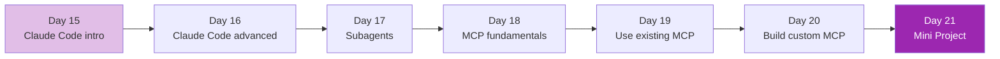

# Week 3: Developer Tools 🛠️

จาก "เรียก API ได้" → "เป็น power user ของ Claude Code + MCP"

## รายวิชา

| Day | หัวข้อ | สกิลที่ได้ | เวลา |
|-----|--------|-----------|------|
| 15 | Claude Code — Setup & First Use | install, project workflow | 4h |
| 16 | Claude Code — Advanced (Plan/Memory/Hooks) | autonomous coding | 4h |
| 17 | Subagents | delegate งานย่อยให้ agent อื่น | 3h |
| 18 | MCP Fundamentals | concept + protocol | 3h |
| 19 | Using existing MCP servers | GitHub, Filesystem, Slack | 3h |
| 20 | Build custom MCP server | Python SDK | 5h |
| 21 | Mini Project: Dev Workflow Automation | นำทุกอย่างมาผสม | 5h |

## หลังจบ Week 3 คุณจะ

- [x] ใช้ Claude Code ทำงาน coding agentic ได้
- [x] เข้าใจ subagent และเมื่อไหร่ควรใช้
- [x] เข้าใจ MCP protocol
- [x] ติดตั้งและใช้ MCP servers สาธารณะ
- [x] สร้าง MCP server เองได้

[เริ่ม Day 15 :material-arrow-right:](day-15.md){ .md-button .md-button--primary }
