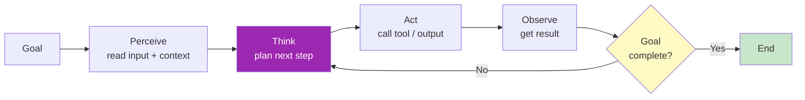
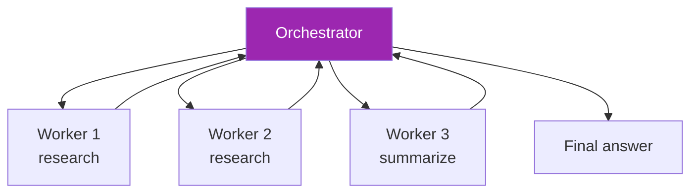
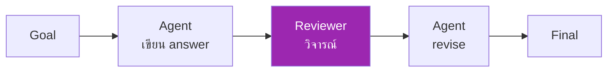
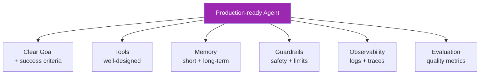
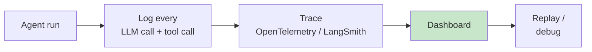

# Day 22: Agent Architecture 🧠

<div class="lesson-meta">
⏱️ 3 ชั่วโมง &nbsp;|&nbsp; 📊 Intermediate &nbsp;|&nbsp; 📋 Prerequisites: Day 12, 17
</div>

## 🎯 Learning Objectives

<ul class="objectives">
<li>นิยาม "agent" ที่ชัดเจน — ต่างจาก workflow อย่างไร</li>
<li>เข้าใจ agent loop (Perceive → Think → Act)</li>
<li>รู้จัก patterns: tool use, planning, reflection</li>
<li>เข้าใจเมื่อไหร่ "ควร" ใช้ agent (และเมื่อไหร่ไม่ควร)</li>
</ul>

---

## 1. นิยาม Agent (จาก Anthropic)

> **Agent** = LLM ที่ใช้ tools ใน loop เพื่อบรรลุ goal โดยตัดสินใจเองว่าจะทำ step อะไรต่อ

ความต่างกับ **workflow** (ใน Anthropic's "Building Effective Agents"):

| Workflow | Agent |
|---------|-------|
| Predefined steps (เรียงไว้ก่อน) | Dynamic — LLM ตัดสินใจเองทุก step |
| Predictable | Less predictable แต่ flexible |
| ดีบั๊กง่าย | ต้องมี observability ดี |
| Cheaper | Cost สูงกว่า (loop tokens) |
| ใช้กับ task ที่ pattern ชัด | ใช้กับ task ที่ open-ended |

---

## 2. Agent Loop



### ในโค้ดจริง

```python
messages = [{"role": "user", "content": goal}]

while True:
    resp = claude.messages.create(
        model="claude-sonnet-4-6",
        max_tokens=2000,
        tools=tools,
        messages=messages
    )
    
    if resp.stop_reason == "end_turn":
        break  # agent says done
    
    if resp.stop_reason == "tool_use":
        # extract tool calls, run them, append results
        messages.append({"role": "assistant", "content": resp.content})
        tool_results = run_tools(resp.content)
        messages.append({"role": "user", "content": tool_results})
        continue
```

---

## 3. Agent Patterns (Anthropic taxonomy)

### 3.1 Tool-using Agent (พื้นฐาน)

LLM + tools + loop → end-to-end task

ตัวอย่าง: customer support agent ที่ใช้ knowledge base + ticket system + email

### 3.2 Planner-Executor

```mermaid
graph TD
    G[Goal] --> P[Planner<br/>(Opus)]
    P --> PLAN[List of steps]
    PLAN --> E[Executor<br/>(Sonnet)]
    E --> R[Result]
    style P fill:#9c27b0,color:#fff
    style E fill:#e1bee7
```

- **Planner** (model แรง — Opus) สร้าง plan
- **Executor** (model ถูก — Sonnet/Haiku) ทำตาม plan

→ ประหยัด cost: ใช้ model แพงเฉพาะตอน plan

### 3.3 Orchestrator-Worker



→ ใกล้เคียง Subagent pattern (Day 17)

### 3.4 Reflection Pattern



→ Self-critique เพิ่มคุณภาพ (แต่เพิ่ม cost)

### 3.5 Evaluator-Optimizer

มี **Evaluator agent** ที่ให้ score → กลับไป revise จนคะแนนถึง threshold

---

## 4. เมื่อไหร่ "ไม่ควร" ใช้ agent

| Situation | ทำไม |
|-----------|------|
| Task มี deterministic flow | ใช้ workflow แทน — predictable, ถูก |
| Task เสร็จใน 1 LLM call | ไม่ต้องวน loop |
| Stakes สูง (financial transaction) | Agent ไม่ deterministic — เสี่ยง |
| Latency critical | Loop = หลาย LLM calls = slow |
| Cost-sensitive ที่ scale มาก | Agent loop = expensive |

!!! quote "Anthropic แนะนำ"
    "เริ่มจาก **simplest solution** — ลองทำเป็น single LLM call ก่อน → workflow → agent เป็น **last resort**"

---

## 5. องค์ประกอบของ Agent ที่ดี



### 5.1 Tools Design

- Schema ชัด — name, description, args
- One responsibility per tool
- Return structured output
- Error → human-readable message

### 5.2 Memory

| Type | Use | ตัวอย่าง |
|------|-----|---------|
| Working (conversation) | ระหว่าง task | message history |
| Episodic | จำเหตุการณ์ | "เมื่อวานทำอะไรไป" |
| Semantic | ความรู้ทั่วไป | RAG knowledge base |
| Procedural | how-to | playbooks |

### 5.3 Guardrails

- Max iterations (กัน infinite loop)
- Tool call rate limit
- Cost budget per task
- Sensitive action confirmation
- Output validation

### 5.4 Observability



---

## 6. ตัวอย่าง: Customer Support Agent

**Goal:** ตอบ ticket support พร้อม action ที่จำเป็น

**Tools:**
- `search_kb(query)`
- `get_user(user_id)`
- `get_order(order_id)`
- `issue_refund(order_id, amount, reason)` ← requires approval
- `escalate_to_human(ticket_id, reason)`

**Loop:**
1. Read ticket
2. Search KB
3. Get user + order
4. ตัดสินใจ: ตอบเอง, refund, หรือ escalate?
5. Action

**Guardrails:**
- Refund > $100 → require human approval
- Escalate if confidence < 70%
- Max 10 tool calls per ticket

---

## 🛠️ Hands-on Exercise

!!! example "Exercise 1: Classify Patterns"
    คิดถึง 5 use cases ในงานคุณ — แต่ละอันใช้ pattern อะไร?
    
    - Workflow / Tool-using agent / Planner-executor / Orchestrator-worker / Reflection

!!! example "Exercise 2: Design Tools"
    เลือก 1 agent use case → ออกแบบ:
    - List tools ที่จำเป็น (≤ 8)
    - Schema ของแต่ละ tool
    - Guardrails

!!! example "Exercise 3: Read & Reflect"
    อ่าน [Anthropic — Building Effective Agents](https://www.anthropic.com/research/building-effective-agents) ตอบ:
    - "Augmented LLM" คืออะไร?
    - "Routing" workflow ต่างจาก agent อย่างไร?

---

## ✅ Self-Check Quiz

<div class="quiz">

**Q1:** ความต่างหลักของ Workflow vs Agent?

??? success "ดูคำตอบ"
    - **Workflow**: steps ถูก predefined โดย dev — predictable
    - **Agent**: LLM ตัดสินใจ next step เอง — dynamic, less predictable

**Q2:** เมื่อไหร่ "ไม่ควร" ใช้ agent?

??? success "ดูคำตอบ"
    Task ที่:
    - Deterministic flow
    - Stakes สูง (financial)
    - Latency critical
    - Cost sensitive ที่ scale

**Q3:** Planner-Executor pattern ช่วยอะไร?

??? success "ดูคำตอบ"
    ประหยัด cost — ใช้ model แพงเฉพาะตอน plan ส่วน execute ใช้ model ถูก

**Q4:** Guardrails สำคัญที่สุด 3 อันคืออะไร?

??? success "ดูคำตอบ"
    1. Max iterations (กัน infinite loop)
    2. Sensitive action confirmation
    3. Cost budget per task

</div>

---

## 🔍 Cross-check & References

- 📘 [Anthropic — Building Effective Agents (engineering blog)](https://www.anthropic.com/research/building-effective-agents)
- 📘 [Anthropic — Agent Capabilities](https://docs.claude.com/)
- 📄 [ReAct: Synergizing Reasoning and Acting in LLMs (Yao et al. 2022)](https://arxiv.org/abs/2210.03629)

[ต่อไป → Day 23 :material-arrow-right:](day-23.md){ .md-button .md-button--primary }
