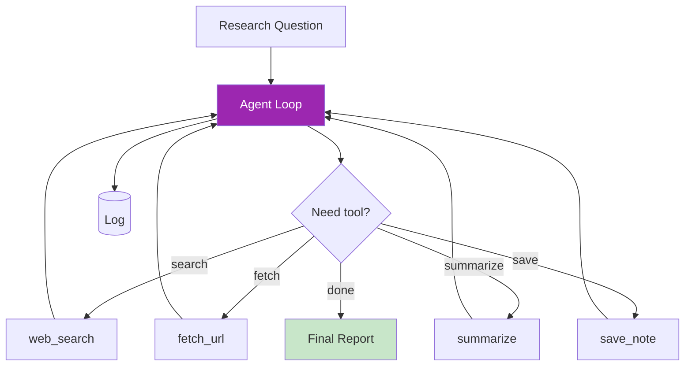

# Day 23: สร้าง Agent ตัวแรก 🤖

<div class="lesson-meta">
⏱️ 4 ชั่วโมง &nbsp;|&nbsp; 📊 Advanced &nbsp;|&nbsp; 📋 Prerequisites: Day 12, 22
</div>

## 🎯 Project Goal

สร้าง **Research Agent** ที่:

<ul class="objectives">
<li>รับ research question</li>
<li>ใช้ tools: web_search, fetch_url, summarize, save_note</li>
<li>วน loop เอง จนได้คำตอบ</li>
<li>มี guardrails (max iterations, cost budget)</li>
<li>Log ทุก step</li>
</ul>

---

## 1. Architecture



---

## 2. Code

### Setup
```bash
mkdir research-agent && cd research-agent
python -m venv venv && source venv/bin/activate
pip install anthropic python-dotenv requests beautifulsoup4 duckduckgo-search
echo "ANTHROPIC_API_KEY=sk-ant-xxx" > .env
```

### `tools.py`

```python
import requests
from bs4 import BeautifulSoup
from duckduckgo_search import DDGS
import json, os

NOTES_DIR = "notes"
os.makedirs(NOTES_DIR, exist_ok=True)

def web_search(query: str, max_results: int = 5):
    """Return top results: title, snippet, url"""
    with DDGS() as ddgs:
        results = list(ddgs.text(query, max_results=max_results))
    return [
        {"title": r["title"], "snippet": r["body"], "url": r["href"]}
        for r in results
    ]

def fetch_url(url: str):
    """Fetch URL and extract main text"""
    try:
        r = requests.get(url, timeout=10, headers={"User-Agent": "Mozilla/5.0"})
        soup = BeautifulSoup(r.text, "html.parser")
        # Remove scripts/styles
        for s in soup(["script", "style", "nav", "footer"]):
            s.decompose()
        text = soup.get_text(separator="\n", strip=True)
        return text[:5000]  # cap to 5K chars
    except Exception as e:
        return f"Error: {e}"

def save_note(filename: str, content: str):
    path = os.path.join(NOTES_DIR, filename)
    with open(path, "w", encoding="utf-8") as f:
        f.write(content)
    return f"Saved: {path}"
```

### `agent.py`

```python
import json, os, time
from dotenv import load_dotenv
from anthropic import Anthropic
import tools as T

load_dotenv()
client = Anthropic()

MODEL = "claude-sonnet-4-6"
MAX_ITERATIONS = 15
MAX_TOKENS_BUDGET = 100_000  # total input+output across run

TOOLS_SPEC = [
    {
        "name": "web_search",
        "description": "Search the web for information. Returns up to 5 results with title, snippet, url.",
        "input_schema": {
            "type": "object",
            "properties": {
                "query": {"type": "string"},
                "max_results": {"type": "integer", "default": 5}
            },
            "required": ["query"]
        }
    },
    {
        "name": "fetch_url",
        "description": "Fetch a URL and return its main text content (capped 5K chars).",
        "input_schema": {
            "type": "object",
            "properties": {"url": {"type": "string"}},
            "required": ["url"]
        }
    },
    {
        "name": "save_note",
        "description": "Save a note to file. Use to persist intermediate findings.",
        "input_schema": {
            "type": "object",
            "properties": {
                "filename": {"type": "string"},
                "content": {"type": "string"}
            },
            "required": ["filename", "content"]
        }
    }
]

def run_tool(name, args):
    fn = {"web_search": T.web_search, "fetch_url": T.fetch_url, "save_note": T.save_note}[name]
    try:
        result = fn(**args)
        return json.dumps(result, ensure_ascii=False, default=str)[:8000]
    except Exception as e:
        return f"Error: {e}"

def research(question: str):
    print(f"\n🔍 Research: {question}\n")
    
    messages = [{"role": "user", "content": f"""
You are a research agent. Goal: {question}

Workflow:
1. Search web for relevant sources
2. Fetch most promising URLs
3. Synthesize findings
4. Save intermediate notes
5. When done, output FINAL REPORT (markdown) including:
   - TL;DR (3 bullets)
   - Detailed findings
   - Sources (urls)

Stop using tools and just respond with the report when you have enough info.
"""}]
    
    total_input = 0
    total_output = 0
    
    for iteration in range(MAX_ITERATIONS):
        print(f"--- Iteration {iteration + 1} ---")
        
        resp = client.messages.create(
            model=MODEL,
            max_tokens=2000,
            tools=TOOLS_SPEC,
            messages=messages
        )
        
        total_input += resp.usage.input_tokens
        total_output += resp.usage.output_tokens
        print(f"  Tokens: in={resp.usage.input_tokens}, out={resp.usage.output_tokens}, stop={resp.stop_reason}")
        
        # Budget check
        if total_input + total_output > MAX_TOKENS_BUDGET:
            print(f"⚠️  Budget exceeded ({total_input + total_output} > {MAX_TOKENS_BUDGET})")
            break
        
        if resp.stop_reason == "end_turn":
            # Agent finished
            final_text = "\n".join(b.text for b in resp.content if b.type == "text")
            print("\n✅ DONE\n")
            print(final_text)
            return final_text
        
        if resp.stop_reason == "tool_use":
            messages.append({"role": "assistant", "content": resp.content})
            
            tool_results = []
            for block in resp.content:
                if block.type == "tool_use":
                    print(f"  → Tool: {block.name}({json.dumps(block.input)[:100]})")
                    result = run_tool(block.name, block.input)
                    tool_results.append({
                        "type": "tool_result",
                        "tool_use_id": block.id,
                        "content": result
                    })
            messages.append({"role": "user", "content": tool_results})
        else:
            print(f"Unexpected stop_reason: {resp.stop_reason}")
            break
    
    print("⚠️  Max iterations reached")
    return None

if __name__ == "__main__":
    import sys
    question = sys.argv[1] if len(sys.argv) > 1 else "อะไรคือ MCP (Model Context Protocol) — ทำงานอย่างไร?"
    research(question)
```

### Run
```bash
python agent.py "เทคโนโลยี vector database ตัวไหนเด่นในปี 2026"
```

---

## 3. ตัวอย่าง Output ที่ดี

```
🔍 Research: เทคโนโลยี vector database ตัวไหนเด่นในปี 2026

--- Iteration 1 ---
  Tokens: in=520, out=180, stop=tool_use
  → Tool: web_search({"query": "best vector database 2026 comparison"})
--- Iteration 2 ---
  Tokens: in=1850, out=120, stop=tool_use
  → Tool: fetch_url({"url": "https://example.com/vdb-2026"})
...
✅ DONE

# Vector Database Landscape 2026

## TL;DR
- Pinecone yang เด่นในด้าน managed service...
- pgvector เติบโต...
- Qdrant และ Weaviate...

## Detailed Findings
...
```

---

## 4. Guardrails ที่ใส่แล้ว

| Guardrail | ใน code |
|-----------|---------|
| Max iterations | `MAX_ITERATIONS = 15` |
| Token budget | `MAX_TOKENS_BUDGET` check after each call |
| Tool result size cap | `[:8000]` chars |
| URL fetch timeout | `timeout=10` |
| Web search results cap | `max_results=5` |

### เพิ่ม guardrails ที่ดี

```python
DANGEROUS_URLS = ["localhost", "127.0.0.1", "10.0.0.0/8"]

def fetch_url(url: str):
    parsed = urlparse(url)
    if any(d in parsed.netloc for d in DANGEROUS_URLS):
        return "Blocked: internal URL"
    # ... fetch
```

---

## 🛠️ Hands-on Exercise

!!! example "Exercise 1: Run + Tweak"
    รัน agent กับ 3 questions:
    1. "AWS region ใดมี service Bedrock ครบสุด?"
    2. "Kubernetes 1.30 features สำคัญ"
    3. คำถามของคุณเอง

!!! example "Exercise 2: เพิ่ม Tool"
    เพิ่ม `compare_two(topic_a, topic_b)` — เปรียบเทียบ 2 หัวข้อแบบตาราง

!!! example "Exercise 3: Reflection Pattern"
    เพิ่ม step "review" หลังจาก final report:
    - ส่ง report ให้ Claude อีกครั้ง พร้อม prompt "Critique this report"
    - ถ้ามีปัญหา → loop กลับไปแก้

!!! example "Exercise 4: Observability"
    เพิ่ม:
    - Log ทุก iteration เป็น JSON file
    - แสดง cost ที่ใช้จริง (token × price)

---

## ✅ Self-Check Quiz

<div class="quiz">

**Q1:** ทำไมต้องมี `MAX_ITERATIONS`?

??? success "ดูคำตอบ"
    กัน infinite loop — agent อาจวนซ้ำเรียก tool ไม่จบ ทำให้เปลือง cost และเครื่องค้าง

**Q2:** ทำไม cap tool result ที่ 8K chars?

??? success "ดูคำตอบ"
    - ป้องกัน context window เต็ม
    - ลด cost (token น้อย)
    - บังคับให้ agent ค้นจุดสำคัญแทนการอ่านดิบทั้งหมด

**Q3:** อะไรคือ `stop_reason == "end_turn"`?

??? success "ดูคำตอบ"
    Claude บอกว่า "ฉันเสร็จแล้ว ไม่ต้องเรียก tool อีก" — ไม่มี tool call ในรอบนี้ → break loop

</div>

---

## 🔍 Cross-check & References

- 📘 [Anthropic — Tool Use Workflow](https://docs.claude.com/en/docs/build-with-claude/tool-use)
- 📦 [Anthropic Cookbook — Agents](https://github.com/anthropics/anthropic-cookbook/tree/main/tool_use)
- 📄 [Schick et al. — Toolformer](https://arxiv.org/abs/2302.04761)

[ต่อไป → Day 24 :material-arrow-right:](day-24.md){ .md-button .md-button--primary }
