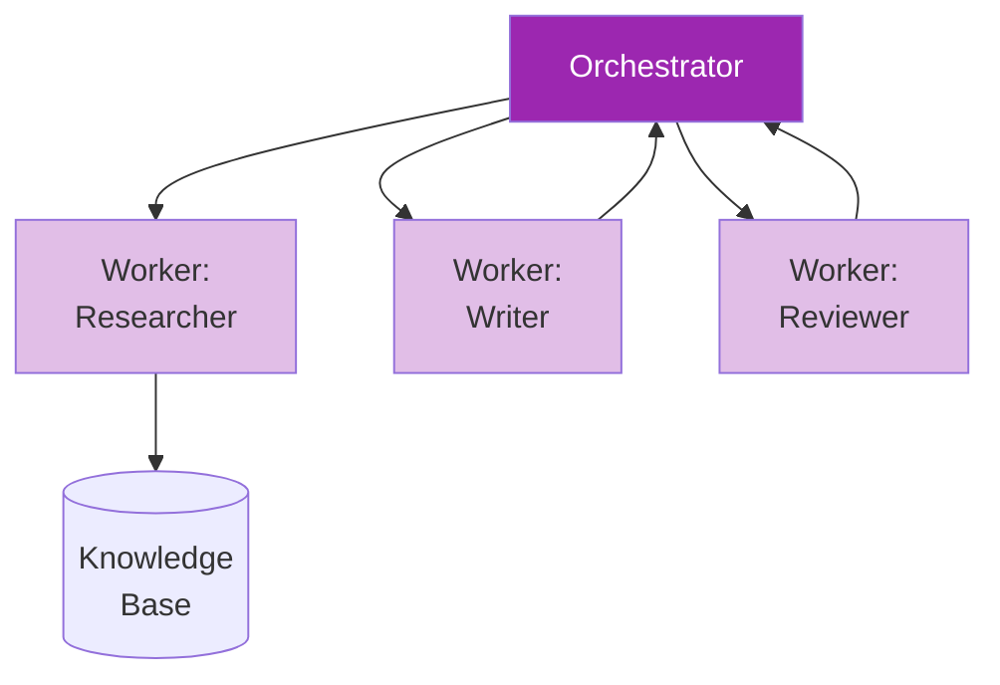
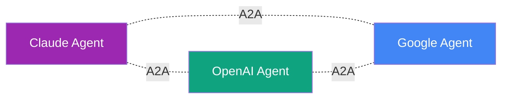
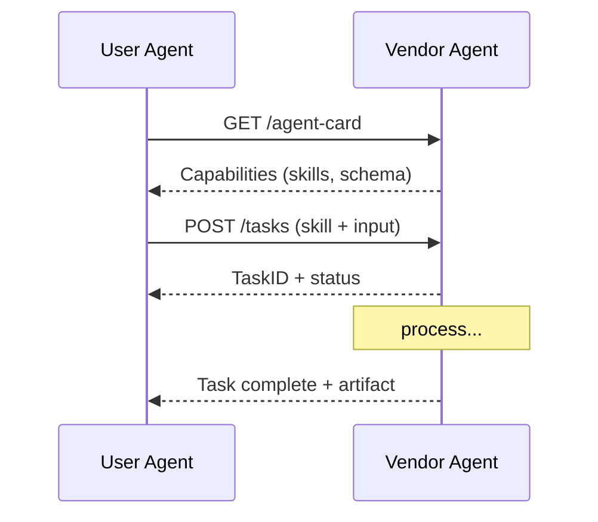

# Day 24: Multi-Agent & A2A 🤝

<div class="lesson-meta">
⏱️ 4 ชั่วโมง &nbsp;|&nbsp; 📊 Advanced &nbsp;|&nbsp; 📋 Prerequisites: Day 22, 23
</div>

## 🎯 Learning Objectives

<ul class="objectives">
<li>เข้าใจ orchestrator-worker pattern</li>
<li>สร้าง multi-agent system ที่ specialized</li>
<li>เข้าใจแนวคิด A2A (Agent-to-Agent) protocol</li>
<li>รู้จุดที่ multi-agent ดีกว่า single agent และจุดที่แพง</li>
</ul>

---

## 1. Multi-Agent คืออะไร?

**Multi-agent system** = หลาย agent ทำงานร่วมกัน โดยอาจมี:



### หลัก 3 patterns

1. **Orchestrator-Worker** (centralized) — มี boss
2. **Peer-to-Peer** (decentralized) — agents คุยกันเอง
3. **Hierarchical** — orchestrator แบ่ง sub-orchestrators

---

## 2. เมื่อไหร่ใช้ Multi-Agent

### ✅ ดีเมื่อ

- งานต้องใช้ **specialized expertise** หลายด้าน
- Sub-tasks **parallelizable**
- ต้องการ **separation of concerns** (security, reliability)
- งานใหญ่จน context window เดียวไม่พอ

### ❌ ไม่ดีเมื่อ

- Task เล็ก single agent ทำได้
- Communication overhead > benefit
- Cost-sensitive
- Latency-sensitive

!!! quote "Anthropic Cautions"
    "Multi-agent ดูเท่ แต่ในงานจริง simple agent + good tools มักได้ผลดีกว่า — ใช้ multi-agent เมื่อมี evidence ชัดว่า single agent ทำไม่ได้"

---

## 3. ตัวอย่าง: Research Team

ลองทำ team:
- **Orchestrator** — รับคำถาม วาง plan
- **Researcher × N** — ค้น web parallel
- **Synthesizer** — รวมข้อมูล
- **Critic** — ตรวจสอบ accuracy

### Code โครงสร้าง

```python
import asyncio
from anthropic import AsyncAnthropic

client = AsyncAnthropic()

async def researcher_agent(subtopic: str):
    """Worker: research one subtopic"""
    resp = await client.messages.create(
        model="claude-sonnet-4-6",
        max_tokens=1500,
        system="You research one subtopic deeply. Return bullet findings.",
        messages=[{"role": "user", "content": f"Research: {subtopic}"}],
        # ... tools for web search
    )
    return resp.content[0].text

async def synthesizer_agent(findings: list[str], question: str):
    resp = await client.messages.create(
        model="claude-opus-4-7",  # smart model สำหรับ synthesize
        max_tokens=3000,
        system="Synthesize multiple research notes into a cohesive report.",
        messages=[{"role": "user", "content": f"Question: {question}\n\nFindings:\n" + "\n---\n".join(findings)}]
    )
    return resp.content[0].text

async def critic_agent(report: str):
    resp = await client.messages.create(
        model="claude-sonnet-4-6",
        max_tokens=1000,
        system="You are a critical reviewer. Find weaknesses, missing perspectives, factual gaps.",
        messages=[{"role": "user", "content": report}]
    )
    return resp.content[0].text

async def orchestrator(question: str):
    # 1. Plan
    plan_resp = await client.messages.create(
        model="claude-opus-4-7",
        max_tokens=500,
        system="Break the question into 3-5 subtopics for parallel research. Output JSON list.",
        messages=[{"role": "user", "content": question}]
    )
    import json, re
    text = plan_resp.content[0].text
    # extract JSON array
    match = re.search(r"\[.*\]", text, re.DOTALL)
    subtopics = json.loads(match.group(0))
    
    # 2. Parallel research
    findings = await asyncio.gather(*[researcher_agent(s) for s in subtopics])
    
    # 3. Synthesize
    report = await synthesizer_agent(findings, question)
    
    # 4. Critique
    critique = await critic_agent(report)
    
    # 5. Final revise
    final = await client.messages.create(
        model="claude-sonnet-4-6",
        max_tokens=3000,
        messages=[{"role": "user", "content": f"Report:\n{report}\n\nCritique:\n{critique}\n\nRevise the report addressing critiques."}]
    )
    return final.content[0].text

if __name__ == "__main__":
    result = asyncio.run(orchestrator("What is the future of vector databases in 2026?"))
    print(result)
```

---

## 4. A2A (Agent-to-Agent Protocol)

### แนวคิด

A2A = **open protocol** สำหรับให้ agents ของ **different vendors** คุยกัน เช่น Claude agent คุยกับ OpenAI agent คุยกับ Google agent



A2A เปิดตัวโดย Google (2025) — เน้น cross-platform agent collaboration

### Components หลัก

- **Agent Card** — agent ประกาศ capabilities (เหมือน OpenAPI สำหรับ agent)
- **Tasks** — request/response unit
- **Messages** — multi-turn conversation
- **Artifacts** — output ที่ structured

### Conceptual Flow



### ความสัมพันธ์ MCP vs A2A

| | MCP | A2A |
|--|-----|-----|
| Connect | LLM ↔ tools/data | Agent ↔ Agent |
| Standardize | tool calling | agent collaboration |
| Vendor | Anthropic (open) | Google (open) |
| Layer | "below" agent | "between" agents |

→ **MCP และ A2A complementary** ไม่ขัดกัน

---

## 5. Lessons จาก Anthropic Research

อ่าน "Building Effective Agents" และ research papers:

- ส่วนใหญ่ของระบบ AI ที่ดี = **simple workflow + good tools** ไม่ใช่ complex agent network
- Multi-agent มี **communication overhead** — agents ต้อง explain context ให้กันและกัน
- Specialization ช่วยเฉพาะเมื่อ task มี clear sub-domain boundaries
- Single agent + better prompting มักเอาชนะ multi-agent ที่ออกแบบไม่ดี

---

## 🛠️ Hands-on Exercise

!!! example "Exercise 1: Run Multi-Agent Research"
    รันโค้ดข้างบนกับคำถามจริง เปรียบเทียบกับ single agent (Day 23)
    
    - คุณภาพต่างกันไหม?
    - Cost ต่างเท่าไหร่?
    - Latency เท่าไหร่?

!!! example "Exercise 2: Specialist Pattern"
    สร้าง multi-agent system สำหรับ "Architecture Design":
    - **Architect** — ออกแบบ high-level
    - **Security expert** — ตรวจ security
    - **DBA** — ออกแบบ data layer
    - **DevOps** — แนะนำ deployment

!!! example "Exercise 3: A2A Reading"
    อ่าน [A2A Protocol spec](https://github.com/google-a2a) → ตอบ:
    - Agent Card format คืออะไร?
    - การ auth ระหว่าง agents ทำอย่างไร?

---

## ✅ Self-Check Quiz

<div class="quiz">

**Q1:** Orchestrator-Worker ต่างจาก Subagent (Day 17) อย่างไร?

??? success "ดูคำตอบ"
    Concept คล้ายกัน — แต่ Subagent เป็นการ implement orchestrator-worker pattern ใน Claude Code โดยเฉพาะ ส่วน orchestrator-worker เป็น generic pattern ที่ใช้ได้ทุก framework

**Q2:** MCP vs A2A?

??? success "ดูคำตอบ"
    - **MCP**: agent (LLM) ↔ tools/data — connect AI to capabilities
    - **A2A**: agent ↔ agent — agents ของต่าง vendor คุยกันได้

**Q3:** Multi-agent มี downside อะไร?

??? success "ดูคำตอบ"
    - Communication overhead (agents ต้องอธิบายให้กัน)
    - Cost สูงขึ้น (หลาย LLM calls)
    - Latency สูงกว่า (chained calls)
    - ดีบั๊กยากกว่า

**Q4:** เมื่อไหร่ควรใช้ Opus ใน multi-agent?

??? success "ดูคำตอบ"
    บทบาทที่ต้อง reasoning ลึก เช่น orchestrator (วาง plan), synthesizer (รวม findings); บทบาท worker ที่ task ง่ายให้ใช้ Sonnet/Haiku ประหยัด cost

</div>

---

## 🔍 Cross-check & References

- 📘 [Anthropic — Building Effective Agents](https://www.anthropic.com/research/building-effective-agents)
- 📘 [Google A2A Protocol](https://github.com/google-a2a)
- 📄 [Multi-Agent LLM Survey (2024)](https://arxiv.org/abs/2402.01680)

[ต่อไป → Day 25 :material-arrow-right:](day-25.md){ .md-button .md-button--primary }
