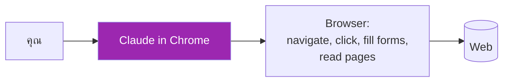
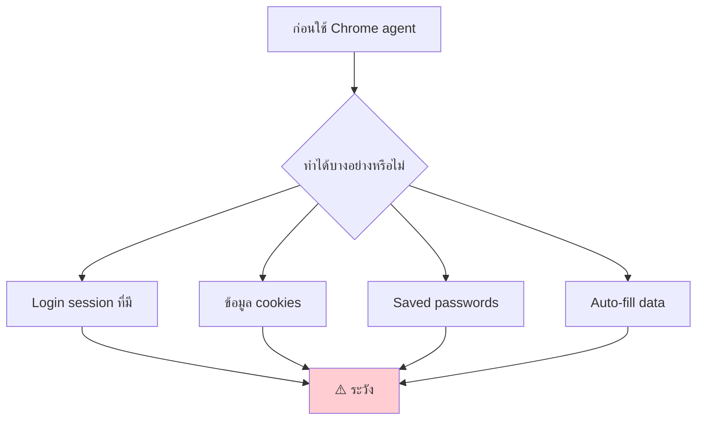
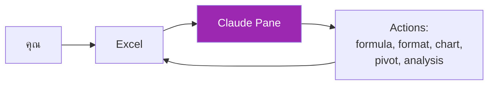
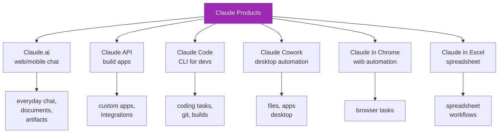
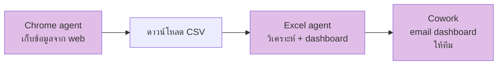

# Day 25: Claude in Chrome & Excel 🌐📊

<div class="lesson-meta">
⏱️ 3 ชั่วโมง &nbsp;|&nbsp; 📊 Intermediate &nbsp;|&nbsp; 📋 Prerequisites: Week 1
</div>

## 🎯 Learning Objectives

<ul class="objectives">
<li>เข้าใจ Claude in Chrome — browser agent</li>
<li>เข้าใจ Claude in Excel — spreadsheet agent</li>
<li>ใช้งานสองตัวนี้ในงานจริง</li>
<li>รู้ security implications และ best practices</li>
</ul>

---

## 1. Claude in Chrome 🌐

### คืออะไร

**Claude in Chrome** = Chrome extension (beta) ที่ให้ Claude เป็น **browser agent** — ทำงานกับ web pages ได้เหมือนคนเปิด tab



### ทำได้

- เปิดเว็บ navigate
- Fill forms
- Click buttons
- Extract data จากหน้าเว็บ
- เปรียบเทียบหน้าเว็บหลายหน้า
- กรอก form ซ้ำๆ
- ทำ basic web research

### ติดตั้ง

ดูที่ [docs.claude.com](https://docs.claude.com) — ขั้นตอนคือ:

1. ติดตั้ง Chrome extension
2. Login ด้วย Anthropic account
3. Grant permission
4. เปิด side panel เริ่มใช้

### ตัวอย่างคำสั่ง

```
"ค้นหา flight LAX → BKK วันที่ 1 ก.ค. 2026 ใน 3 เว็บ:
Google Flights, Skyscanner, Expedia
เปรียบเทียบราคา flight ที่ early morning"
```

```
"ใน Notion workspace ของฉัน 
สร้าง page ใหม่ชื่อ 'Q3 Plan'
copy template จาก 'Quarterly Plan Template'
แก้ section 'Owner' = ฉัน"
```

### Security Considerations



!!! warning "ระวัง"
    - **Prompt injection** จาก hostile web pages
    - อย่า log in ในบัญชี sensitive (banking) ใน session ที่ Claude ใช้
    - Review action ก่อน confirm
    - ใช้ separate Chrome profile สำหรับ Claude

---

## 2. Claude in Excel 📊

### คืออะไร

**Claude in Excel** = add-in (beta) ที่ฝัง Claude ใน Microsoft Excel — ทำงานกับ spreadsheet ได้



### ทำได้

- เขียน formula ที่ซับซ้อน
- สร้าง pivot tables
- สร้าง charts
- Clean ข้อมูล (dedupe, fill, format)
- วิเคราะห์ + ใส่ insights ในเซลล์
- Multi-step transformation

### ติดตั้ง

ตาม [docs.claude.com](https://docs.claude.com) instructions — ติดตั้งเป็น Office add-in

### ตัวอย่างคำสั่ง

```
"ใน sheet Sales:
- เพิ่ม column Revenue = Qty × Price
- คำนวณ YoY% เทียบกับ column ปีก่อน
- highlight rows ที่ YoY > 20% เขียว, < -10% แดง"
```

```
"จาก data range A1:F500:
- ลบ duplicate
- standardize เบอร์โทร เป็น +66 format
- สร้าง pivot ตาม Region × Quarter"
```

```
"สร้าง dashboard sheet ใหม่:
- KPI cards (revenue, orders, avg deal)
- Bar chart: revenue by region
- Line chart: monthly trend
- Pivot: top 10 customers"
```

---

## 3. เปรียบเทียบ Claude Tools — ทั้งหมด



### Decision Matrix

| งาน | ใช้อะไร? |
|-----|---------|
| คุย ถาม วิเคราะห์ doc | Claude.ai |
| Build product | API |
| Coding ใน terminal | Claude Code |
| Automate files/apps บนเครื่อง | Cowork |
| Automate web tasks | Chrome |
| Spreadsheet work | Excel |

---

## 4. ตัวอย่าง Combo



### Use case: Weekly Market Research

1. **Chrome** — เก็บราคา product 10 เจ้า → save เป็น CSV
2. **Excel** — รวม CSV, สร้าง dashboard
3. **Cowork** — email dashboard ทุกเช้าวันจันทร์

---

## 🛠️ Hands-on Exercise

!!! example "Exercise 1: Chrome — Comparison Shopping"
    ใช้ Claude in Chrome เปรียบเทียบราคา laptop รุ่นเดียวกันใน 3 ร้าน online → output ตาราง

!!! example "Exercise 2: Excel — Sales Cleanup"
    หา CSV sales ตัวอย่าง (Kaggle) → ขอ Claude in Excel:
    1. Clean data
    2. Add calculated columns
    3. สร้าง pivot dashboard

!!! example "Exercise 3: Combo Workflow"
    คิด workflow รายสัปดาห์ของคุณ → ดูว่า Chrome + Excel + Cowork ช่วยตรงไหนได้

---

## ✅ Self-Check Quiz

<div class="quiz">

**Q1:** Claude in Chrome ต่างจาก Cowork อย่างไร?

??? success "ดูคำตอบ"
    - **Chrome**: scope ที่ browser เท่านั้น — เน้น web tasks
    - **Cowork**: scope ทั้ง desktop — files + multiple apps

**Q2:** ความเสี่ยงด้าน security ของ browser agent คืออะไร?

??? success "ดูคำตอบ"
    - Prompt injection จาก web pages
    - เข้าถึง session cookies / login ที่ active
    - อาจ submit forms โดยไม่ตั้งใจ
    - Auto-fill sensitive data

**Q3:** Excel agent เหมาะกับงานแบบไหน?

??? success "ดูคำตอบ"
    Multi-step transformation, complex formulas, pivot tables, dashboard creation — งานที่ใช้เวลาคน manual

</div>

---

## 🔍 Cross-check & References

- 📘 [Claude in Chrome (Anthropic)](https://www.anthropic.com/) — search "Claude Chrome"
- 📘 [Claude in Excel](https://www.anthropic.com/) — search "Claude Excel"
- 📘 [Prompt Injection Safety](https://docs.claude.com/)

[ต่อไป → Day 26 :material-arrow-right:](day-26.md){ .md-button .md-button--primary }
