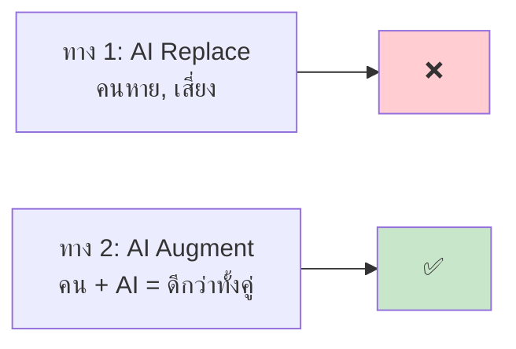
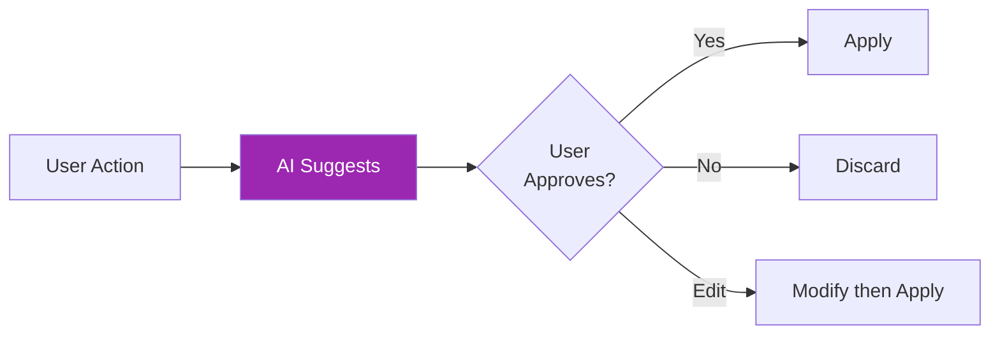
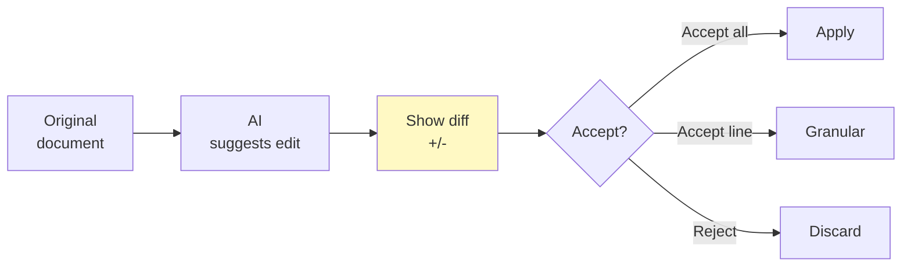

# Day 26: Claude Design Principles 🎨

<div class="lesson-meta">
⏱️ 3 ชั่วโมง &nbsp;|&nbsp; 📊 Intermediate &nbsp;|&nbsp; 📋 Prerequisites: Week 1–3
</div>

## 🎯 Learning Objectives

<ul class="objectives">
<li>เข้าใจหลัก design ของ AI products</li>
<li>รู้ patterns ที่ดี vs anti-patterns</li>
<li>ออกแบบ UX ที่จัดการความไม่แน่นอนของ LLM</li>
<li>เข้าใจ "AI augmentation" vs "AI replacement"</li>
</ul>

---

## 1. หลักการพื้นฐาน (จาก Anthropic Design)

### Principle 1: Build for Trust, Not Magic

❌ **Magic:** "AI ทำเอง ไม่ต้องคุยกับใคร เชื่อใจ"

✅ **Trust:** Transparent, explainable, reversible

### Principle 2: AI Augments Humans



ออกแบบให้คนยัง **in the loop** เสมอ ในจุดที่สำคัญ

### Principle 3: Make Uncertainty Visible

LLM มี uncertainty — แสดงให้ผู้ใช้รู้ ไม่ซ่อน

ตัวอย่าง:
- แสดง confidence score
- แสดง sources ที่ใช้ (citation)
- แสดง "drafted by AI — please review"

### Principle 4: Provide Escape Hatches

ผู้ใช้ต้องสามารถ:
- **Undo** action ของ AI
- **Override** suggestion
- **Disable** feature ถ้าไม่ต้องการ
- **Report** mistake ให้ feedback

---

## 2. Design Patterns ที่ดี

### Pattern 1: Suggestion, Not Action



ตัวอย่าง: Email subject line auto-suggest — แสดง 3 ตัวเลือก ให้คนเลือก แทนใส่อัตโนมัติ

### Pattern 2: Streaming + Cancel

แสดง response แบบ stream + ปุ่ม "Stop" ให้ user

→ ลด perceived latency, ให้ control

### Pattern 3: Citation / Source Attribution

```
Claude: ตาม [AWS docs](https://...), Lambda มี 15-min timeout limit
```

→ User verify ได้, build trust

### Pattern 4: Diff View



### Pattern 5: Graceful Degradation

ถ้า AI fail → fallback ดีกว่า crash:

```
[AI down] → ใช้ template ปกติ + แจ้ง user
[Rate limit] → queue + retry หลัง 1 นาที
[Hallucinated] → ให้ feedback button → re-generate
```

---

## 3. Anti-Patterns (อย่าทำ)

### ❌ Anti-Pattern 1: Magic UI

ใส่ AI ตอบเลยไม่มี context, ไม่มี explain → ผู้ใช้สับสน

### ❌ Anti-Pattern 2: Endless Loading

AI คิดนานๆ ไม่บอกอะไรเลย → ผู้ใช้ติด anxiety

แก้: streaming, progress message ("กำลังค้นหา...", "กำลังสรุป...")

### ❌ Anti-Pattern 3: Irreversible Action

AI ลบ/ส่ง/charge เงิน โดยไม่ confirm → disaster

แก้: ขอ confirm ก่อนทุก destructive action

### ❌ Anti-Pattern 4: Overconfidence

LLM ตอบมั่นใจทั้งที่ผิด → ผู้ใช้เชื่อแล้วเกิดความเสียหาย

แก้: 
- prompt engineering ให้ admit uncertainty
- แสดง confidence
- คำเตือนสำหรับ high-stakes (medical, legal, financial)

### ❌ Anti-Pattern 5: Hide AI

ปกปิดว่ามี AI ทำงาน → trust ปัญหาเมื่อผู้ใช้รู้ทีหลัง

แก้: บอกชัดเจน "Drafted by AI", "AI-assisted"

---

## 4. UX Patterns สำหรับสถานการณ์ทั่วไป

### 4.1 Empty State

แทน "No data" → AI แนะนำ:
```
"ยังไม่มี notes — ลองพิมพ์ idea แล้ว AI ช่วยขยายให้"
```

### 4.2 Onboarding

แทน 10-step wizard → conversational onboarding:
```
"สวัสดี! ผมอยากเรียนรู้คุณนิดหน่อย เพื่อช่วยได้ตรงใจ
คุณทำงานในด้านไหนเป็นหลัก?"
```

### 4.3 Errors

แทน "Error 500" → human-friendly + AI suggest:
```
"เกิดข้อผิดพลาด ลอง:
1. รีโหลดหน้า
2. เช็คอินเทอร์เน็ต
3. ลองอีกครั้งใน 30 วิ
ถ้ายังไม่ได้ → contact support พร้อม code: ABC-123"
```

### 4.4 Confirmations

แทน "Are you sure?" บ่อย → batch + smart:
```
"AI จะลบ 17 emails ที่เป็น spam — ทบทวนก่อน:
[ดู list 17 emails]
[ลบทั้งหมด] [เลือกเอง] [ยกเลิก]"
```

---

## 5. Accessibility

- Voice input/output สำหรับคนพิมพ์ลำบาก
- Keyboard shortcuts ครบทุก action
- Screen reader friendly
- High contrast mode
- Adjustable font / spacing
- ภาษาท้องถิ่น (i18n)

---

## 6. Performance Heuristics

| Metric | Target |
|--------|--------|
| Time to first token | < 500ms |
| Full response | < 5s (streaming) |
| Tool call | < 2s |
| Error recovery | < 3s |

---

## 🛠️ Hands-on Exercise

!!! example "Exercise 1: Audit Existing Product"
    เปิด AI product ที่คุณใช้ (Notion AI, ChatGPT, Cursor) → ระบุ:
    - 3 design patterns ที่ดี
    - 3 anti-patterns ที่เจอ
    - Suggestion ของคุณ

!!! example "Exercise 2: Redesign"
    เลือก 1 feature ใน app เก่าๆ (ไม่ใช่ AI) → ออกแบบ AI version
    
    - User journey: เดิม vs ใหม่
    - Trust mechanism
    - Escape hatches
    - Failure modes

!!! example "Exercise 3: Citation UX"
    ลอง prompt Claude.ai ให้ตอบพร้อม citations → UI ของ Claude.ai แสดงอย่างไร? เปรียบเทียบกับ Perplexity และ Google AI Overviews

---

## ✅ Self-Check Quiz

<div class="quiz">

**Q1:** "AI augments humans" ในเชิงปฏิบัติแปลว่าอะไร?

??? success "ดูคำตอบ"
    คนยังอยู่ใน loop — AI แนะนำ, คน approve; AI ช่วย, คนคิด final; AI หา drafts, คน edit. ไม่ใช่ "AI ทำเอง คนหาย"

**Q2:** ทำไมต้อง "make uncertainty visible"?

??? success "ดูคำตอบ"
    LLM hallucinate ได้ — ถ้าซ่อน uncertainty ผู้ใช้จะเชื่อ blindly → เกิดความเสียหายเมื่อผิด การแสดง uncertainty (citation, confidence) ช่วยให้คนตัดสินใจถูก

**Q3:** "Escape hatch" สำคัญตรงไหน?

??? success "ดูคำตอบ"
    AI ทำผิดได้เสมอ — ต้องมีทาง undo, override, disable เพื่อไม่ให้ user รู้สึก trapped หรือเสียหายจาก AI mistake

**Q4:** Streaming response ช่วยอะไรในด้าน UX?

??? success "ดูคำตอบ"
    ลด perceived latency — user เห็นความคืบหน้าแม้ total time เท่าเดิม, ยังให้ user "stop" ได้กลางคันถ้าเห็นว่าผิด

</div>

---

## 🔍 Cross-check & References

- 📘 [Anthropic — Design Principles](https://www.anthropic.com/)
- 📚 [Google PAIR — People + AI Guidebook](https://pair.withgoogle.com/guidebook/)
- 📚 [Microsoft — Guidelines for Human-AI Interaction](https://www.microsoft.com/en-us/research/publication/guidelines-for-human-ai-interaction/)

[ต่อไป → Day 27 :material-arrow-right:](day-27.md){ .md-button .md-button--primary }
