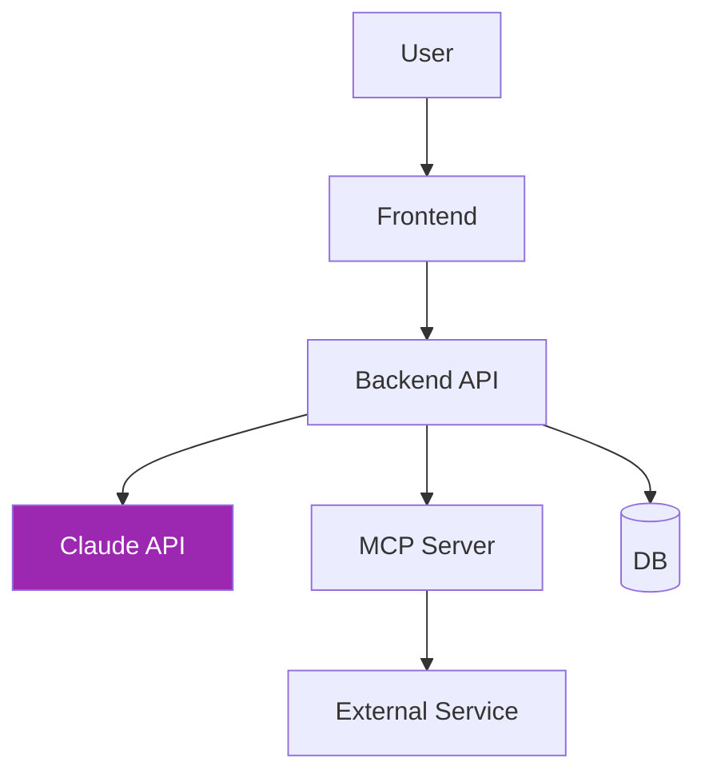

# Day 28–30: Capstone Project 🏆

<div class="lesson-meta">
⏱️ 15 ชั่วโมง (5h × 3 วัน) &nbsp;|&nbsp; 📊 Capstone &nbsp;|&nbsp; 📋 Prerequisites: ทุกบท
</div>

## 🎯 Goal

สร้าง **production-ready Claude application** ที่:

<ul class="objectives">
<li>ใช้ Claude API + tool use + agent loop</li>
<li>มี custom MCP server (optional)</li>
<li>มี frontend ที่ดี (UX patterns จาก Day 26)</li>
<li>ผ่าน production checklist (Day 27)</li>
<li>มี documentation + eval + demo</li>
</ul>

---

## 1. เลือก Project (Day 28 — 1 ชม.)

### Option A: AI DevOps Assistant
- Agent ที่อ่าน Kubernetes logs, suggest fixes
- เชื่อมกับ Prometheus, Grafana via MCP
- Slack notification

### Option B: API Design Companion
- รับ requirements → สร้าง OpenAPI spec
- Generate mock server
- Generate client SDK
- Doc + tests

### Option C: Cost Optimizer
- Connect AWS API → analyze bill
- Detect anomaly + waste
- Suggest right-sizing
- Email weekly report

### Option D: Knowledge Base Agent
- Index company docs (Confluence, Notion)
- Answer Q&A with citations
- Slack bot interface

### Option E: ของคุณเอง
- Project ที่แก้ปัญหาจริงในงาน

!!! tip "เลือกอย่างไร"
    - มี **stakeholder จริง** (ตัวคุณเอง, ทีม, ลูกค้า)
    - Scope พอจบใน 15 ชม.
    - ใช้ ≥ 3 capabilities ที่เรียนไปแล้ว
    - มี **measurable success criteria**

---

## 2. Day 28: Design & Plan (5 ชม.)

### 2.1 Write Project Brief (1 ชม.)

ใช้ template:

```markdown
# Capstone: [project name]

## Problem
[ปัญหาอะไร? ใครเจ็บ? อย่างไร?]

## Solution
[คุณจะแก้อย่างไร? ใช้ Claude ตรงไหน?]

## Success Criteria
- [ ] Metric 1 (เช่น ลดเวลา X จาก 1 ชม. → 5 นาที)
- [ ] Metric 2
- [ ] Metric 3

## Out of Scope
[สิ่งที่จะไม่ทำใน MVP]
```

### 2.2 Architecture Diagram (1 ชม.)



ระบุ:
- Tech stack
- Data flow
- Auth flow
- Failure mode

### 2.3 Prompt Design (1 ชม.)

สำหรับแต่ละ AI feature เขียน:
- System prompt
- Tool schema
- Few-shot examples
- Eval criteria

### 2.4 Eval Dataset (1 ชม.)

≥ 20 test cases (input + expected) ใน CSV

### 2.5 Project Setup (1 ชม.)

```bash
mkdir capstone && cd capstone
git init
# ตั้ง project structure
# CLAUDE.md + README skeleton
```

---

## 3. Day 29: Build (5 ชม.)

### 3.1 Backend Core (2 ชม.)

- Setup framework (FastAPI / Express)
- Auth
- Claude API integration
- Tool definitions
- Agent loop (ถ้าใช้)

### 3.2 Frontend (1.5 ชม.)

- UI สำหรับ user interaction
- Streaming display
- Citation rendering
- Error states
- Feedback button

### 3.3 MCP Server (ถ้ามี) (1 ชม.)

- Setup MCP project
- Define tools/resources
- Test กับ Inspector

### 3.4 Integration Tests (30 นาที)

- Happy path
- Error path
- Edge cases

---

## 4. Day 30: Polish & Demo (5 ชม.)

### 4.1 Eval (1 ชม.)

- Run eval dataset
- บันทึก pass rate, latency, cost / request
- Iterate prompt 1-2 ครั้งถ้าจำเป็น

### 4.2 Security & Cost (1 ชม.)

- ตรวจ prompt injection vulnerabilities
- Setup spending limit
- Right-size model per feature
- Enable prompt caching ถ้า applicable

### 4.3 Documentation (1.5 ชม.)

**README.md:**
- Problem + Solution
- Architecture diagram
- Tech stack
- Setup instructions
- Demo screenshots / GIF
- Future work

**docs/:**
- API reference
- Architecture decisions (ADRs)
- Troubleshooting

### 4.4 Demo Video (1 ชม.)

5-7 นาที video:
1. Problem (30 วิ)
2. Solution overview (30 วิ)
3. Live demo (3-4 นาที)
4. Architecture quick (1 นาที)
5. Eval results + learnings (1 นาที)

### 4.5 Publish (30 นาที)

- Push code → GitHub (public ถ้า OK)
- Tag release v1.0
- Share — LinkedIn, blog, X
- Submit ใน community (Anthropic Discord, dev forums)

---

## 5. Scoring Rubric

| Category | Points |
|----------|--------|
| **Problem & Solution clarity** | / 10 |
| **Architecture & design** | / 15 |
| **Working implementation** | / 25 |
| **Code quality** | / 10 |
| **Claude integration depth** | / 15 |
| **Security & cost considerations** | / 10 |
| **Eval & quality** | / 5 |
| **Documentation** | / 5 |
| **Demo presentation** | / 5 |
| **Total** | **/ 100** |

ผ่าน = 70+ &nbsp;|&nbsp; ดีมาก = 85+ &nbsp;|&nbsp; ยอดเยี่ยม = 95+

---

## 6. Recommended Stack

| Layer | Suggestion |
|-------|-----------|
| Backend | Python (FastAPI) / Node (Express, Hono) |
| Frontend | Next.js / Streamlit (ถ้า Python) / Astro |
| DB | PostgreSQL / SQLite |
| Vector DB (RAG) | pgvector / Qdrant |
| Hosting | Railway / Render / Vercel / Fly.io |
| Observability | Logfire / Helicone / Langfuse |

---

## 7. Common Pitfalls (อ่านก่อนเริ่ม!)

| ❌ Pitfall | ✅ แก้ไข |
|----------|---------|
| Scope creep | ตัด feature ออกจนเหลือ MVP |
| Over-engineered agent | เริ่ม simple workflow ก่อน |
| Ignored eval | บังคับ ≥ 20 cases ก่อน demo |
| Hardcoded prompts ใน code | Separate ใน config files |
| No error handling | retry + fallback ทุก external call |
| Demo ไม่ rehearse | ซ้อม 2 รอบ + record |

---

## 8. After Capstone — Next Steps

### Career
- เพิ่ม project ใน portfolio + LinkedIn
- เขียน blog/article 1 อันเล่าประสบการณ์
- พูดใน meetup / workshop

### Learning
- ลึกขึ้นในหัวข้อที่สนใจ (RAG, fine-tuning, eval)
- ติดตาม [Anthropic Research](https://www.anthropic.com/research)
- เข้าร่วม community: Anthropic Discord, r/LocalLLaMA

### Build
- เปิด open source MCP server ที่ทีมใช้
- Contribute to Anthropic Cookbook
- ขาย / open-source app ของคุณ

---

## 🎉 จบ Course!

```mermaid
graph LR
    A[Day 1<br/>"AI คืออะไร"] --> B[Day 30<br/>"ผมมี production app"]
    style A fill:#fff9c4
    style B fill:#9c27b0,color:#fff
```

**คุณมาไกลมาก:**

- ✅ จาก zero AI knowledge → Claude expert
- ✅ ใช้ Claude.ai, Claude Code, MCP, Agents ได้
- ✅ สร้าง production-ready app
- ✅ เข้าใจ design, security, cost, eval

### Self-Reflection (เขียน 300 คำ)

1. Capability ไหนที่ "อ๋อ" ที่สุด?
2. สิ่งไหนยากที่สุด? เอาชนะอย่างไร?
3. ใน 3 เดือนข้างหน้า จะใช้ Claude ทำอะไร?
4. ใครจะให้คำขอบคุณ?

---

## 🔍 Final References

- 📦 [Anthropic Cookbook](https://github.com/anthropics/anthropic-cookbook)
- 📘 [Anthropic Documentation Hub](https://docs.claude.com)
- 💬 [Anthropic Discord](https://www.anthropic.com/discord) (ดู link ล่าสุดใน docs)
- 🎓 [DeepLearning.AI — Anthropic Courses](https://www.deeplearning.ai/)

---

:material-trophy: **Congratulations!** 🎊

[← กลับหน้าแรก](../index.md){ .md-button }
[Capstone gallery — ดูของคนอื่น :material-arrow-right:](https://github.com/topics/claude-capstone){ .md-button .md-button--primary }
