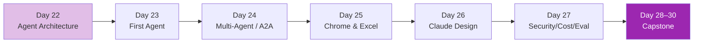

# Week 4: Agents & Capstone 🎯

จากเครื่องมือต่างๆ → **Agent ที่ทำงานได้เอง** + **Capstone Project**

## รายวิชา

| Day | หัวข้อ | สกิลที่ได้ | เวลา |
|-----|--------|-----------|------|
| 22 | Agent Architecture — แนวคิด | loops, tools, memory, evaluation | 3h |
| 23 | สร้าง First Agent | Python script ที่เป็น agent | 4h |
| 24 | Multi-Agent & A2A | orchestrator-worker, A2A protocol | 4h |
| 25 | Claude in Chrome & Excel | beta tools | 3h |
| 26 | Claude Design Principles | when AI helps vs hurts UX | 3h |
| 27 | Security, Cost, Eval | production readiness | 4h |
| 28–30 | **Capstone** | end-to-end project | 5h × 3 |

## หลังจบ Week 4 คุณจะ

- [x] เข้าใจ agent architecture ใน depth
- [x] สร้าง agent ที่ทำงานได้เอง
- [x] รู้จัก A2A protocol และ multi-agent pattern
- [x] รู้จัก Chrome / Excel ของ Claude
- [x] เข้าใจ design principles สำหรับ AI products
- [x] เตรียม production: security, cost, eval
- [x] มี portfolio capstone ของตัวเอง

[เริ่ม Day 22 :material-arrow-right:](day-22.md){ .md-button .md-button--primary }
