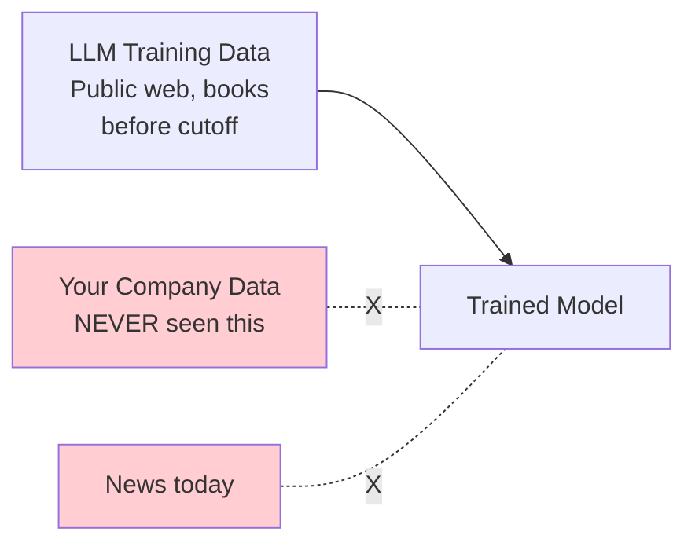
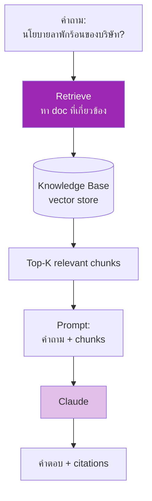
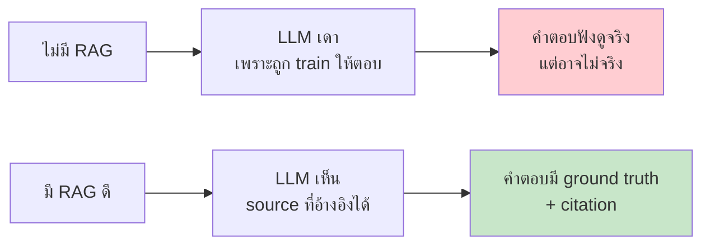
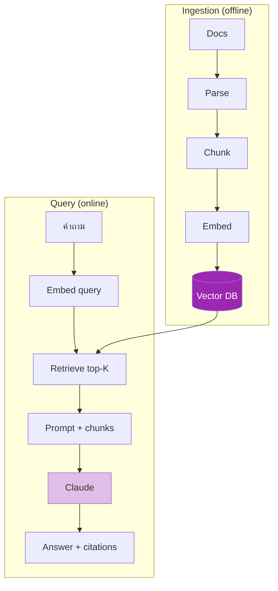

# Day 31: ทำไมต้อง RAG? 🔍

⏱️ 3 ชั่วโมง &nbsp;|&nbsp; 📊 Intermediate &nbsp;|&nbsp; 📋 Prerequisites: Week 1 (LLM พื้นฐาน)

## 🎯 Learning Objectives

<ul class="objectives">
<li>เข้าใจว่าทำไม LLM "ไม่รู้" ข้อมูล company ของเรา</li>
<li>รู้จัก context window limits และ cost implications</li>
<li>เข้าใจปัญหา hallucination ที่ RAG ช่วยแก้</li>
<li>รู้ว่าเมื่อไหร่ "ไม่ควร" ใช้ RAG</li>
</ul>

---

## 1. ปัญหา: LLM เป็น "Sealed Box"

LLM เรียนจาก training data จนถึง cutoff date (เช่น Claude Opus 4.7 = Jan 2026) — แต่ไม่รู้:

- ข้อมูล **บริษัทคุณ** (Confluence pages, internal docs)
- ข้อมูลใหม่หลัง cutoff (ข่าวล่าสุด)
- ข้อมูล **private** (ลูกค้า, transaction)
- เอกสารยาวเฉพาะที่ไม่เคยอยู่บนเน็ต

---

## 2. ทำไมไม่ใส่ทุกอย่างใน Context Window?

Claude มี **context window ใหญ่** (~200K tokens) — แต่ enterprise data ใหญ่กว่ามาก

### ตัวอย่างเลขจริง

| Source | Tokens | ใส่ใน context ได้? |
|--------|--------|-------------------|
| 1 เอกสาร PDF (50 หน้า) | ~25K | ✅ ใส่ได้ |
| Confluence space ขนาดกลาง | ~5M | ❌ ใหญ่กว่า context 25 เท่า |
| Codebase บริษัท | ~50M+ | ❌ |
| คลังเอกสารทั้งบริษัท | ~500M+ | ❌ |

### Cost ของการ stuff context

| Context size | Input cost (Sonnet, ราคาประมาณ) | / 1000 queries |
|-------------|---------------------------------|---------------|
| 5K tokens | $0.015 | $15 |
| 50K tokens | $0.15 | $150 |
| 200K (max) | $0.60 | $600 |

→ ใส่หมดทุก query = แพง + ช้า + เกินขีดอยู่ดี

---

## 3. ทางออก: RAG

**RAG = Retrieval-Augmented Generation**

> หา (retrieve) เฉพาะส่วนที่เกี่ยวข้องกับคำถาม → ใส่ใน context → generate

### ตัวอย่างเชิง concrete

ผู้ใช้: "ลาพักร้อนเกิน 10 วันต่อปีได้ไหม?"

**ไม่มี RAG:** Claude เดา ตามข้อมูล public — อาจจะตอบนโยบายของบริษัทอื่น ❌

**มี RAG:** ระบบหา HR_Policy_Vacation_v2024.pdf chunk ที่เกี่ยวข้อง → ใส่ใน prompt → Claude ตอบจริง พร้อม cite source ✅

---

## 4. ปัญหา Hallucination ที่ RAG ลด (ไม่ได้ขจัด)

!!! warning "RAG ไม่ได้ขจัด hallucination ทั้งหมด"
    - ถ้า retrieved chunks ไม่ตรง — LLM ยังเดาได้
    - ต้องออกแบบ **prompt** ให้ refuse ถ้าไม่เจอ info
    - ต้องใช้ **eval** ตรวจสอบ

---

## 5. เมื่อไหร่ "ไม่ควร" ใช้ RAG?

| Case | ใช้อะไรแทน |
|------|-----------|
| ข้อมูลใส่ใน prompt ได้สบาย (< 5K tokens) | Stuff context ปกติ |
| Task creative (story writing) | ไม่ต้อง RAG |
| ข้อมูลเปลี่ยนทุกวินาที (stock price) | Tool call API |
| ตอบเดิมๆ ทุก user | Cache response |
| ต้องการ exact match (เช่น lookup ใน table) | SQL/Database |

---

## 6. RAG Architecture Overview

→ Day 32-36 จะลงไปลึกแต่ละ component

---

## 🛠️ Hands-on Exercise

!!! example "Exercise 1: ลอง 'No-RAG' vs 'Stuffed Context'"
    เลือก PDF บริษัท (หรือเอกสารที่คุณมี) — ถาม Claude.ai สองวิธี:
    
    1. ถามตรงๆ ไม่ upload doc — ดู Claude เดาหรือ refuse
    2. Upload doc แล้วถาม — ดูคุณภาพคำตอบ
    
    Reflect: ถ้าคุณมีเอกสารพันๆ ไฟล์ จะ upload ทุกครั้งได้ไหม?

!!! example "Exercise 2: คำนวณ Cost"
    บริษัทมี:
    - 10,000 docs เฉลี่ย 5K tokens = 50M tokens
    - 1000 queries/วัน
    
    คำนวณ cost ต่อเดือนของ:
    - Approach A: stuff ทุก doc ทุก query (200K limit จึงเป็นไปไม่ได้ — แต่ลองคิด)
    - Approach B: RAG (retrieve top-3 = ~15K context)

!!! example "Exercise 3: หา Use Case"
    ในงานคุณตอนนี้ ระบุ 3 use cases ที่ RAG จะช่วยมาก:
    - ใครเป็น user?
    - Knowledge base คืออะไร?
    - คำถามที่จะถามคืออะไร?

---

## ✅ Self-Check Quiz

**Q1:** ทำไม LLM "ไม่รู้" ข้อมูลบริษัทของเรา?

??? success "ดูคำตอบ"
    LLM ถูก train จาก public data จนถึง cutoff date — ไม่เคยเห็นข้อมูล private/internal ของบริษัทใดบริษัทหนึ่ง

**Q2:** ทำไมแค่ "ใส่ทุกอย่างใน context window" ไม่ได้?

??? success "ดูคำตอบ"
    3 เหตุผลหลัก: (1) Context มี limit เช่น 200K tokens, enterprise data ใหญ่กว่า, (2) Cost — ส่ง 200K tokens × 1000 queries แพงมาก, (3) Latency — context ยาว = ช้า

**Q3:** RAG ขจัด hallucination ได้ 100% ไหม?

??? success "ดูคำตอบ"
    ไม่ได้ — ลดได้มากแต่ไม่ขจัด เพราะ: retrieve ผิด chunks ได้, LLM ยังเดาเสริมได้, ต้องใช้ prompt + eval ช่วย

**Q4:** Ingestion vs Query phase ต่างกันอย่างไร?

??? success "ดูคำตอบ"
    - **Ingestion (offline)**: parse → chunk → embed → store ทำครั้งเดียวต่อ doc
    - **Query (online)**: embed คำถาม → retrieve → generate ทำทุก query

---

## 🔍 Cross-check & References

- 📘 [Anthropic — Retrieval Augmented Generation](https://docs.claude.com/en/docs/build-with-claude/retrieval)
- 📚 [Lewis et al. — RAG paper (Facebook AI, 2020)](https://arxiv.org/abs/2005.11401)
- 📺 [DeepLearning.AI — Retrieval Augmented Generation course](https://www.deeplearning.ai/courses/retrieval-augmented-generation)

[ต่อไป → Day 32: Embeddings :material-arrow-right:](day-32.md){ .md-button .md-button--primary }
