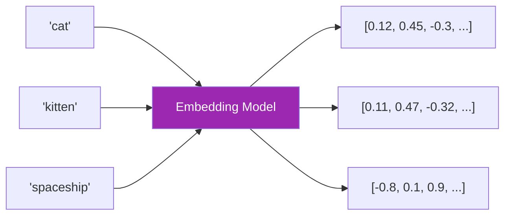
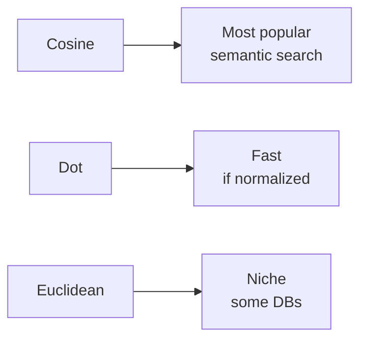
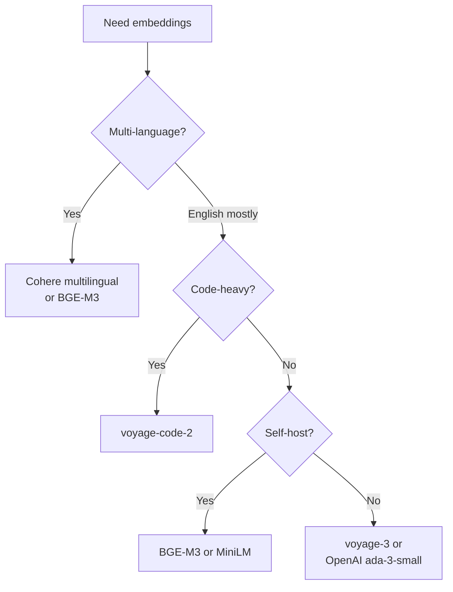

# Day 32: Embeddings 🧮

<div class="lesson-meta">
⏱️ 4 ชั่วโมง &nbsp;|&nbsp; 📊 Intermediate &nbsp;|&nbsp; 📋 Prerequisites: Day 31
</div>

## 🎯 Learning Objectives

<ul class="objectives">
<li>เข้าใจว่า embedding คืออะไร และทำงานยังไง</li>
<li>รู้จัก similarity metrics (cosine, dot product, euclidean)</li>
<li>เลือก embedding model ที่เหมาะ — OpenAI, Voyage, Cohere, BGE, multilingual</li>
<li>เข้าใจ multimodal embeddings (image+text)</li>
</ul>

---

## 1. Embedding คืออะไร?

**Embedding** = vector ตัวเลข (มัก 768-3072 dimensions) ที่ encode "ความหมาย" ของข้อความ



**คุณสมบัติสำคัญ:** ข้อความที่ใกล้กันในความหมาย → vector ใกล้กันใน space

- `cat` ↔ `kitten` → ใกล้กัน (เกี่ยวกับแมว)
- `cat` ↔ `spaceship` → ไกลกัน

---

## 2. Visualize ใน 2D

จริงๆ embeddings มีหลายร้อย dimensions แต่ลด dimension มาดูใน 2D ได้ (ผ่าน UMAP/t-SNE):

```
              Animals
       cat ─── kitten
        │       │
       dog ── puppy
                        Tech
                  ────  computer
                  ────  laptop
                        ────  CPU

                                Space
                                ── rocket
                                ── spaceship
```

Cluster กันตามหัวข้อโดยอัตโนมัติ

---

## 3. Similarity Metrics

3 metrics ที่นิยม:

### 3.1 Cosine Similarity (default)

วัด angle ระหว่าง vectors — ignore magnitude

```
cos_sim(A, B) = (A · B) / (|A| × |B|)
range: -1 (opposite) ... 1 (identical)
```

**ใช้เมื่อ:** ส่วนใหญ่ — เหมาะกับ semantic search

### 3.2 Dot Product

```
A · B = Σ aᵢ × bᵢ
```

**ใช้เมื่อ:** vectors ถูก normalize แล้ว → เร็วกว่า cosine

### 3.3 Euclidean Distance

```
||A - B||
range: 0 (same) ... ∞
```

**ใช้เมื่อ:** น้อยลง — บางครั้ง vector DB optimized



---

## 4. Embedding Models เลือกอย่างไร

| Model | Provider | Dim | Use Case | ราคา (1M tokens) |
|-------|----------|-----|---------|------------------|
| voyage-3-large | Voyage AI | 1024 | Anthropic recommended | ~$0.18 |
| voyage-3 | Voyage AI | 1024 | Cheaper good baseline | ~$0.06 |
| voyage-code-2 | Voyage AI | 1536 | Code search | ~$0.12 |
| text-embedding-3-large | OpenAI | 3072 | General + popular | ~$0.13 |
| text-embedding-3-small | OpenAI | 1536 | Cheap baseline | ~$0.02 |
| embed-multilingual-v3 | Cohere | 1024 | 100+ languages | ~$0.10 |
| BGE-M3 | BAAI (open) | 1024 | Self-host, multilingual | $0 (compute only) |
| MiniLM | Sentence Tx (open) | 384 | Lightweight, on-device | $0 |

(ราคาเปลี่ยนเสมอ — ตรวจสอบ vendor pricing ล่าสุด)

### Decision Tree



!!! tip "Anthropic แนะนำ Voyage AI"
    เพราะ Anthropic + Voyage มี partnership และ Voyage benchmark ดีกับ Claude — แต่ OpenAI embeddings ก็ใช้กับ Claude ได้

---

## 5. Multimodal Embeddings

บาง model embed image + text เข้า **shared space** เดียวกัน → ค้น image ด้วย text ได้

```
"red sports car"  ────► [0.3, -0.5, 0.8, ...]
[🚗 image of red Ferrari] ────► [0.31, -0.48, 0.79, ...]
                            ↑ ใกล้กันใน same space
```

Models: CLIP, SigLIP, Voyage multimodal-3, Cohere Embed v4

**Use cases:**
- ค้นหา image จากคำอธิบาย
- Visual product search
- Document Q&A ที่มี chart/diagram

---

## 6. Code Example — Embedding ด้วย Voyage

```python
import voyageai

vo = voyageai.Client()  # uses VOYAGE_API_KEY

# Embed single text
result = vo.embed(
    ["RAG combines retrieval and generation"],
    model="voyage-3",
    input_type="document"  # or "query"
)
print(len(result.embeddings[0]))  # 1024
print(result.embeddings[0][:5])   # [0.012, -0.045, ...]

# Batch
texts = ["doc 1", "doc 2", "doc 3"]
result = vo.embed(texts, model="voyage-3", input_type="document")
embeddings = result.embeddings  # list of 3 vectors
```

### Cosine similarity ใน numpy

```python
import numpy as np

def cosine_sim(a, b):
    return np.dot(a, b) / (np.linalg.norm(a) * np.linalg.norm(b))

q_emb = vo.embed(["how does RAG work"], model="voyage-3", input_type="query").embeddings[0]

scores = [cosine_sim(q_emb, doc_emb) for doc_emb in embeddings]
ranked = sorted(zip(scores, texts), reverse=True)
print(ranked[:3])  # top 3 most similar
```

---

## 🛠️ Hands-on Exercise

!!! example "Exercise 1: ลอง Voyage AI"
    Sign up [voyageai.com](https://www.voyageai.com) → ลอง embed 10 ประโยค → คำนวณ cosine similarity → check ว่า cluster ถูกหัวข้อไหม

!!! example "Exercise 2: เปรียบเทียบ Models"
    Embed 20 sentences ด้วย voyage-3 และ openai text-embedding-3-small
    
    - คุณภาพต่างไหม (ทดสอบด้วย retrieval test)?
    - ราคา + latency ต่างเท่าไหร่?

!!! example "Exercise 3: Visualize"
    ใช้ UMAP/t-SNE ลด 1024 dim → 2D → plot ดู cluster
    
    (sklearn TSNE + matplotlib หรือ Embedding Projector)

---

## ✅ Self-Check Quiz

<div class="quiz">

**Q1:** ทำไม embedding ใกล้กันแปลว่า "ความหมายใกล้กัน"?

??? success "ดูคำตอบ"
    เพราะ embedding model ถูก train ด้วย objective ที่บังคับให้คำที่ปรากฏใน context คล้ายกัน → ได้ vector ใกล้กัน (contrastive learning, sentence pair training)

**Q2:** ทำไม cosine similarity เป็น default มากกว่า euclidean?

??? success "ดูคำตอบ"
    Cosine ignore magnitude — สนใจ "ทิศทาง" ของ vector ซึ่งเก็บความหมาย; magnitude อาจเปลี่ยนตาม length ของ text — irrelevant สำหรับ semantic

**Q3:** Multimodal embedding ทำงานยังไง?

??? success "ดูคำตอบ"
    Model ถูก train ให้ encode image และ text เข้า **shared embedding space** — ผ่าน contrastive learning (CLIP-style): ภาพ + caption ที่คู่กันต้องอยู่ใกล้กัน

</div>

---

## 🔍 Cross-check & References

- 📘 [Voyage AI Docs](https://docs.voyageai.com/)
- 📚 [DeepLearning.AI — Embedding Models from Architecture to Implementation](https://www.deeplearning.ai/courses/embedding-models-from-architecture-to-implementation)
- 📺 [DLAI — Understanding and Applying Text Embeddings](https://www.deeplearning.ai/courses/google-cloud-vertex-ai)
- 🛠️ [Anthropic — Embeddings overview](https://docs.claude.com/en/docs/build-with-claude/embeddings)

[ต่อไป → Day 33: Vector Databases :material-arrow-right:](day-33.md){ .md-button .md-button--primary }
