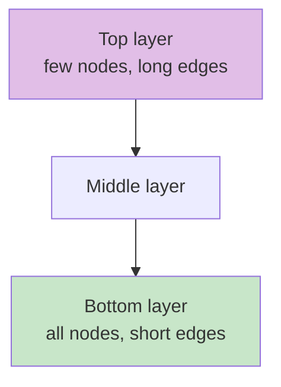
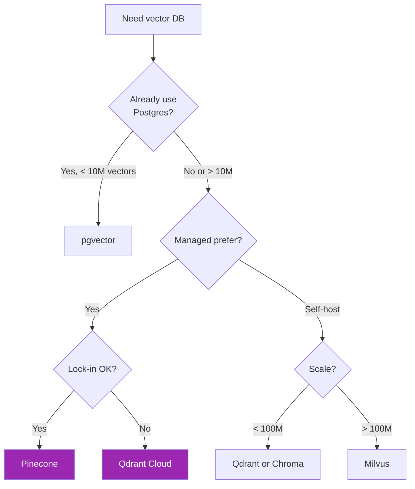

# Day 33: Vector Databases 🗄️

<div class="lesson-meta">
⏱️ 4 ชั่วโมง &nbsp;|&nbsp; 📊 Intermediate &nbsp;|&nbsp; 📋 Prerequisites: Day 32
</div>

## 🎯 Learning Objectives

<ul class="objectives">
<li>เข้าใจว่าทำไมต้องใช้ vector DB แทน scan-all</li>
<li>รู้จัก ANN algorithms (HNSW, IVF)</li>
<li>เปรียบเทียบ Pinecone, Qdrant, Weaviate, pgvector</li>
<li>เลือก vector DB ตาม workload</li>
</ul>

---

## 1. ทำไมต้อง Vector Database?

### ปัญหา: Brute-force ไม่ scale

มี 10M docs — ถ้าค้นทุกครั้งคำนวณ cosine กับทั้ง 10M = **ช้ามาก**

### ทางออก: Approximate Nearest Neighbor (ANN)

แลก accuracy 1-2% เพื่อ speed 100-1000×

```mermaid
graph LR
    A[10M vectors] --> B[Index<br/>HNSW / IVF]
    B --> C[Search<br/>O(log N)<br/>~ms]
    style B fill:#9c27b0,color:#fff
```

---

## 2. ANN Algorithms

### HNSW (Hierarchical Navigable Small World) — popular default



→ Search: start top layer → descend → fine-grained search at bottom

Pros: fast recall, good for static data
Cons: high memory

### IVF (Inverted File Index)

แบ่ง space เป็น cells (Voronoi) → ค้นแค่ cells ที่ใกล้

Pros: less memory, ดีกับ data ขนาดใหญ่
Cons: needs training, slower than HNSW

### IVF-PQ (with Product Quantization)

Compress vectors → memory ลด 10-50× แลก precision

---

## 3. Vector DB Landscape

### Comparison Matrix

| DB | Type | Hosting | Strength | Cost |
|----|------|---------|----------|------|
| **Pinecone** | Managed | Cloud only | Easiest setup, scale | $$ |
| **Qdrant** | OSS + Cloud | Self/cloud | Rust, fast, hybrid built-in | $-$$ |
| **Weaviate** | OSS + Cloud | Self/cloud | Graph features, GraphQL | $-$$ |
| **Milvus** | OSS + Cloud (Zilliz) | Self/cloud | Massive scale | $-$$ |
| **Chroma** | OSS | Self mostly | Simple, dev-friendly | $ (compute) |
| **pgvector** | Postgres extension | Self | Use existing Postgres | $ |
| **Elasticsearch** | OSS + Cloud | Self/cloud | Already in stack? | $$ |
| **Vespa** | OSS | Self | Yahoo-grade, complex | $$ |
| **MongoDB Atlas Vector** | Managed | Cloud | Already use Mongo? | $$ |
| **Redis (RedisSearch)** | OSS + Cloud | Self/cloud | Already use Redis? | $ |

### Decision Tree



---

## 4. Code Example — Qdrant (popular OSS choice)

### Setup
```bash
# Local Docker
docker run -p 6333:6333 qdrant/qdrant

# Or Qdrant Cloud — sign up + get API key
```

```python
from qdrant_client import QdrantClient
from qdrant_client.models import Distance, VectorParams, PointStruct
import voyageai

vo = voyageai.Client()
qd = QdrantClient(url="http://localhost:6333")

# Create collection
qd.create_collection(
    collection_name="company_docs",
    vectors_config=VectorParams(size=1024, distance=Distance.COSINE),
)

# Embed + upload
docs = [
    {"id": 1, "text": "ลาพักร้อนได้ 15 วันต่อปี", "source": "HR_policy"},
    {"id": 2, "text": "WFH ได้สูงสุด 3 วันต่อสัปดาห์", "source": "WFH_policy"},
    # ... 10K more
]

embeddings = vo.embed(
    [d["text"] for d in docs],
    model="voyage-3", input_type="document"
).embeddings

points = [
    PointStruct(id=d["id"], vector=emb, payload=d)
    for d, emb in zip(docs, embeddings)
]
qd.upsert(collection_name="company_docs", points=points)

# Query
q_emb = vo.embed(["WFH นโยบายเป็นไง"], model="voyage-3", input_type="query").embeddings[0]
results = qd.search(
    collection_name="company_docs",
    query_vector=q_emb,
    limit=3
)
for r in results:
    print(r.score, r.payload["text"])
```

---

## 5. Code Example — pgvector (ใช้ Postgres เดิม)

```bash
# In Postgres:
CREATE EXTENSION vector;
```

```sql
CREATE TABLE docs (
  id SERIAL PRIMARY KEY,
  content TEXT,
  embedding vector(1024)
);

CREATE INDEX ON docs USING hnsw (embedding vector_cosine_ops);

-- Insert (from Python with embeddings)
INSERT INTO docs (content, embedding) VALUES ('text...', '[0.1, ...]');

-- Query (cosine distance)
SELECT content, embedding <=> '[0.2, ...]' AS distance
FROM docs ORDER BY distance LIMIT 5;
```

### ข้อดี pgvector
- ใช้ ACID transactions, JOIN กับ relational data ปกติ
- Backup ใช้ pg_dump เหมือนเดิม
- ไม่ต้องเรียนรู้ DB ใหม่

### ข้อจำกัด
- Performance รองจาก dedicated vector DB ที่ scale ใหญ่
- ไม่มี advanced features (hybrid built-in, filtering complex)

---

## 6. Metadata & Filtering

ทุก vector มี **metadata** (source, author, date, type, ...) ใช้ filter

```python
# Qdrant filter example
from qdrant_client.models import Filter, FieldCondition, MatchValue

results = qd.search(
    collection_name="company_docs",
    query_vector=q_emb,
    query_filter=Filter(
        must=[
            FieldCondition(key="department", match=MatchValue(value="HR")),
            FieldCondition(key="year", match=MatchValue(value=2024)),
        ]
    ),
    limit=3
)
```

→ "ค้นเฉพาะเอกสาร HR ปี 2024"

---

## 🛠️ Hands-on Exercise

!!! example "Exercise 1: ลอง 3 DBs"
    Install + ทดลอง:
    - Qdrant (Docker)
    - Chroma (`pip install chromadb`)
    - pgvector (ถ้ามี Postgres)
    
    Insert 100 docs ใส่ทั้ง 3 → measure: insert time, query latency, recall

!!! example "Exercise 2: Filtering"
    เพิ่ม metadata (department, year, doctype) → query ที่ filter
    
    เปรียบเทียบ: vector-only vs vector + filter — ผลลัพธ์ดีขึ้นไหม?

!!! example "Exercise 3: Cost Analysis"
    คำนวณ TCO 1 ปีของ:
    - Pinecone (managed) สำหรับ 10M vectors
    - Qdrant self-hosted (EC2 + storage)
    - pgvector (เพิ่มใน RDS เดิม)

---

## ✅ Self-Check Quiz

<div class="quiz">

**Q1:** ทำไม ANN > brute-force?

??? success "ดูคำตอบ"
    Brute-force = O(N) compare ทุก vector — ไม่ scale เกิน 100K. ANN = O(log N) แลก accuracy 1-2% เพื่อ speed 100-1000×

**Q2:** ควรใช้ pgvector หรือ dedicated vector DB?

??? success "ดูคำตอบ"
    - **pgvector**: ถ้าใช้ Postgres อยู่แล้ว, < 10M vectors, อยาก JOIN กับ relational data ปกติ
    - **Dedicated**: > 10M vectors, advanced features (hybrid, complex filters), max performance

**Q3:** Metadata filter สำคัญตรงไหน?

??? success "ดูคำตอบ"
    1. **Accuracy**: filter ก่อน → result space เล็กลง → relevance ดีขึ้น
    2. **Security**: filter ตาม user permission (row-level)
    3. **Multi-tenancy**: filter ตาม tenant_id

</div>

---

## 🔍 Cross-check & References

- 📘 [Qdrant Docs](https://qdrant.tech/documentation/)
- 📘 [Pinecone Learning Center](https://www.pinecone.io/learn/)
- 📘 [pgvector](https://github.com/pgvector/pgvector)
- 📚 [DLAI — Vector Databases: from Embeddings to Applications (Weaviate)](https://www.deeplearning.ai/courses/vector-databases-embeddings-applications)
- 📺 [DLAI — Building Applications with Vector Databases (Pinecone)](https://www.deeplearning.ai/courses/building-applications-vector-databases)

[ต่อไป → Day 34: Chunking :material-arrow-right:](day-34.md){ .md-button .md-button--primary }
