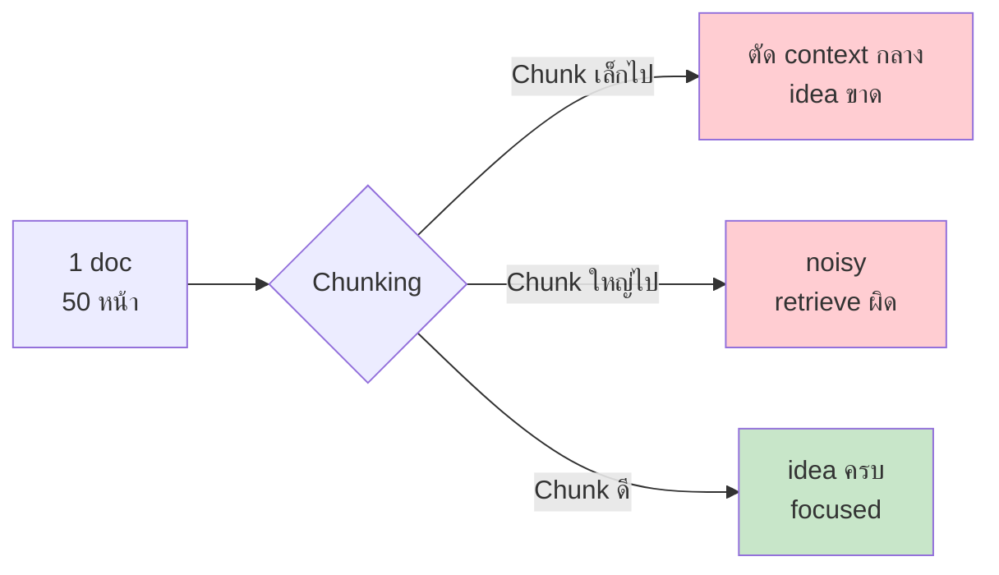
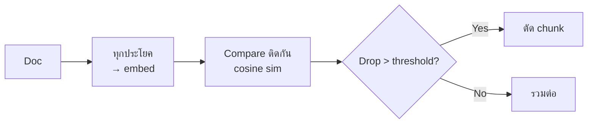

# Day 34: Chunking 🧩

<div class="lesson-meta">
⏱️ 3 ชั่วโมง &nbsp;|&nbsp; 📊 Intermediate &nbsp;|&nbsp; 📋 Prerequisites: Day 33
</div>

## 🎯 Learning Objectives

<ul class="objectives">
<li>เข้าใจทำไม chunking สำคัญต่อคุณภาพ RAG</li>
<li>รู้ 5 strategies: fixed, sentence, recursive, semantic, agentic</li>
<li>เลือก chunking ตาม document type</li>
<li>จัดการ tables, code, images ใน docs</li>
</ul>

---

## 1. Why Chunking Matters

LLM context มี limit — และ retriever ทำงานดีขึ้นเมื่อ chunk ตรงประเด็น



---

## 2. 5 Strategies

### 2.1 Fixed-size (baseline)

```
chunk_size = 500 tokens
overlap = 50 tokens
```

```python
def fixed_chunk(text, size=500, overlap=50):
    tokens = tokenize(text)
    chunks = []
    for i in range(0, len(tokens), size - overlap):
        chunks.append(detokenize(tokens[i:i+size]))
    return chunks
```

Pros: simple, deterministic
Cons: ตัดกลางประโยค/idea

### 2.2 Sentence-based

แตกตาม period/newline — ดีกับเอกสาร formal

```python
import re
sentences = re.split(r'(?<=[.!?])\s+', text)
```

### 2.3 Recursive (LangChain default)

แตกตาม hierarchy: paragraph → sentence → word

```python
from langchain.text_splitter import RecursiveCharacterTextSplitter

splitter = RecursiveCharacterTextSplitter(
    separators=["\n\n", "\n", ". ", " ", ""],
    chunk_size=500,
    chunk_overlap=50
)
chunks = splitter.split_text(text)
```

→ ตัดที่ "boundary ธรรมชาติ" ก่อน — ถ้ายังเกิน chunk_size ค่อยตัดต่อ

### 2.4 Semantic Chunking

ใช้ embedding ตรวจ "เปลี่ยนเรื่อง" ที่ไหน



```python
from llama_index.core.node_parser import SemanticSplitterNodeParser
from llama_index.embeddings.voyageai import VoyageEmbedding

splitter = SemanticSplitterNodeParser(
    embed_model=VoyageEmbedding(model_name="voyage-3"),
    breakpoint_percentile_threshold=95
)
chunks = splitter.get_nodes_from_documents(docs)
```

Pros: chunks มีความหมายครบ
Cons: ใช้ embedding cost เพิ่ม

### 2.5 Agentic Chunking (newest)

ใช้ LLM อ่าน + แบ่ง chunk ตามโครงสร้างที่ entend (เช่น "หา section heading", "หา code block")

```python
prompt = """อ่านเอกสาร แล้วแบ่งเป็น chunks logical:
- Chunk ต้องครอบคลุม 1 idea
- ไม่ตัดกลาง code block หรือ table
- ใส่ header ชื่อ chunk

Output JSON: [{title, content, type}]
"""
```

Pros: คุณภาพดีที่สุด
Cons: ช้า + แพง (LLM call ทุก doc)

---

## 3. Chunk Size — เลือกอย่างไร?

| Use case | Chunk size | เหตุผล |
|----------|-----------|--------|
| FAQ / Q&A | 256-512 tokens | คำตอบสั้น มี granular |
| Documentation | 512-1024 | ต้องการ context |
| Code | 800-1500 | function/class ต้องครบ |
| Legal/Contract | 1024-2000 | clause ครบ |
| Research paper | 1500-2500 | section idea ครบ |

### Overlap

10-20% ของ chunk size — ช่วยกัน idea ตัดกลาง

---

## 4. Tables, Code, Images

### Tables
- ❌ Fixed-chunk จะตัดกลาง row → ผิด
- ✅ Detect tables ก่อน (markdown `|`, html `<table>`) → keep as single chunk
- ✅ ตาราง > 1000 tokens → แต่ละ row + header เป็น chunk

### Code
- ✅ ใช้ AST-aware splitter (tree-sitter) → ตัดที่ function boundary
- ✅ Keep function with comments

### Images / Diagrams
- ใช้ multimodal embedding → embed ภาพแยก
- หรือใช้ LLM caption ภาพ → embed caption + ref

---

## 5. Contextual Retrieval (Anthropic ใหม่)

Anthropic ออก paper "Contextual Retrieval" — pre-prompt แต่ละ chunk ด้วย context summary

```
Original chunk: "WFH ได้สูงสุด 3 วันต่อสัปดาห์"

Contextualized chunk:
"จากเอกสารนโยบาย WFH ของบริษัท XYZ ปี 2024
WFH ได้สูงสุด 3 วันต่อสัปดาห์"
```

→ retrieval accuracy +30-50%!

```python
def contextualize(chunk, full_doc):
    prompt = f"""<document>{full_doc}</document>
    
    <chunk>{chunk}</chunk>
    
    ให้ context สั้นๆ (50 คำ) ว่า chunk นี้อยู่ที่ไหนในเอกสาร และเกี่ยวกับอะไร
    """
    context = claude.messages.create(...)
    return f"{context}\n\n{chunk}"
```

ใช้ prompt caching → cost พอใช้

---

## 🛠️ Hands-on Exercise

!!! example "Exercise 1: เปรียบเทียบ 3 Strategies"
    เอกสารบริษัทคุณ 1 ไฟล์ → chunk ด้วย:
    - Fixed (500 tokens)
    - Recursive (LangChain)
    - Semantic (LlamaIndex)
    
    Query 5 คำถาม → ดูว่า retrieval อันไหนตรงสุด

!!! example "Exercise 2: Optimize Chunk Size"
    Fix strategy = recursive → ลอง chunk_size 256, 512, 1024
    
    Measure: precision@5 ที่ chunk size ไหนดีสุดสำหรับ docs ของคุณ

!!! example "Exercise 3: Contextual Retrieval"
    Implement contextualize() function → A/B test กับ vanilla chunking
    
    ตัวเลขคุณภาพดีขึ้นกี่ %?

---

## ✅ Self-Check Quiz

<div class="quiz">

**Q1:** ทำไม overlap สำคัญ?

??? success "ดูคำตอบ"
    กัน idea ตัดกลางที่ boundary — chunk[N] ปลาย และ chunk[N+1] ต้น ทับกัน → context ที่อยู่ตรงตัด ยังถูก retrieve ได้

**Q2:** Recursive chunking ดีกว่า fixed ตรงไหน?

??? success "ดูคำตอบ"
    ตัดที่ "natural boundary" (paragraph, sentence) ก่อน → ไม่ตัดกลางคำหรือกลางความคิด — เก็บความหมายดีกว่า

**Q3:** Contextual Retrieval ทำงานอย่างไร?

??? success "ดูคำตอบ"
    Pre-prompt แต่ละ chunk ด้วย "context summary" (ใช้ LLM gen) ก่อน embed — chunk ออกมามี context ครบ → retrieval แม่นขึ้น 30-50% ตาม Anthropic paper

</div>

---

## 🔍 Cross-check & References

- 📘 [Anthropic — Contextual Retrieval](https://www.anthropic.com/news/contextual-retrieval)
- 📚 [LangChain Text Splitters](https://python.langchain.com/docs/concepts/text_splitters/)
- 📺 [DLAI — Preprocessing Unstructured Data for LLM Applications](https://www.deeplearning.ai/courses/preprocessing-unstructured-data-for-llm-applications)

[ต่อไป → Day 35: Basic RAG Pipeline :material-arrow-right:](day-35.md){ .md-button .md-button--primary }
