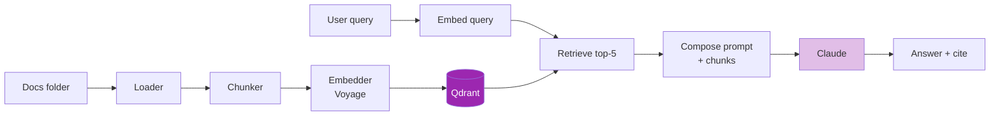

# Day 35: Basic RAG Pipeline 🔧

<div class="lesson-meta">
⏱️ 5 ชั่วโมง &nbsp;|&nbsp; 📊 Hands-on &nbsp;|&nbsp; 📋 Prerequisites: Day 31-34
</div>

## 🎯 Project: ทำ RAG จากศูนย์

<ul class="objectives">
<li>Load docs (PDF, MD, HTML)</li>
<li>Chunk + embed</li>
<li>Store ใน Qdrant</li>
<li>Retrieve top-K + generate ด้วย Claude</li>
<li>เพิ่ม citation ใน output</li>
</ul>

---

## 1. Architecture



---

## 2. Setup

```bash
mkdir simple-rag && cd simple-rag
python -m venv venv && source venv/bin/activate
pip install anthropic voyageai qdrant-client \
    unstructured "unstructured[pdf,md]" \
    langchain-text-splitters python-dotenv

cat > .env << EOL
ANTHROPIC_API_KEY=sk-ant-xxx
VOYAGE_API_KEY=pa-xxx
EOL

# Qdrant local
docker run -d -p 6333:6333 qdrant/qdrant
```

---

## 3. Ingestion Code

```python
# ingest.py
import os, uuid
from unstructured.partition.auto import partition
from langchain_text_splitters import RecursiveCharacterTextSplitter
import voyageai
from qdrant_client import QdrantClient
from qdrant_client.models import Distance, VectorParams, PointStruct
from dotenv import load_dotenv

load_dotenv()
vo = voyageai.Client()
qd = QdrantClient(url="http://localhost:6333")

COLLECTION = "company_docs"
DIM = 1024

# Create collection
try:
    qd.create_collection(
        collection_name=COLLECTION,
        vectors_config=VectorParams(size=DIM, distance=Distance.COSINE)
    )
except Exception:
    print(f"Collection {COLLECTION} exists")

splitter = RecursiveCharacterTextSplitter(chunk_size=800, chunk_overlap=100)

def ingest_file(filepath):
    """Load → chunk → embed → upsert"""
    elements = partition(filepath)
    text = "\n\n".join(str(el) for el in elements)
    
    chunks = splitter.split_text(text)
    print(f"  {filepath}: {len(chunks)} chunks")
    
    # Batch embed (Voyage handles up to 128 per call)
    batch_size = 100
    points = []
    for i in range(0, len(chunks), batch_size):
        batch = chunks[i:i+batch_size]
        result = vo.embed(batch, model="voyage-3", input_type="document")
        
        for chunk, emb in zip(batch, result.embeddings):
            points.append(PointStruct(
                id=str(uuid.uuid4()),
                vector=emb,
                payload={
                    "text": chunk,
                    "source": os.path.basename(filepath),
                    "filepath": filepath
                }
            ))
    
    qd.upsert(collection_name=COLLECTION, points=points)
    print(f"  uploaded {len(points)} points")

# Ingest all files in ./docs
DOCS_DIR = "./docs"
for fn in os.listdir(DOCS_DIR):
    if fn.endswith((".pdf", ".md", ".txt", ".html")):
        ingest_file(os.path.join(DOCS_DIR, fn))

print(f"\n✅ Total points: {qd.count(COLLECTION).count}")
```

```bash
mkdir docs
# วาง file ทดสอบ — PDFs, markdown ของบริษัท
python ingest.py
```

---

## 4. Query Code

```python
# query.py
import voyageai
from qdrant_client import QdrantClient
from anthropic import Anthropic
from dotenv import load_dotenv

load_dotenv()
vo = voyageai.Client()
qd = QdrantClient(url="http://localhost:6333")
claude = Anthropic()

COLLECTION = "company_docs"
TOP_K = 5

def retrieve(query: str, k: int = TOP_K):
    q_emb = vo.embed([query], model="voyage-3", input_type="query").embeddings[0]
    results = qd.search(
        collection_name=COLLECTION,
        query_vector=q_emb,
        limit=k
    )
    return [
        {
            "text": r.payload["text"],
            "source": r.payload["source"],
            "score": r.score
        }
        for r in results
    ]

def generate(query: str, chunks: list[dict]):
    # Build context with source numbering for citations
    context_str = "\n\n".join(
        f"[Source {i+1}: {c['source']}]\n{c['text']}"
        for i, c in enumerate(chunks)
    )
    
    prompt = f"""ตอบคำถามต่อไปนี้โดยใช้ context ที่ให้
- ตอบเป็นภาษาเดียวกับคำถาม
- อ้างอิงแหล่งโดยใส่ [Source N] ในประโยค
- ถ้าไม่มีข้อมูลใน context ให้ตอบว่า "ไม่พบข้อมูลในเอกสารที่มี"

<context>
{context_str}
</context>

<question>{query}</question>

ตอบ:"""
    
    resp = claude.messages.create(
        model="claude-sonnet-4-6",
        max_tokens=1024,
        messages=[{"role": "user", "content": prompt}]
    )
    return resp.content[0].text

def ask(query: str):
    print(f"\n❓ {query}")
    chunks = retrieve(query)
    print(f"\n📚 Retrieved {len(chunks)} chunks:")
    for i, c in enumerate(chunks):
        print(f"  [{i+1}] {c['source']} (score: {c['score']:.3f})")
    
    answer = generate(query, chunks)
    print(f"\n🤖 Answer:\n{answer}\n")
    return answer, chunks

if __name__ == "__main__":
    import sys
    query = " ".join(sys.argv[1:]) or "นโยบาย WFH ของบริษัทเป็นไง"
    ask(query)
```

```bash
python query.py "นโยบายลาพักร้อน"
python query.py "process การเบิกค่าใช้จ่าย"
```

---

## 5. ตัวอย่าง Output

```
❓ นโยบาย WFH ของบริษัทเป็นไง

📚 Retrieved 5 chunks:
  [1] WFH_Policy_2024.pdf (score: 0.876)
  [2] WFH_Policy_2024.pdf (score: 0.841)
  [3] HR_Handbook.pdf (score: 0.798)
  [4] Code_of_Conduct.pdf (score: 0.621)
  [5] Office_Guidelines.pdf (score: 0.598)

🤖 Answer:
พนักงานสามารถ Work From Home (WFH) ได้สูงสุด 3 วันต่อสัปดาห์ [Source 1] 
โดยต้องแจ้งหัวหน้างานล่วงหน้า 1 วัน [Source 2] ในกรณีพิเศษ 
สามารถขอ WFH เต็มสัปดาห์ผ่าน HR ได้ [Source 1]
```

---

## 6. Improvements ที่จะทำใน Week 6

| ปัญหาที่อาจเจอใน basic RAG | แก้ใน Week 6 |
|--------------------------|-------------|
| Retrieve ผิด chunk | Hybrid search (Day 38) |
| Top-1 ไม่ใช่ relevant สุด | Re-ranking (Day 39) |
| Query สั้นไป retrieve ไม่ได้ | Query expansion (Day 40) |
| เอกสารมี relationship | Knowledge graphs (Day 41-42) |
| Multi-step ค้น | Agentic RAG (Day 43) |

---

## 🛠️ Hands-on Exercise

!!! example "Exercise 1: Run end-to-end"
    1. Run code ข้างบนกับเอกสาร 5-10 ไฟล์ของคุณ
    2. ถาม 10 คำถาม
    3. Manual evaluate: ตอบถูกกี่ %?

!!! example "Exercise 2: เพิ่ม UI"
    ใช้ Streamlit ครอบ → web app ที่ paste query → ดู answer + sources

!!! example "Exercise 3: เพิ่ม Metadata Filter"
    Tag docs ด้วย `department` → query filter ตาม department

---

## ✅ Self-Check Quiz

<div class="quiz">

**Q1:** ทำไมต้อง `input_type="document"` ตอน embed doc และ `"query"` ตอน embed คำถาม?

??? success "ดูคำตอบ"
    บาง embedding model (Voyage) ถูก train แยก — document และ query มี distribution ต่างกัน การระบุ type ช่วยให้ retrieval accuracy ดีขึ้น 5-10%

**Q2:** ทำไมต้อง batch embed?

??? success "ดูคำตอบ"
    API มี rate limit — batch (100 chunks/call) ลด round-trips, ลด latency, ใช้ rate limit อย่างมีประสิทธิภาพ

**Q3:** ทำไมในระบบ production ต้องมี citation?

??? success "ดูคำตอบ"
    - User verify ได้
    - Build trust
    - Legal compliance (ใน vertical เช่น healthcare, legal)
    - Debug ง่ายถ้า answer ผิด

</div>

---

## 🔍 Cross-check & References

- 📦 [Unstructured.io](https://docs.unstructured.io/) - document parsing
- 📘 [Qdrant Tutorial](https://qdrant.tech/documentation/tutorials/)
- 📚 [Anthropic Cookbook — RAG](https://github.com/anthropics/anthropic-cookbook)

[ต่อไป → Day 36: Citation :material-arrow-right:](day-36.md){ .md-button .md-button--primary }
