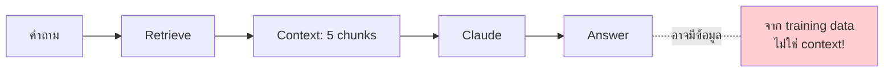
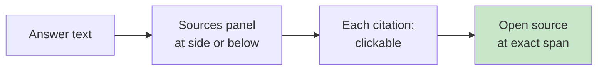

# Day 36: Citation & Grounding 📎

<div class="lesson-meta">
⏱️ 3 ชั่วโมง &nbsp;|&nbsp; 📊 Intermediate &nbsp;|&nbsp; 📋 Prerequisites: Day 35
</div>

## 🎯 Learning Objectives

<ul class="objectives">
<li>เข้าใจ "grounding" — บังคับให้ LLM ตอบจาก source เท่านั้น</li>
<li>Implement citation ใน output</li>
<li>ใช้ Anthropic's built-in Citations API</li>
<li>Evaluate "groundedness" ของ RAG response</li>
</ul>

---

## 1. ปัญหา: Ungrounded Responses



ตัวอย่าง:
- Retrieved: "WFH ได้สูงสุด 3 วัน"
- Claude ตอบ: "WFH ได้สูงสุด 3 วัน และต้องผ่าน approval 5 ระดับ" ← ตัว 5 ระดับมาจาก training data ไม่ใช่ source!

---

## 2. Grounding Techniques

### 2.1 Prompt Constraint

```
ตอบโดยใช้ ONLY ข้อมูลใน <context> เท่านั้น
ถ้าไม่พบข้อมูลให้ตอบ "ไม่พบข้อมูลในเอกสาร"
ห้ามใช้ความรู้นอก context
ทุก claim ต้องมี [Source N] อ้างอิง
```

### 2.2 Force Citation Format

```
Output format:
- ทุกประโยคต้องลงท้ายด้วย [Source N]
- ถ้าประโยคไม่มี source — ห้ามเขียนประโยคนั้น
```

### 2.3 JSON Structured Output

```python
prompt = """ตอบในรูปแบบ JSON:
{
  "answer": "...",
  "claims": [
    {"text": "...", "source_id": 1, "source_quote": "..."},
    {"text": "...", "source_id": 3, "source_quote": "..."}
  ],
  "confidence": "high|medium|low"
}
"""
```

---

## 3. Anthropic Citations API (built-in!)

Anthropic API มี **Citations** feature — pass docs เป็น content blocks → Claude ตอบพร้อม citations อัตโนมัติ

```python
from anthropic import Anthropic
client = Anthropic()

resp = client.messages.create(
    model="claude-sonnet-4-6",
    max_tokens=1024,
    messages=[{
        "role": "user",
        "content": [
            {
                "type": "document",
                "source": {
                    "type": "text",
                    "media_type": "text/plain",
                    "data": "WFH นโยบาย: สูงสุด 3 วันต่อสัปดาห์ ต้องแจ้งหัวหน้า 1 วันล่วงหน้า"
                },
                "title": "WFH_Policy_2024.pdf",
                "citations": {"enabled": True}
            },
            {
                "type": "document",
                "source": {"type": "text", "media_type": "text/plain", "data": "..."},
                "title": "HR_Handbook.pdf",
                "citations": {"enabled": True}
            },
            {"type": "text", "text": "WFH ได้กี่วัน?"}
        ]
    }]
)

for block in resp.content:
    if block.type == "text":
        print(block.text)
        if block.citations:
            for cite in block.citations:
                print(f"  📎 {cite.document_title}: \"{cite.cited_text}\"")
```

→ Claude คืน text blocks พร้อม `citations` ที่ระบุชัด document_index + cited_text + character range

!!! tip "เมื่อไหร่ใช้ Citations API"
    - เอกสารเล็ก/กลาง (ใส่ใน prompt ได้)
    - ต้องการ exact citation (legal, audit)
    
    เอกสารใหญ่ → ใช้ external RAG + manual citation pattern

---

## 4. Evaluating Groundedness

วัดว่าคำตอบ "อยู่ใน context" จริงไหม

### LLM-as-Judge

```python
def is_grounded(answer: str, context: list[str]) -> dict:
    judge_prompt = f"""ตรวจสอบว่าคำตอบ "อยู่ใน context" หรือไม่

<context>
{chr(10).join(context)}
</context>

<answer>{answer}</answer>

แตกคำตอบเป็น claims แยกย่อย — สำหรับแต่ละ claim:
- supported: claim นี้มาจาก context ตรงๆ
- inferred: เป็น reasonable inference จาก context
- unsupported: ไม่พบใน context (hallucination)

Output JSON: {{
  "claims": [{{"text": "...", "verdict": "supported|inferred|unsupported"}}],
  "groundedness_score": 0-100
}}"""
    
    resp = claude.messages.create(
        model="claude-opus-4-7",
        max_tokens=2000,
        messages=[{"role": "user", "content": judge_prompt}]
    )
    import json
    return json.loads(resp.content[0].text)
```

### Production Metrics

| Metric | Target |
|--------|--------|
| Groundedness score | > 90% |
| Citation rate | 100% ของ factual claims |
| Hallucination rate | < 2% |
| Refusal rate (when no info) | High when expected |

---

## 5. Frontend Display Pattern



ตัวอย่าง UX:
```
🤖 WFH ได้สูงสุด 3 วันต่อสัปดาห์ ¹ โดยต้องแจ้งหัวหน้า 1 วันล่วงหน้า ²

Sources:
[1] WFH_Policy_2024.pdf, p.2: "พนักงานทุกระดับสามารถ WFH ได้สูงสุด 3 วัน..."
[2] WFH_Policy_2024.pdf, p.5: "การขอ WFH ต้องแจ้งหัวหน้าทาง..."
```

---

## 6. Refusing Gracefully

ถ้าไม่พบข้อมูล — refuse + ให้ทางออก

```
ตอบ: "ไม่พบข้อมูลในเอกสารที่มีเกี่ยวกับ X 
แนะนำให้:
1. ติดต่อ HR ที่ hr@company.com
2. ค้นใน intranet ที่ ..."
```

---

## 🛠️ Hands-on Exercise

!!! example "Exercise 1: Add Citations to Day 35"
    Modify code วันเก่า → ทุก answer ต้องมี [Source N] inline

!!! example "Exercise 2: ลอง Anthropic Citations API"
    Refactor ให้ใช้ Citations API (documents เป็น content blocks)
    
    เปรียบเทียบ accuracy of citations vs manual prompting

!!! example "Exercise 3: Eval Groundedness"
    Implement is_grounded() → run บน 50 queries
    
    บันทึก score — feature ของคุณ ground แค่ไหน?

---

## ✅ Self-Check Quiz

<div class="quiz">

**Q1:** ทำไม "grounding via prompt" ไม่พอ?

??? success "ดูคำตอบ"
    LLM ยังหลุดได้ — prompt constraint ลด risk แต่ไม่ขจัด. ต้องเสริมด้วย: structured output, eval (groundedness check), human review สำหรับ high-stakes

**Q2:** Anthropic Citations API ดีกว่า manual ตรงไหน?

??? success "ดูคำตอบ"
    Built-in: citations มี character range ของ source ตรงเป๊ะ, JSON structured, ไม่ต้อง parse text เอง, accuracy สูงกว่าเพราะ trained-in

**Q3:** ถ้า groundedness score ต่ำกว่า 70% ทำอะไรต่อ?

??? success "ดูคำตอบ"
    Debug pipeline: (1) retrieval ผิดไหม — relevance ดู, (2) prompt ชัดพอไหม — มีบังคับ "use context only" ไหม, (3) chunks ขาด context — ลอง contextual retrieval, (4) model — ลอง Opus

</div>

---

## 🔍 Cross-check & References

- 📘 [Anthropic — Citations](https://docs.claude.com/en/docs/build-with-claude/citations)
- 📚 [Faithfulness in RAG (Ragas)](https://docs.ragas.io/)
- 📺 [DLAI — Building and Evaluating Advanced RAG](https://www.deeplearning.ai/courses/building-evaluating-advanced-rag)

[ต่อไป → Day 37: Mini Project :material-arrow-right:](day-37.md){ .md-button .md-button--primary }
