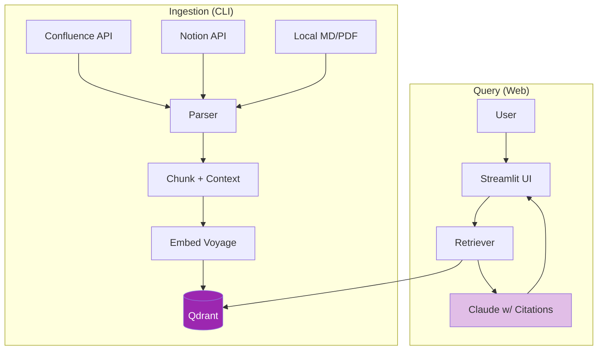

# Day 37: Mini Project — Company Wiki Q&A 📚

<div class="lesson-meta">
⏱️ 5 ชั่วโมง &nbsp;|&nbsp; 📊 Project &nbsp;|&nbsp; 📋 Prerequisites: Day 31-36
</div>

## 🎯 Goal

สร้าง **production-grade RAG app** สำหรับ company wiki

<ul class="objectives">
<li>Ingest จาก Confluence/Notion/Markdown/PDF</li>
<li>Web UI ที่ใช้งานได้จริง</li>
<li>Citation + source preview</li>
<li>Filter ตาม department/source</li>
<li>Eval dataset + score</li>
</ul>

---

## 1. Architecture



---

## 2. Setup

```bash
mkdir wiki-qa && cd wiki-qa
python -m venv venv && source venv/bin/activate
pip install streamlit anthropic voyageai qdrant-client \
    "unstructured[pdf,md]" langchain-text-splitters \
    python-dotenv pandas

docker run -d -p 6333:6333 qdrant/qdrant
```

โครงสร้าง:
```
wiki-qa/
├── ingest.py       # CLI to ingest docs
├── app.py          # Streamlit UI
├── rag.py          # RAG logic (shared)
├── eval.py         # eval script
├── eval_set.csv    # 50 test queries
└── docs/           # source documents
```

---

## 3. `rag.py` (shared module)

```python
import os, uuid, voyageai
from qdrant_client import QdrantClient
from qdrant_client.models import (
    Distance, VectorParams, PointStruct, Filter, FieldCondition, MatchValue
)
from anthropic import Anthropic

vo = voyageai.Client()
qd = QdrantClient(url="http://localhost:6333")
claude = Anthropic()

COLLECTION = "wiki"
DIM = 1024

def init_collection():
    try:
        qd.create_collection(
            COLLECTION, vectors_config=VectorParams(size=DIM, distance=Distance.COSINE)
        )
    except Exception:
        pass

def embed(texts, input_type="document"):
    return vo.embed(texts, model="voyage-3", input_type=input_type).embeddings

def upsert(chunks_with_meta):
    """chunks_with_meta = [{text, source, department, doctype, url}, ...]"""
    texts = [c["text"] for c in chunks_with_meta]
    embs = embed(texts, "document")
    points = [
        PointStruct(id=str(uuid.uuid4()), vector=e, payload=c)
        for c, e in zip(chunks_with_meta, embs)
    ]
    qd.upsert(COLLECTION, points=points)

def retrieve(query, k=5, department=None):
    q_emb = embed([query], "query")[0]
    filt = None
    if department:
        filt = Filter(must=[FieldCondition(key="department", match=MatchValue(value=department))])
    
    results = qd.search(COLLECTION, query_vector=q_emb, limit=k, query_filter=filt)
    return [{"text": r.payload["text"], **r.payload, "score": r.score} for r in results]

def generate(query, chunks):
    context = "\n\n".join(f"[{i+1}] [{c['source']}]\n{c['text']}" for i, c in enumerate(chunks))
    
    prompt = f"""ตอบโดยใช้ context เท่านั้น

<context>
{context}
</context>

<question>{query}</question>

กฎ:
1. ทุก factual claim ใส่ [N] อ้างอิง source
2. ถ้าไม่พบ ตอบ "ไม่พบข้อมูลในเอกสาร"
3. ตอบเป็นภาษาเดียวกับคำถาม"""
    
    resp = claude.messages.create(
        model="claude-sonnet-4-6",
        max_tokens=1024,
        messages=[{"role": "user", "content": prompt}]
    )
    return resp.content[0].text

def ask(query, k=5, department=None):
    chunks = retrieve(query, k, department)
    if not chunks:
        return "ไม่พบข้อมูลในเอกสาร", []
    answer = generate(query, chunks)
    return answer, chunks
```

---

## 4. `app.py` (Streamlit UI)

```python
import streamlit as st
from rag import ask, init_collection

st.set_page_config(page_title="Company Wiki Q&A", page_icon="📚", layout="wide")
init_collection()

st.title("📚 Company Wiki Q&A")
st.caption("ค้นหาคำตอบจากเอกสารบริษัทด้วย AI")

# Sidebar filters
with st.sidebar:
    st.header("⚙️ Settings")
    k = st.slider("Top-K chunks", 1, 10, 5)
    dept = st.selectbox(
        "Department filter",
        [None, "HR", "Engineering", "Sales", "Finance"],
        format_func=lambda x: "ทั้งหมด" if x is None else x
    )
    st.divider()
    st.caption("💡 ลองถาม: นโยบาย WFH, ค่าเดินทาง, การลา")

# Main UI
query = st.text_input("❓ ถามอะไร", placeholder="เช่น 'WFH ได้กี่วัน'")

if query:
    with st.spinner("กำลังค้นหา..."):
        answer, chunks = ask(query, k=k, department=dept)
    
    col1, col2 = st.columns([2, 1])
    
    with col1:
        st.subheader("🤖 คำตอบ")
        st.markdown(answer)
    
    with col2:
        st.subheader("📎 Sources")
        for i, c in enumerate(chunks):
            with st.expander(f"[{i+1}] {c['source']} (score: {c['score']:.2f})"):
                st.text(c["text"][:500] + "..." if len(c["text"]) > 500 else c["text"])
                if c.get("url"):
                    st.markdown(f"[เปิด source]({c['url']})")
```

```bash
streamlit run app.py
```

---

## 5. `eval.py`

```python
# eval_set.csv format: query,expected_keywords,expected_source
import pandas as pd, json
from rag import ask, claude

df = pd.read_csv("eval_set.csv")
results = []

for _, row in df.iterrows():
    answer, chunks = ask(row["query"])
    
    # Keyword match
    kws = [k.strip() for k in row["expected_keywords"].split("|")]
    kw_score = sum(1 for k in kws if k.lower() in answer.lower()) / len(kws)
    
    # Source check
    sources = [c["source"] for c in chunks]
    src_match = row["expected_source"] in sources
    
    # LLM judge
    judge_resp = claude.messages.create(
        model="claude-sonnet-4-6", max_tokens=200,
        messages=[{"role": "user", "content": f"""ให้คะแนน 1-5 ของ answer สำหรับคำถาม:
Q: {row['query']}
A: {answer}
Expected keywords: {row['expected_keywords']}
Just output number 1-5"""}]
    )
    try:
        llm_score = int(judge_resp.content[0].text.strip())
    except:
        llm_score = 3
    
    results.append({
        "query": row["query"],
        "kw_score": kw_score,
        "src_match": src_match,
        "llm_score": llm_score
    })

df_res = pd.DataFrame(results)
print(df_res.describe())
print(f"\nLLM score mean: {df_res['llm_score'].mean():.2f}")
print(f"Source accuracy: {df_res['src_match'].mean():.1%}")
df_res.to_csv("eval_results.csv", index=False)
```

---

## 6. Deliverables

!!! example "ส่งเป็น GitHub repo"
    1. ✅ Code ที่ run ได้ (rag.py, app.py, ingest.py)
    2. ✅ eval_set.csv อย่างน้อย 30 cases
    3. ✅ eval_results.csv + brief analysis
    4. ✅ README.md พร้อม screenshot
    5. ✅ Demo video 3 นาที

---

## 7. Scoring Rubric

| เกณฑ์ | คะแนน |
|------|------|
| Ingestion ทำงานได้ครบ doctypes | / 15 |
| Retrieval accuracy (eval > 75%) | / 25 |
| Citation ครบทุก claim | / 15 |
| UX ใช้งานง่าย + filter | / 15 |
| Eval framework + analysis | / 15 |
| Documentation | / 10 |
| Demo presentation | / 5 |
| **Total** | **/ 100** |

---

## ✅ Week 5 Self-Check

- [x] เข้าใจทำไม RAG > stuff context
- [x] รู้จัก embedding models + เลือกได้
- [x] ใช้ vector DB ได้คล่อง
- [x] เลือก chunking strategy ตาม content
- [x] ประกอบ end-to-end RAG ได้
- [x] ทำ citation + groundedness check

---

:material-check-decagram: **จบ Week 5!** Week 6 จะ optimize RAG ให้แม่นยำขึ้น

[ต่อไป → Week 6: Advanced RAG :material-arrow-right:](../week-06/index.md){ .md-button .md-button--primary }
