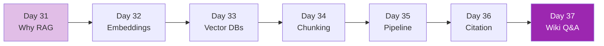

# Week 5: RAG Fundamentals 🔍

จุดเริ่มของ **Month 2 — Enterprise AI Engineering** — รากฐานสำคัญที่สุดสำหรับ enterprise AI

## รายวิชา

| Day | หัวข้อ | สกิลที่ได้ | เวลา |
|-----|--------|-----------|------|
| 31 | ทำไมต้อง RAG | hallucination, context limits, when RAG helps | 3h |
| 32 | Embeddings ลึก | similarity, models, multimodal | 4h |
| 33 | Vector Databases | Pinecone, Qdrant, Weaviate, pgvector | 4h |
| 34 | Chunking Strategies | fixed, semantic, recursive, agentic | 3h |
| 35 | Basic RAG Pipeline | load→embed→store→retrieve→generate | 5h |
| 36 | Citation & Grounding | source attribution, hallucination guard | 3h |
| 37 | Mini Project | Company Wiki Q&A | 5h |

## หลังจบ Week 5 คุณจะ

- [x] ออกแบบ RAG architecture ที่ตรงงาน
- [x] เลือก vector DB ที่เหมาะกับ workload
- [x] สร้าง production-ready RAG จากศูนย์
- [x] จัดการ citation + grounding เพื่อลด hallucination

[เริ่ม Day 31 :material-arrow-right:](day-31.md){ .md-button .md-button--primary }
