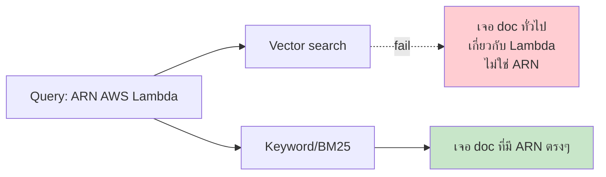

# Day 38: Hybrid Search 🔀

<div class="lesson-meta">
⏱️ 3 ชั่วโมง &nbsp;|&nbsp; 📊 Intermediate &nbsp;|&nbsp; 📋 Prerequisites: Week 5
</div>

## 🎯 Learning Objectives

<ul class="objectives">
<li>เข้าใจจุดอ่อนของ vector-only search</li>
<li>รู้จัก BM25 (keyword search algorithm)</li>
<li>รวม BM25 + vector ด้วย Reciprocal Rank Fusion (RRF)</li>
<li>เลือก weight ระหว่าง keyword vs semantic</li>
</ul>

---

## 1. ปัญหา: Vector-only ไม่พอ



Vector ดีกับ semantic เช่น "WFH นโยบาย" ↔ "remote work policy"
แต่ **แย่กับ exact terms** เช่น `ARN`, `SKU-12345`, version numbers

---

## 2. BM25 — Keyword Algorithm ดั้งเดิม

BM25 (1994) = ทันสมัยกว่า TF-IDF, ใช้กันแพร่หลายใน Elasticsearch

**Intuition:** ให้คะแนน doc ที่ keyword ปรากฏบ่อย แต่ลด weight ของ keyword ที่ "common too much"

```
BM25(doc, query) = Σ IDF(term) × tf(term, doc) × (k+1) / (tf + k×(1-b + b×|doc|/avgdl))
```

ไม่ต้องจำสูตร — ใช้ library ก็พอ

---

## 3. Reciprocal Rank Fusion (RRF)

วิธี combine ranking จาก 2 sources

```
RRF_score(d) = Σ (1 / (k + rank_i(d)))   # k = 60 ทั่วไป
```

ตัวอย่าง:
| Doc | Vector rank | BM25 rank | RRF score |
|-----|------------|-----------|-----------|
| A | 1 | 5 | 1/61 + 1/65 = 0.032 |
| B | 5 | 1 | 1/65 + 1/61 = 0.032 |
| C | 2 | 2 | 1/62 + 1/62 = 0.032 |

→ A, B, C tie ใกล้กัน เพราะปรากฏใน top ของทั้งสอง

---

## 4. Implementation

### Option A: Qdrant Hybrid (built-in)

```python
from qdrant_client.models import Prefetch, FusionQuery, Fusion

results = qd.query_points(
    collection_name="docs",
    prefetch=[
        Prefetch(query=q_vector, using="dense", limit=20),
        Prefetch(query=q_sparse, using="sparse", limit=20),
    ],
    query=FusionQuery(fusion=Fusion.RRF),
    limit=5
)
```

→ Qdrant สามารถ store sparse vectors (BM25-like) คู่ dense

### Option B: Manual RRF

```python
def bm25_search(query, k=20):
    from rank_bm25 import BM25Okapi
    # tokenize corpus once at startup
    tokenized_corpus = [doc.split() for doc in all_docs]
    bm25 = BM25Okapi(tokenized_corpus)
    
    tokenized_query = query.split()
    scores = bm25.get_scores(tokenized_query)
    top_k = sorted(zip(range(len(scores)), scores), key=lambda x: -x[1])[:k]
    return [(idx, score) for idx, score in top_k]

def reciprocal_rank_fusion(rankings_lists, k=60):
    """rankings_lists = [(doc_id, rank), ...]"""
    rrf_scores = {}
    for ranking in rankings_lists:
        for rank, (doc_id, _score) in enumerate(ranking):
            rrf_scores[doc_id] = rrf_scores.get(doc_id, 0) + 1/(k + rank + 1)
    
    return sorted(rrf_scores.items(), key=lambda x: -x[1])

vector_results = vector_search(query, k=20)
bm25_results = bm25_search(query, k=20)
fused = reciprocal_rank_fusion([vector_results, bm25_results])
top_5 = fused[:5]
```

### Option C: Elasticsearch / OpenSearch

ถ้าใช้ ES อยู่แล้ว — ES มี vector + BM25 ใน query เดียว (`knn` + `match`)

---

## 5. Weighted Hybrid

ปรับ weight ระหว่าง 2 sources

```python
def weighted_hybrid(query, alpha=0.5):
    """alpha=1 → all vector, alpha=0 → all BM25"""
    vec_scores = normalize(vector_search(query))
    bm25_scores = normalize(bm25_search(query))
    
    combined = {}
    for doc_id, vs in vec_scores.items():
        bs = bm25_scores.get(doc_id, 0)
        combined[doc_id] = alpha * vs + (1 - alpha) * bs
    
    return sorted(combined.items(), key=lambda x: -x[1])
```

### Tuning alpha

A/B test กับ eval dataset:
- alpha=0.3 → keyword-heavy (ดีกับ technical IDs)
- alpha=0.7 → semantic-heavy (ดีกับ natural language Q&A)
- alpha=0.5 → balanced (default ที่ดี)

---

## 6. เมื่อไหร่ใช้แต่ละแบบ?

| Workload | แนะนำ |
|----------|------|
| Customer support FAQ | Vector-only (semantic) |
| API docs + code | Hybrid (alpha=0.5) — มี IDs สำคัญ |
| Product catalog | BM25 + filter (SKU exact) |
| Legal contracts | Hybrid + entity recognition |
| Medical Q&A | Hybrid + LLM verification |

---

## 🛠️ Hands-on Exercise

!!! example "Exercise 1: A/B Test Vector vs Hybrid"
    ใช้ RAG จาก Week 5 → เพิ่ม BM25 + RRF → ทดสอบ 30 queries
    
    Vector-only accuracy = ? %
    Hybrid accuracy = ? %

!!! example "Exercise 2: Tune Alpha"
    ลอง alpha = 0.0, 0.2, 0.4, 0.6, 0.8, 1.0
    
    Plot accuracy vs alpha — find sweet spot ของ workload คุณ

!!! example "Exercise 3: Edge Cases"
    Find 5 queries ที่ vector-only fail แต่ hybrid pass
    
    เป็น pattern อะไร? (exact IDs, version numbers, jargon, ...)

---

## ✅ Self-Check Quiz

<div class="quiz">

**Q1:** ทำไม vector-only แย่กับ ARN/SKU?

??? success "ดูคำตอบ"
    Vector embed encode semantic meaning — ARN/SKU เป็น identifier ที่ไม่มี semantic meaning ตามที่ embedding model เรียนรู้ — BM25 จับได้ดีกว่าเพราะ keyword exact match

**Q2:** RRF ทำงานยังไง?

??? success "ดูคำตอบ"
    รวม ranking โดยให้ weight = 1/(k+rank) — doc ที่ rank ดีในหลาย source จะได้ score รวมสูง โดยไม่ต้อง normalize scores จาก source ที่ scale ต่างกัน

**Q3:** Hybrid เพิ่ม cost ไหม?

??? success "ดูคำตอบ"
    เพิ่มเล็กน้อย — BM25 ค่อนข้างเร็ว (in-memory index) เทียบกับ vector search latency รวมจะเพิ่มประมาณ 10-30% แต่ accuracy เพิ่ม 15-40% มักคุ้ม

</div>

---

## 🔍 Cross-check & References

- 📘 [Qdrant Hybrid Search](https://qdrant.tech/articles/hybrid-search/)
- 📚 [BM25 — original paper by Robertson](https://en.wikipedia.org/wiki/Okapi_BM25)
- 📺 [DLAI — Large Language Models with Semantic Search (Cohere)](https://www.deeplearning.ai/courses/large-language-models-semantic-search)

[ต่อไป → Day 39: Re-ranking :material-arrow-right:](day-39.md){ .md-button .md-button--primary }
