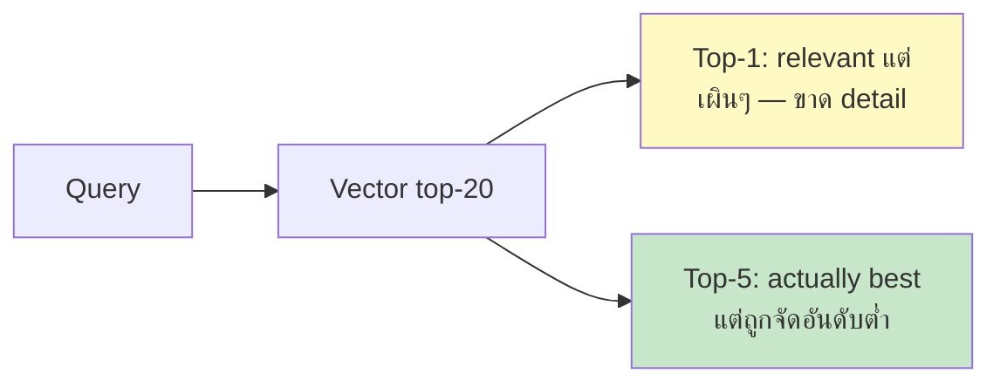
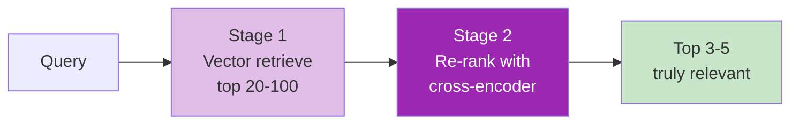
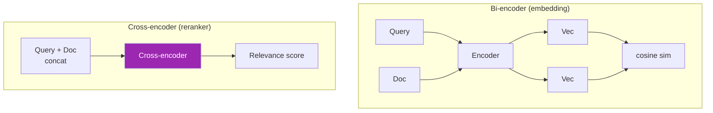

# Day 39: Re-ranking 🎯

<div class="lesson-meta">
⏱️ 3 ชั่วโมง &nbsp;|&nbsp; 📊 Intermediate &nbsp;|&nbsp; 📋 Prerequisites: Day 38
</div>

## 🎯 Learning Objectives

<ul class="objectives">
<li>เข้าใจ 2-stage retrieval pattern</li>
<li>รู้จัก cross-encoder vs bi-encoder</li>
<li>ใช้ Cohere Rerank, BGE-Reranker, LLM-as-reranker</li>
<li>วัด impact ของ rerank ต่อ accuracy</li>
</ul>

---

## 1. ปัญหา: Top-K ดิบไม่แม่นพอ



Vector similarity = approximation — ส่ง top-20 ให้ LLM ตอบทำให้ context ใหญ่และ noisy

---

## 2. 2-Stage Retrieval Pattern



**Stage 1:** Fast, recall-focused (เอามาเยอะๆ ไม่พลาด)
**Stage 2:** Slow, precision-focused (เลือกที่ดีที่สุดออกมา)

---

## 3. Bi-encoder vs Cross-encoder



| | Bi-encoder | Cross-encoder |
|--|-----------|--------------|
| Speed | Fast (embed once) | Slow (per query-doc pair) |
| Accuracy | Good | Better (sees both together) |
| Use | Initial retrieval (millions of docs) | Re-rank top-K only |

---

## 4. Cohere Rerank (popular SaaS)

```python
import cohere
co = cohere.Client()

docs = [c["text"] for c in stage1_chunks]  # 20 chunks from vector

reranked = co.rerank(
    query=query,
    documents=docs,
    top_n=5,
    model="rerank-multilingual-v3.0"
)

# reranked.results = [{index, relevance_score}, ...]
top_chunks = [stage1_chunks[r.index] for r in reranked.results]
```

ราคา: ~$2/1000 calls (ดู [cohere pricing](https://cohere.com/pricing))

---

## 5. BGE-Reranker (open-source, self-host)

```python
from sentence_transformers import CrossEncoder

reranker = CrossEncoder("BAAI/bge-reranker-large")

pairs = [(query, doc) for doc in docs]
scores = reranker.predict(pairs)

ranked = sorted(zip(scores, docs), reverse=True)
top_chunks = [doc for _, doc in ranked[:5]]
```

→ Free แต่ต้อง GPU/CPU มี — model ~500MB

---

## 6. LLM-as-Reranker

ใช้ Claude เองให้ rerank — accuracy สูงสุด แต่แพง

```python
def llm_rerank(query, chunks, top_n=5):
    chunks_str = "\n".join(f"[{i}] {c['text'][:300]}" for i, c in enumerate(chunks))
    
    prompt = f"""สำหรับคำถาม: "{query}"
จัดอันดับ chunks ต่อไปนี้ตาม relevance (1 = สุด):

{chunks_str}

Output JSON: {{"ranking": [chunk_index_in_order]}}"""
    
    resp = claude.messages.create(
        model="claude-haiku-4-5-20251001",  # cheap model
        max_tokens=200,
        messages=[{"role": "user", "content": prompt}]
    )
    import json
    order = json.loads(resp.content[0].text)["ranking"]
    return [chunks[i] for i in order[:top_n]]
```

→ ใช้ Haiku ประหยัด cost

---

## 7. Decision Matrix

| Workload | แนะนำ |
|----------|------|
| < 1000 queries/day | Cohere Rerank (no infra) |
| > 10K queries/day | BGE-Reranker (self-host) |
| Critical (legal, medical) | LLM-as-reranker (Opus) |
| Cost-sensitive bulk | Skip rerank, tune chunking instead |

---

## 8. ROI Measurement

```python
# Before rerank (vector only top-5)
vector_top5_accuracy = evaluate(test_set, retrieve_vector_top5)

# After rerank (vector top-20 → rerank → top-5)
rerank_accuracy = evaluate(test_set, retrieve_with_rerank)

uplift = rerank_accuracy - vector_top5_accuracy
cost_per_query = cohere_cost + extra_latency_cost
```

ROI dimensions:
- Accuracy uplift (%)
- Latency add (ms)
- Cost add ($)
- User satisfaction (thumbs feedback)

ตัวเลขจริงจาก papers: rerank เพิ่ม MRR/NDCG 5-15%

---

## 🛠️ Hands-on Exercise

!!! example "Exercise 1: A/B Compare"
    Setup 2 versions:
    - V1: vector top-5
    - V2: vector top-20 → rerank → top-5
    
    Run eval set → compare precision@5

!!! example "Exercise 2: Try 3 Rerankers"
    - Cohere Rerank
    - BGE-Reranker (local)
    - Claude Haiku as judge
    
    เปรียบเทียบ accuracy + latency + cost

!!! example "Exercise 3: Cost-Performance Curve"
    Plot: accuracy vs cost per query สำหรับ rerank strategies
    
    Find Pareto frontier — เลือก operating point ที่ดีสุด

---

## ✅ Self-Check Quiz

<div class="quiz">

**Q1:** ทำไม cross-encoder แม่นกว่า bi-encoder?

??? success "ดูคำตอบ"
    Cross-encoder ดู query+doc พร้อมกัน — encode interaction ได้ตรง bi-encoder encode แยก ไม่เห็น interaction (limited representation)

**Q2:** ทำไม Stage 1 ใช้ top-20 ไม่ใช่ top-5?

??? success "ดูคำตอบ"
    Stage 1 เน้น recall (อย่าพลาด) ไม่เน้น precision ส่ง 20 ให้ Stage 2 → ถ้า relevant doc ติดอันดับ 8-15 ก็ยังถูกเลือกหลัง rerank

**Q3:** เมื่อไหร่ "ไม่ควร" ใช้ rerank?

??? success "ดูคำตอบ"
    - Latency-critical (sub-100ms target)
    - Cost-sensitive scale ใหญ่
    - Embedding ดีอยู่แล้ว (Stage 1 accuracy > 90%)
    - Use case simple (FAQ ตรงๆ)

</div>

---

## 🔍 Cross-check & References

- 📘 [Cohere Rerank](https://docs.cohere.com/docs/rerank)
- 📘 [BGE Reranker](https://huggingface.co/BAAI/bge-reranker-large)
- 📚 [Pinecone Rerank Guide](https://www.pinecone.io/learn/series/rag/rerankers/)

[ต่อไป → Day 40: Query Transformation :material-arrow-right:](day-40.md){ .md-button .md-button--primary }
