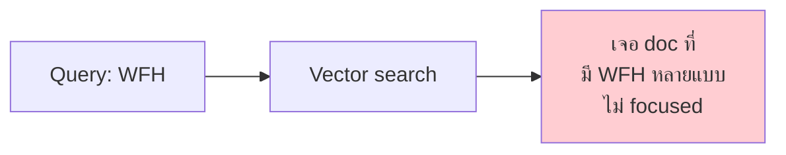
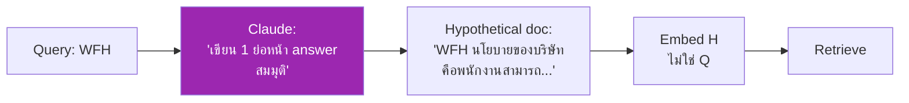
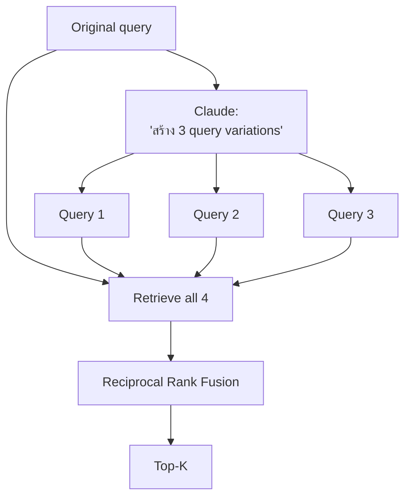
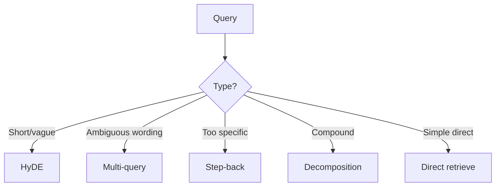

# Day 40: Query Transformation 🔄

<div class="lesson-meta">
⏱️ 3 ชั่วโมง &nbsp;|&nbsp; 📊 Intermediate &nbsp;|&nbsp; 📋 Prerequisites: Day 39
</div>

## 🎯 Learning Objectives

<ul class="objectives">
<li>เข้าใจปัญหาของ query สั้น/กำกวม</li>
<li>ใช้ HyDE (Hypothetical Document Embeddings)</li>
<li>ใช้ Multi-query expansion</li>
<li>ใช้ Step-back prompting</li>
<li>ใช้ Query decomposition สำหรับคำถามซับซ้อน</li>
</ul>

---

## 1. ปัญหา: Query สั้น

User ถาม: **"WFH"**



ผู้ใช้รู้บริบทแต่ไม่เขียน — ระบบต้องเดา

---

## 2. Technique 1: HyDE

**HyDE** = Hypothetical Document Embeddings (Stanford, 2022)

แนวคิด: ให้ LLM "**เขียนคำตอบสมมุติ**" ก่อน แล้ว embed คำตอบนั้น (ไม่ใช่ query)



ทำไมเวิร์ก? Embedding ของ "hypothetical answer" ใกล้กับ **real answer** มากกว่า embedding ของ "short query"

```python
def hyde_retrieve(query, k=5):
    hypo = claude.messages.create(
        model="claude-haiku-4-5-20251001",
        max_tokens=200,
        messages=[{"role": "user", "content": f"เขียนย่อหน้าสั้นๆ ที่ตอบคำถาม (สมมุติ): {query}"}]
    ).content[0].text
    
    return vector_search(hypo, k)
```

---

## 3. Technique 2: Multi-query Expansion



```python
def multi_query(query, k=5):
    variations = claude.messages.create(
        model="claude-haiku-4-5-20251001",
        max_tokens=300,
        messages=[{"role": "user", "content": f"""สร้าง 3 query variations ที่ความหมายเหมือนกัน แต่คำต่าง:

Query: {query}

Output JSON: ["variation1", "variation2", "variation3"]"""}]
    ).content[0].text
    
    import json
    variants = json.loads(variations)
    
    all_results = [vector_search(q, k*2) for q in [query] + variants]
    return reciprocal_rank_fusion(all_results)[:k]
```

---

## 4. Technique 3: Step-back Prompting

DeepMind paper (2023): ถาม **คำถามทั่วไป (step back)** ก่อน

ตัวอย่าง:
- Original: "ปลั๊ก type A ใช้ในประเทศไหนได้บ้าง?"
- Step-back: "ประเทศที่ใช้ปลั๊ก type ใดอยู่บ้าง?"

→ Retrieve doc ที่อธิบาย "ระบบปลั๊กทั่วโลก" → context กว้างขึ้น → answer ตรงประเด็น

```python
def step_back(query):
    sb_prompt = f"""ให้ step-back question ที่ทั่วไปกว่า:

Original: {query}

Step-back: """
    sb_query = claude.messages.create(...).content[0].text
    
    return vector_search(query, 3) + vector_search(sb_query, 3)
```

---

## 5. Technique 4: Query Decomposition

**Complex query** → แตก เป็น **sub-queries**

ตัวอย่าง: "เปรียบเทียบ WFH ของ Engineering กับ Sales ต่างกันอย่างไร"

→ Decompose:
1. "นโยบาย WFH ของ Engineering"
2. "นโยบาย WFH ของ Sales"
3. "ความแตกต่างของ WFH ระหว่างทีม"

แต่ละ sub-query retrieve แยก → รวม context → ตอบ

```python
def decompose_query(query):
    prompt = f"""แตก complex query เป็น sub-queries ที่ตอบทีละข้อ:

Query: {query}

Output JSON list of sub-queries"""
    sub_queries = json.loads(claude.messages.create(...).content[0].text)
    
    all_chunks = []
    for sq in sub_queries:
        all_chunks.extend(vector_search(sq, 3))
    
    return deduplicate(all_chunks)
```

---

## 6. เลือก Technique ตาม Query Type



### Hybrid Approach

Production ใช้ **router** ตัดสินใจ:

```python
def smart_retrieve(query):
    # Quick classification
    cls = claude.messages.create(
        model="claude-haiku-4-5-20251001", max_tokens=50,
        messages=[{"role": "user", "content": f"""Classify query:
- DIRECT: simple lookup
- COMPLEX: multi-part question
- AMBIGUOUS: short or vague
Query: {query}
Output: one word"""}]
    ).content[0].text.strip()
    
    if cls == "COMPLEX":
        return decompose_query(query)
    elif cls == "AMBIGUOUS":
        return hyde_retrieve(query)
    else:
        return vector_search(query)
```

---

## 🛠️ Hands-on Exercise

!!! example "Exercise 1: ลอง HyDE"
    Implement HyDE → ทดสอบ 20 short queries
    
    Vector-only accuracy vs HyDE accuracy?

!!! example "Exercise 2: Multi-query"
    Implement multi-query expansion + RRF → ดูว่า "weird queries" เก่งขึ้นไหม

!!! example "Exercise 3: Build Router"
    สร้าง router ที่เลือก technique อัตโนมัติ → eval on mixed query types

---

## ✅ Self-Check Quiz

<div class="quiz">

**Q1:** ทำไม HyDE ทำงานได้?

??? success "ดูคำตอบ"
    Embedding ของ "hypothetical answer" ใกล้กับ embedding ของ "real answer documents" มากกว่า embedding ของ "short query" — เพราะภาษาเหมือนกัน (paragraph-like)

**Q2:** Multi-query เพิ่ม cost ยังไง?

??? success "ดูคำตอบ"
    +1 LLM call (gen variants ที่ใช้ Haiku ถูก) + 3-4 เท่าของ vector queries — รวมแล้วเพิ่ม 30-50% latency แต่ accuracy ดีขึ้นในกรณี ambiguous

**Q3:** เมื่อไหร่ "ไม่ควร" ใช้ query transformation?

??? success "ดูคำตอบ"
    - Latency-critical (real-time chat)
    - Queries ตรงประเด็นอยู่แล้ว
    - Cost-sensitive ที่ scale มาก
    - Eval แสดงว่าไม่ช่วย — measure first

</div>

---

## 🔍 Cross-check & References

- 📚 [HyDE paper](https://arxiv.org/abs/2212.10496)
- 📚 [Step-Back Prompting (Google DeepMind)](https://arxiv.org/abs/2310.06117)
- 📺 [LangChain Multi-Query Retriever](https://python.langchain.com/docs/how_to/MultiQueryRetriever/)

[ต่อไป → Day 41: Knowledge Graphs + Neo4j :material-arrow-right:](day-41.md){ .md-button .md-button--primary }
