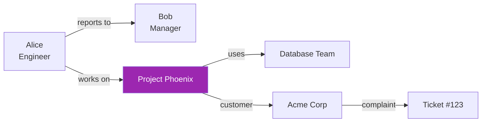

# Day 41: Knowledge Graphs + Cypher 🕸️

<div class="lesson-meta">
⏱️ 4 ชั่วโมง &nbsp;|&nbsp; 📊 Intermediate &nbsp;|&nbsp; 📋 Prerequisites: Day 33 (Vector DBs)
</div>

## 🎯 Learning Objectives

<ul class="objectives">
<li>เข้าใจว่า Knowledge Graph ต่างจาก Vector DB อย่างไร</li>
<li>เรียน Cypher query language พื้นฐาน</li>
<li>Build small KG ของบริษัทตัวอย่าง</li>
<li>เห็นเมื่อไหร่ KG ดีกว่า Vector — และตรงข้าม</li>
</ul>

---

## 1. ปัญหาที่ Vector DB แก้ไม่ได้

Vector DB เก่งเรื่อง "**ความคล้าย semantic**" — แต่ไม่เข้าใจ **ความสัมพันธ์**

ตัวอย่างคำถาม:
- "**ใครเป็น manager ของคนที่ทำ project Phoenix?**" — vector ตอบไม่ได้
- "**โครงการไหน depend on database team?**" — ต้อง traverse relationships
- "**ลูกค้า A เคย complain เรื่องอะไรบ้างใน 6 เดือน?**" — ต้องเชื่อมหลาย entity



→ **Knowledge Graph** = nodes (entities) + edges (relationships)

---

## 2. Neo4j Quick Setup

```bash
# Docker
docker run -d --name neo4j \
  -p 7474:7474 -p 7687:7687 \
  -e NEO4J_AUTH=neo4j/password \
  neo4j:5

# Open browser: http://localhost:7474
# Or use Neo4j Aura cloud (free tier)
```

Python driver:
```bash
pip install neo4j langchain-neo4j
```

---

## 3. Cypher — Query Language ของ Neo4j

Cypher = SQL ของ graph world

### CREATE nodes & relationships

```cypher
// Create employees
CREATE (alice:Person {name: 'Alice', role: 'Engineer'})
CREATE (bob:Person {name: 'Bob', role: 'Manager'})
CREATE (project:Project {name: 'Phoenix', status: 'active'})

// Create relationships
CREATE (alice)-[:REPORTS_TO]->(bob)
CREATE (alice)-[:WORKS_ON]->(project)
```

### MATCH (เหมือน SELECT)

```cypher
// หา manager ของ Alice
MATCH (alice:Person {name: 'Alice'})-[:REPORTS_TO]->(manager)
RETURN manager.name

// หาทุกคนที่ทำ Phoenix
MATCH (p:Person)-[:WORKS_ON]->(:Project {name: 'Phoenix'})
RETURN p.name, p.role

// 2-hop: หา manager ของคนที่ทำ Phoenix
MATCH (p:Person)-[:WORKS_ON]->(:Project {name: 'Phoenix'}),
      (p)-[:REPORTS_TO]->(manager)
RETURN p.name, manager.name
```

### Aggregation

```cypher
// คนใน team ที่ใหญ่ที่สุด
MATCH (p:Person)-[:WORKS_ON]->(proj:Project)
RETURN proj.name, count(p) AS team_size
ORDER BY team_size DESC
```

---

## 4. KG + Claude — สั่งด้วย natural language

```python
from neo4j import GraphDatabase
from anthropic import Anthropic

driver = GraphDatabase.driver("bolt://localhost:7687",
                              auth=("neo4j", "password"))
client = Anthropic()

SCHEMA = """
Nodes: Person(name, role), Project(name, status), Team(name)
Relationships: REPORTS_TO, WORKS_ON, BELONGS_TO
"""

def nl_to_cypher(question: str) -> str:
    resp = client.messages.create(
        model="claude-sonnet-4-6",
        max_tokens=500,
        system=f"You are a Cypher expert. Schema:\n{SCHEMA}\nOutput ONLY the Cypher query, no explanation.",
        messages=[{"role": "user", "content": question}]
    )
    return resp.content[0].text.strip()

def ask_graph(question: str):
    cypher = nl_to_cypher(question)
    print(f"Cypher: {cypher}")
    with driver.session() as s:
        result = s.run(cypher)
        return [r.data() for r in result]

# ใช้งาน
print(ask_graph("ใครเป็น manager ของคนที่ทำ Phoenix?"))
```

---

## 5. KG vs Vector — Decision Matrix

| ลักษณะคำถาม | KG | Vector |
|------------|-----|--------|
| "เนื้อหาคล้าย X" | ❌ | ✅✅ |
| "ใคร related กับใคร" | ✅✅ | ❌ |
| Multi-hop reasoning | ✅✅ | ❌ |
| Fuzzy text similarity | ❌ | ✅✅ |
| Structured filter (date range, status) | ✅ | ⚠️ via metadata |
| Path finding | ✅✅ | ❌ |
| Aggregate count | ✅✅ | ❌ |

!!! tip "Best of both worlds"
    Modern enterprise RAG = **Hybrid (KG + Vector)** → Day 42 (GraphRAG)

---

## 6. Building KG จาก Unstructured Text

ไม่ใช่ทุกคนเริ่มจาก structured database — บางครั้งต้อง extract จาก text

```python
def extract_entities(text: str):
    resp = client.messages.create(
        model="claude-sonnet-4-6",
        max_tokens=1000,
        system="""Extract entities and relationships as JSON:
{
  "entities": [{"type": "Person|Project|Team", "name": "..."}],
  "relationships": [{"from": "...", "type": "REPORTS_TO|...", "to": "..."}]
}""",
        messages=[{"role": "user", "content": text}]
    )
    import json
    return json.loads(resp.content[0].text)

# ตัวอย่าง: extract จาก email/Slack/meeting notes → upsert ลง Neo4j
```

---

## 🛠️ Hands-on Exercise

!!! example "Exercise 1: Setup + Sample Graph"
    1. Run Neo4j Docker
    2. สร้าง KG ของทีมคุณ (5-10 nodes)
    3. ลอง query 3 คำถาม

!!! example "Exercise 2: NL Query Tool"
    Implement `ask_graph()` กับ schema ของคุณ → ลอง 5 คำถาม

!!! example "Exercise 3: Entity Extraction"
    เอา Slack chat / email 5 ข้อความ → extract entities → import เข้า Neo4j

---

## ✅ Self-Check Quiz

<div class="quiz">

**Q1:** Knowledge Graph ดีกว่า Vector DB ตรงไหน?

??? success "ดูคำตอบ"
    - Multi-hop reasoning (ความสัมพันธ์หลายระดับ)
    - Path finding
    - Structured aggregation
    - Explicit relationship semantics

**Q2:** Cypher MATCH คล้ายอะไรใน SQL?

??? success "ดูคำตอบ"
    คล้าย SELECT + JOIN — แต่ syntax visual กว่า เพราะ `()-[:REL]->()` แสดง pattern ของ graph โดยตรง

**Q3:** เมื่อไหร่ต้องใช้ทั้ง KG + Vector?

??? success "ดูคำตอบ"
    เมื่อคำถามต้องการทั้ง **semantic similarity** (vector) และ **relationship reasoning** (graph) — เช่น "หา project ที่คล้าย Phoenix และ list manager ของแต่ละ project" — Day 42 GraphRAG ครอบคลุม

</div>

---

## 🔍 Cross-check & References

- 📘 [Neo4j Docs](https://neo4j.com/docs/)
- 📘 [Cypher Reference](https://neo4j.com/docs/cypher-manual/current/)
- 📦 [LangChain Neo4j integration](https://python.langchain.com/docs/integrations/graphs/neo4j_cypher)
- 📺 [Knowledge Graphs for RAG (DLAI)](https://www.deeplearning.ai/courses/knowledge-graphs-rag)

[ต่อไป → Day 42: GraphRAG :material-arrow-right:](day-42.md){ .md-button .md-button--primary }
