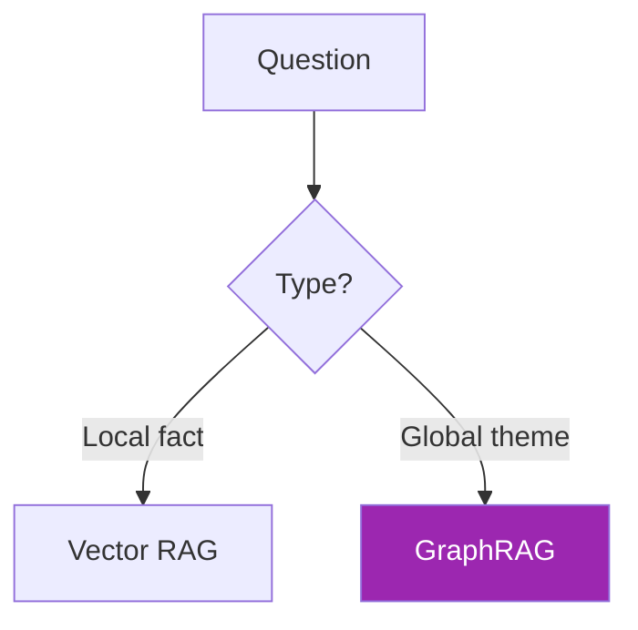
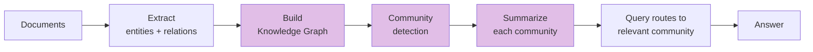

# Day 42: GraphRAG 🌐

<div class="lesson-meta">
⏱️ 4 ชั่วโมง &nbsp;|&nbsp; 📊 Advanced &nbsp;|&nbsp; 📋 Prerequisites: Day 41
</div>

## 🎯 Learning Objectives

<ul class="objectives">
<li>เข้าใจ GraphRAG pattern (Microsoft Research, 2024)</li>
<li>เห็นความต่างกับ Vector-only RAG บน global queries</li>
<li>Implement community detection ใน Neo4j</li>
<li>รวม graph + embedding เป็น hybrid retrieval</li>
</ul>

---

## 1. ปัญหาที่ GraphRAG แก้

**Vector RAG เก่งคำถามท้องถิ่น (local)** — แต่อ่อนคำถาม **global / holistic**

ตัวอย่าง:
- ✅ Local: "Project Phoenix ใช้ database อะไร?" → vector หาเจอแน่
- ❌ Global: "**Major themes** ของ project complaints ทั้งบริษัทคือ?" → vector ไม่เห็นภาพรวม



---

## 2. GraphRAG Pipeline (Microsoft)



### Step-by-step

1. **Extract** entities + relationships from text (Day 41)
2. **Build** KG
3. **Detect communities** — cluster of nodes ที่เชื่อมกันแน่น (Leiden algorithm)
4. **Summarize** ทุก community → "Theme description"
5. **Query** → route ไปยัง community ที่ relevant → Answer ใช้ summary นั้น

---

## 3. Community Detection ใน Neo4j

```python
# ใช้ Neo4j Graph Data Science (GDS)
from neo4j import GraphDatabase

driver = GraphDatabase.driver("bolt://localhost:7687",
                              auth=("neo4j", "password"))

with driver.session() as s:
    # 1. Project graph เข้า memory ของ GDS
    s.run("""
    CALL gds.graph.project('myGraph', 
      ['Person', 'Project'],
      {WORKS_ON: {orientation: 'UNDIRECTED'},
       COLLABORATES_WITH: {orientation: 'UNDIRECTED'}})
    """)
    
    # 2. Run Leiden community detection
    result = s.run("""
    CALL gds.leiden.stream('myGraph')
    YIELD nodeId, communityId
    RETURN gds.util.asNode(nodeId).name AS name, communityId
    ORDER BY communityId
    """)
    
    for r in result:
        print(f"{r['name']}: community {r['communityId']}")
```

---

## 4. Summarize แต่ละ Community

```python
from anthropic import Anthropic
client = Anthropic()

def summarize_community(nodes_and_edges: str) -> dict:
    """Summarize a community of related entities + relationships"""
    resp = client.messages.create(
        model="claude-sonnet-4-6",
        max_tokens=500,
        system="""Given entities and relationships in a community, output JSON:
{
  "theme": "1-line theme",
  "summary": "3-5 sentence summary",
  "key_entities": ["...","..."],
  "common_patterns": ["..."]
}""",
        messages=[{"role": "user", "content": nodes_and_edges}]
    )
    import json
    return json.loads(resp.content[0].text)

# Run บนทุก community
for community_id, members in communities.items():
    text = format_community_for_llm(members)
    summary = summarize_community(text)
    # Store ใน Neo4j as Community node
    with driver.session() as s:
        s.run("""
        CREATE (c:Community {id: $id, theme: $theme, summary: $summary})
        """, id=community_id, theme=summary["theme"], summary=summary["summary"])
```

---

## 5. Query Routing

```python
def graphrag_query(question: str):
    # 1. หา community ที่ relevant ผ่าน semantic search บน community summaries
    relevant_communities = vector_search_communities(question, top_k=3)
    
    # 2. สำหรับแต่ละ community → ดึง detailed info
    contexts = []
    for c in relevant_communities:
        ctx = fetch_community_details(c.id)  # nodes + edges
        contexts.append(ctx)
    
    # 3. Send to Claude สำหรับ final answer
    resp = client.messages.create(
        model="claude-opus-4-7",
        max_tokens=1500,
        system="Answer using ONLY the community context. Cite community ID.",
        messages=[{"role": "user", "content": f"Q: {question}\n\nContext:\n{contexts}"}]
    )
    return resp.content[0].text
```

---

## 6. Local vs Global Search

GraphRAG paper แยก 2 mode:

| Mode | When | How |
|------|------|-----|
| **Local search** | Specific question about entity | Find entity → expand 1-2 hops → retrieve text |
| **Global search** | Theme/pattern question | Aggregate community summaries → Map-reduce |

```python
def is_global_question(q: str) -> bool:
    """ใช้ Claude ตัดสินใจ"""
    resp = client.messages.create(
        model="claude-haiku-4-5-20251001",
        max_tokens=10,
        system="Is this a global/thematic question (LOCAL or GLOBAL)? Output one word.",
        messages=[{"role": "user", "content": q}]
    )
    return "GLOBAL" in resp.content[0].text.upper()
```

---

## 7. เปรียบเทียบ Accuracy

จาก Microsoft research paper:

| Question type | Vector RAG | GraphRAG |
|--------------|-----------|----------|
| Local fact | 78% | 75% |
| Global theme | 38% | **72%** |
| Multi-hop reasoning | 45% | **80%** |

→ GraphRAG ชนะใหญ่ใน global + multi-hop, เสมอใน local

---

## 🛠️ Hands-on Exercise

!!! example "Exercise 1: Setup GDS + Leiden"
    Install Neo4j Graph Data Science library → run Leiden บน sample data

!!! example "Exercise 2: Community Summarizer"
    Implement summarize_community() → run บน graph ของคุณ → store เป็น Community nodes

!!! example "Exercise 3: Global vs Local Q&A"
    ลอง 3 คำถาม:
    - Local: "Who works on Project X?"
    - Global: "What are the main themes of customer complaints?"
    - Compare กับ vector-only RAG (Day 35)

---

## ✅ Self-Check Quiz

<div class="quiz">

**Q1:** ทำไม Vector RAG อ่อน global question?

??? success "ดูคำตอบ"
    Vector RAG ดึง top-k chunks ที่ "คล้าย" — แต่ global theme กระจายอยู่ทั้ง corpus ไม่ใช่จุดเดียว top-k miss ส่วนใหญ่ของ data

**Q2:** Leiden algorithm ทำอะไร?

??? success "ดูคำตอบ"
    Community detection algorithm — แบ่ง graph เป็น cluster ที่ nodes ภายในเชื่อมกันแน่นกว่าระหว่าง cluster

**Q3:** เมื่อไหร่ "ไม่ควร" ใช้ GraphRAG?

??? success "ดูคำตอบ"
    - Corpus เล็ก (~100 docs) — overhead ไม่คุ้ม
    - คำถามทั้งหมดเป็น local fact
    - ไม่มี budget/skill เขียน entity extraction pipeline
    - Real-time data ที่ update เร็วเกินกว่าจะ rebuild graph

</div>

---

## 🔍 Cross-check & References

- 📄 [Microsoft GraphRAG Paper](https://arxiv.org/abs/2404.16130)
- 📦 [Microsoft GraphRAG repo](https://github.com/microsoft/graphrag)
- 📘 [Neo4j GDS](https://neo4j.com/docs/graph-data-science/current/)
- 📺 [Agentic Knowledge Graph Construction (DLAI)](https://www.deeplearning.ai/courses/agentic-knowledge-graph-construction)

[ต่อไป → Day 43: Agentic RAG :material-arrow-right:](day-43.md){ .md-button .md-button--primary }
