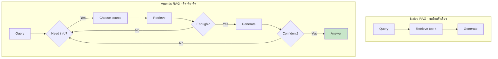
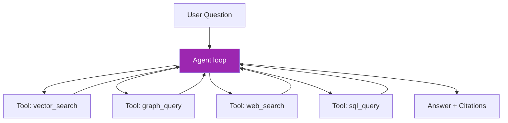

# Day 43: Agentic RAG 🤖

<div class="lesson-meta">
⏱️ 4 ชั่วโมง &nbsp;|&nbsp; 📊 Advanced &nbsp;|&nbsp; 📋 Prerequisites: Day 35, 42
</div>

## 🎯 Learning Objectives

<ul class="objectives">
<li>เข้าใจว่า Agentic RAG ต่างจาก Naive RAG อย่างไร</li>
<li>Build agent ที่ตัดสินใจ retrieve เอง</li>
<li>Multi-source RAG: vector + graph + web + DB</li>
<li>Self-reflection: ตรวจคำตอบของตัวเอง</li>
</ul>

---

## 1. Naive RAG vs Agentic RAG



### ความแตกต่างหลัก

| Naive RAG | Agentic RAG |
|----------|------------|
| 1 retrieval call | หลาย call ตามต้องการ |
| 1 source | หลาย source (vector, graph, web, DB) |
| ไม่ verify | self-check + re-query |
| Linear | Loop |
| Cheap | แพงกว่า แต่แม่นยำกว่า |

---

## 2. Architecture



---

## 3. Implementation

### Setup tools

```python
from anthropic import Anthropic
import json

client = Anthropic()

TOOLS = [
    {
        "name": "vector_search",
        "description": "Search company knowledge base by semantic similarity. Best for: 'tell me about', 'how does X work', factual lookup.",
        "input_schema": {
            "type": "object",
            "properties": {
                "query": {"type": "string"},
                "top_k": {"type": "integer", "default": 5}
            },
            "required": ["query"]
        }
    },
    {
        "name": "graph_query",
        "description": "Query knowledge graph for relationships. Best for: 'who manages X', 'connections between A and B', multi-hop queries.",
        "input_schema": {
            "type": "object",
            "properties": {"cypher": {"type": "string"}},
            "required": ["cypher"]
        }
    },
    {
        "name": "web_search",
        "description": "Search the web for recent/external info. Best for: news, public data, anything after training cutoff.",
        "input_schema": {
            "type": "object",
            "properties": {"query": {"type": "string"}},
            "required": ["query"]
        }
    },
    {
        "name": "sql_query",
        "description": "Query operational SQL database. Best for: transactions, metrics, counts.",
        "input_schema": {
            "type": "object",
            "properties": {"sql": {"type": "string"}},
            "required": ["sql"]
        }
    }
]
```

### Agent loop

```python
def run_tool(name, args):
    if name == "vector_search":
        return vector_db.search(args["query"], top_k=args.get("top_k", 5))
    elif name == "graph_query":
        with driver.session() as s:
            return [r.data() for r in s.run(args["cypher"])]
    elif name == "web_search":
        return web_search(args["query"])
    elif name == "sql_query":
        return run_sql(args["sql"])

def agentic_rag(question: str, max_iterations: int = 8):
    messages = [{"role": "user", "content": question}]
    
    for i in range(max_iterations):
        resp = client.messages.create(
            model="claude-sonnet-4-6",
            max_tokens=2000,
            tools=TOOLS,
            system="""Answer using available tools. 
- Choose the BEST tool for each step
- Cite sources in final answer
- If unsure, run more searches
- Stop when you have enough info""",
            messages=messages
        )
        
        if resp.stop_reason == "end_turn":
            return "\n".join(b.text for b in resp.content if b.type == "text")
        
        # tool_use
        messages.append({"role": "assistant", "content": resp.content})
        tool_results = []
        for block in resp.content:
            if block.type == "tool_use":
                result = run_tool(block.name, block.input)
                tool_results.append({
                    "type": "tool_result",
                    "tool_use_id": block.id,
                    "content": json.dumps(result, default=str)[:5000]
                })
        messages.append({"role": "user", "content": tool_results})
    
    return "[Max iterations reached]"
```

---

## 4. Self-Reflection Pattern

หลัง agent ตอบ → ส่ง answer กลับเข้า reviewer agent ตรวจ

```python
def review_answer(question: str, answer: str, sources: list) -> dict:
    resp = client.messages.create(
        model="claude-opus-4-7",
        max_tokens=500,
        system="""Critically review this RAG answer. Output JSON:
{
  "complete": true/false,
  "missing": ["..."],
  "factual_errors": ["..."],
  "needs_more_retrieval": true/false,
  "confidence": 0-1
}""",
        messages=[{"role": "user", "content": f"Q: {question}\n\nA: {answer}\n\nSources: {sources}"}]
    )
    return json.loads(resp.content[0].text)

def agentic_rag_with_reflection(question: str):
    answer = agentic_rag(question)
    review = review_answer(question, answer, [])
    
    if not review["complete"] or review["confidence"] < 0.7:
        # Loop back with feedback
        followup = f"Original Q: {question}\n\nMissing: {review['missing']}"
        answer = agentic_rag(followup)
    
    return answer
```

---

## 5. Real-world Example

### Question: "วิเคราะห์สาเหตุที่ Project Phoenix ล่าช้า — ใช้ทุกแหล่งข้อมูล"

Agent อาจทำ:
1. `vector_search("Project Phoenix status updates")` → ดึง update notes
2. `graph_query("MATCH (p:Project {name:'Phoenix'})-[:HAS_BLOCKER]->(b) RETURN b")` → ดึง blockers
3. `sql_query("SELECT * FROM tickets WHERE project='Phoenix' AND status='blocked'")` → ดึง tickets
4. `web_search("...")` → ดึง external dependencies info
5. Synthesize → cite all sources

→ Naive RAG ทำได้แค่ step 1!

---

## 6. Cost & Latency Trade-off

| Pattern | Avg LLM calls | Avg latency | Cost |
|---------|--------------|-------------|------|
| Naive RAG | 1 | 2-3s | $ |
| Agentic RAG | 3-5 | 6-10s | $$$ |
| + Self-reflection | 5-8 | 10-15s | $$$$ |

→ ใช้ Agentic เมื่อคำถามสำคัญ / ต้อง accurate มาก
→ Cache answer ที่บ่อยๆ เพื่อ amortize cost

---

## 🛠️ Hands-on Exercise

!!! example "Exercise 1: Tool Suite"
    ตั้ง 4 tools (vector, graph, web, sql) — ทดสอบแต่ละตัวแยก

!!! example "Exercise 2: Agentic Loop"
    Implement agent loop ตามโค้ดข้างบน — ลอง 5 คำถามที่ผสมหลาย source

!!! example "Exercise 3: Cost Comparison"
    Run คำถามเดียวกัน Naive vs Agentic → measure cost + latency + accuracy

---

## ✅ Self-Check Quiz

<div class="quiz">

**Q1:** เมื่อไหร่ Agentic RAG คุ้มค่าทำ?

??? success "ดูคำตอบ"
    - High-stakes question (medical, legal, financial)
    - Multi-source data needed
    - Complex multi-hop reasoning
    - User OK กับ latency 5-15s

**Q2:** Self-reflection ใส่อย่างไรไม่ให้แพง?

??? success "ดูคำตอบ"
    - ทำเฉพาะคำตอบ confidence < threshold
    - ใช้ small model (Haiku) เป็น reviewer
    - Cache verified answers
    - Skip ถ้า routine question

**Q3:** ทำไมต้อง `max_iterations`?

??? success "ดูคำตอบ"
    กัน infinite loop — agent อาจวน retrieve ไม่หยุดถ้า confidence ไม่ผ่าน threshold

</div>

---

## 🔍 Cross-check & References

- 📄 [Self-RAG paper](https://arxiv.org/abs/2310.11511)
- 📄 [Corrective RAG (CRAG)](https://arxiv.org/abs/2401.15884)
- 📦 [LlamaIndex Agentic RAG](https://docs.llamaindex.ai/en/stable/examples/agent/)
- 📺 [Building Agentic RAG with LlamaIndex (DLAI)](https://www.deeplearning.ai/courses/building-agentic-rag-with-llamaindex)

[ต่อไป → Day 44 :material-arrow-right:](day-44.md){ .md-button .md-button--primary }
