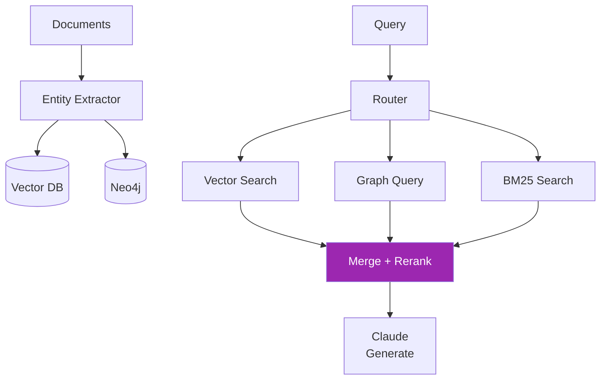

# Day 44: Mini-Project — Hybrid Retrieval 🎯

<div class="lesson-meta">
⏱️ 5 ชั่วโมง &nbsp;|&nbsp; 📊 Project &nbsp;|&nbsp; 📋 Prerequisites: Day 38-43
</div>

## 🎯 Project Goal

สร้าง **Hybrid Retrieval System** ที่:

<ul class="objectives">
<li>Index documents เข้า ทั้ง vector DB + knowledge graph</li>
<li>Query ดึงจากทั้งสอง source</li>
<li>Re-rank รวมผลลัพธ์</li>
<li>วัด accuracy เทียบกับ baseline</li>
</ul>

---

## 1. Architecture



---

## 2. Setup

```bash
mkdir hybrid-retrieval && cd hybrid-retrieval
python -m venv venv && source venv/bin/activate
pip install qdrant-client neo4j anthropic sentence-transformers rank-bm25 cohere
```

โครงสร้าง:
```
hybrid-retrieval/
├── ingest.py      # parse + extract + index
├── retrieve.py    # vector + graph + bm25 + rerank
├── generate.py    # final answer with Claude
├── eval.py        # accuracy testing
└── data/
    └── docs/
```

---

## 3. Ingest Pipeline

```python
# ingest.py
from anthropic import Anthropic
from qdrant_client import QdrantClient
from neo4j import GraphDatabase
from sentence_transformers import SentenceTransformer
import json

client = Anthropic()
embedder = SentenceTransformer("all-mpnet-base-v2")
qdrant = QdrantClient(":memory:")
driver = GraphDatabase.driver("bolt://localhost:7687", auth=("neo4j", "password"))

def extract_entities_and_relations(text: str) -> dict:
    resp = client.messages.create(
        model="claude-sonnet-4-6",
        max_tokens=1500,
        system="""Extract entities and relationships from text. Output JSON:
{
  "entities": [{"name": "...", "type": "Person|Project|Team|Concept"}],
  "relations": [{"from": "...", "type": "WORKS_ON|...", "to": "..."}],
  "summary": "1-sentence summary"
}""",
        messages=[{"role": "user", "content": text}]
    )
    return json.loads(resp.content[0].text)

def ingest_document(doc_id: str, text: str, chunks: list[str]):
    # 1. Vector indexing per chunk
    for i, chunk in enumerate(chunks):
        emb = embedder.encode(chunk).tolist()
        qdrant.upsert("docs", points=[{
            "id": f"{doc_id}-{i}",
            "vector": emb,
            "payload": {"text": chunk, "doc_id": doc_id, "chunk_idx": i}
        }])
    
    # 2. Entity extraction per document
    entities_data = extract_entities_and_relations(text)
    
    # 3. Insert into Neo4j
    with driver.session() as s:
        for ent in entities_data["entities"]:
            s.run(f"MERGE (n:{ent['type']} {{name: $name}}) SET n.doc_id = $doc_id",
                  name=ent["name"], doc_id=doc_id)
        for rel in entities_data["relations"]:
            s.run(f"""
            MATCH (a {{name: $from_name}}), (b {{name: $to_name}})
            MERGE (a)-[:{rel['type']}]->(b)
            """, from_name=rel["from"], to_name=rel["to"])
```

---

## 4. Hybrid Retrieval

```python
# retrieve.py
from rank_bm25 import BM25Okapi
import cohere
co = cohere.Client()  # set COHERE_API_KEY

def vector_search(query: str, top_k=10):
    emb = embedder.encode(query).tolist()
    hits = qdrant.search("docs", query_vector=emb, limit=top_k)
    return [{"text": h.payload["text"], "score": h.score, "source": "vector"} for h in hits]

def bm25_search(query: str, all_chunks: list, top_k=10):
    tokenized = [c.split() for c in all_chunks]
    bm25 = BM25Okapi(tokenized)
    scores = bm25.get_scores(query.split())
    top_indices = sorted(range(len(scores)), key=lambda i: scores[i], reverse=True)[:top_k]
    return [{"text": all_chunks[i], "score": scores[i], "source": "bm25"} for i in top_indices]

def graph_search(query: str) -> list:
    # Use Claude to generate Cypher, then execute
    cypher = nl_to_cypher(query)  # from Day 41
    with driver.session() as s:
        result = s.run(cypher)
        rows = [r.data() for r in result]
    return [{"text": json.dumps(r), "score": 1.0, "source": "graph"} for r in rows]

def hybrid_retrieve(query: str, all_chunks: list):
    vec_results = vector_search(query)
    bm25_results = bm25_search(query, all_chunks)
    graph_results = graph_search(query)
    
    # Reciprocal Rank Fusion
    fused = reciprocal_rank_fusion([vec_results, bm25_results, graph_results])
    
    # Cohere Re-rank top-20
    top_20 = fused[:20]
    rerank_input = [r["text"] for r in top_20]
    reranked = co.rerank(query=query, documents=rerank_input, top_n=5, model="rerank-v3.5")
    
    return [top_20[r.index] for r in reranked.results]

def reciprocal_rank_fusion(rank_lists, k=60):
    scores = {}
    for ranking in rank_lists:
        for rank, item in enumerate(ranking):
            key = item["text"][:200]  # dedupe key
            scores[key] = scores.get(key, 0) + 1 / (k + rank)
    items_by_text = {item["text"][:200]: item for ranking in rank_lists for item in ranking}
    return sorted(items_by_text.values(), key=lambda x: scores[x["text"][:200]], reverse=True)
```

---

## 5. Generate Answer

```python
# generate.py
def answer(question: str, all_chunks: list) -> str:
    retrieved = hybrid_retrieve(question, all_chunks)
    
    context = "\n\n".join([
        f"[{i+1}] (source={r['source']}) {r['text']}"
        for i, r in enumerate(retrieved)
    ])
    
    resp = client.messages.create(
        model="claude-opus-4-7",
        max_tokens=1500,
        system="""Answer using ONLY the provided context. 
Cite source numbers [1][2]. If context doesn't contain answer, say so.""",
        messages=[{"role": "user", "content": f"Question: {question}\n\nContext:\n{context}"}]
    )
    return resp.content[0].text, retrieved
```

---

## 6. Evaluation

```python
# eval.py
test_cases = [
    {"q": "ใครเป็น manager ของคนที่ทำ Phoenix?", "expected_keywords": ["Bob"]},
    {"q": "Project ไหน depend on database team?", "expected_keywords": ["Phoenix"]},
    {"q": "Major themes ของ customer complaints?", "expected_keywords": ["billing", "performance"]},
    # 20+ more cases
]

results = []
for case in test_cases:
    answer_text, sources = answer(case["q"], all_chunks)
    
    # Simple keyword match (or use LLM-as-judge)
    has_keywords = all(kw.lower() in answer_text.lower() for kw in case["expected_keywords"])
    
    results.append({
        "q": case["q"],
        "pass": has_keywords,
        "sources_used": [s["source"] for s in sources]
    })

pass_rate = sum(1 for r in results if r["pass"]) / len(results)
print(f"Pass rate: {pass_rate:.1%}")

# Source usage breakdown
from collections import Counter
all_sources = [s for r in results for s in r["sources_used"]]
print(Counter(all_sources))
```

---

## 7. Deliverables

!!! example "ส่งเป็น GitHub repo + report"
    1. Code (`ingest.py`, `retrieve.py`, `generate.py`, `eval.py`)
    2. Sample dataset (≥ 50 documents)
    3. Test cases (≥ 20)
    4. Evaluation report:
       - Pass rate per source combination
       - Latency P50, P95
       - Cost per query
       - Failure analysis (3 cases ที่ผิด)
    5. README + architecture diagram

---

## 8. Scoring Rubric

| เกณฑ์ | คะแนน |
|------|------|
| 3 retrieval sources ใช้งานได้ | / 20 |
| RRF + Re-rank ทำงาน | / 15 |
| Entity extraction + KG build ครบ | / 20 |
| Eval ≥ 20 cases + report | / 15 |
| Pass rate ≥ 70% บน global questions | / 15 |
| Documentation | / 10 |
| Code quality | / 5 |
| **รวม** | **/ 100** |

---

## ✅ Week 6 Self-Check

- [x] Hybrid Search (BM25 + Vector)
- [x] Re-ranking
- [x] Query transformation
- [x] Knowledge Graph (Neo4j + Cypher)
- [x] GraphRAG
- [x] Agentic RAG
- [x] Hybrid retrieval system ครบทุก source

---

## 🔍 Cross-check & References

- 📦 [Cohere Rerank](https://docs.cohere.com/docs/rerank)
- 📦 [Microsoft GraphRAG](https://github.com/microsoft/graphrag)
- 📺 [Advanced Retrieval for AI with Chroma (DLAI)](https://www.deeplearning.ai/courses/advanced-retrieval-for-ai)

---

:material-check-decagram: **จบ Week 6!** คุณ build RAG ระดับ enterprise ได้แล้ว

[ต่อไป → Week 7: Frameworks :material-arrow-right:](../week-07/index.md){ .md-button .md-button--primary }
