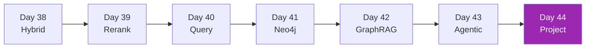

# Week 6: Advanced RAG 🧠

Basic RAG ทำงานกับ FAQ — แต่ enterprise data ต้องการเทคนิคที่ลึกกว่า

## รายวิชา

| Day | หัวข้อ | เวลา |
|-----|-------|------|
| 38 | Hybrid Search (BM25 + Vector) | 3h |
| 39 | Re-ranking (Cohere, cross-encoders) | 3h |
| 40 | Query Transformation (HyDE, multi-query) | 3h |
| 41 | Knowledge Graphs + Neo4j + Cypher | 4h |
| 42 | GraphRAG (Microsoft pattern) | 4h |
| 43 | Agentic RAG | 4h |
| 44 | Mini Project — Graph+Vector Hybrid | 5h |

[เริ่ม Day 38 :material-arrow-right:](day-38.md){ .md-button .md-button--primary }
