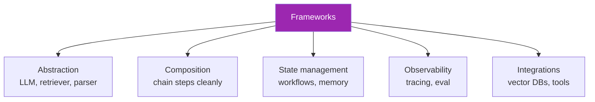
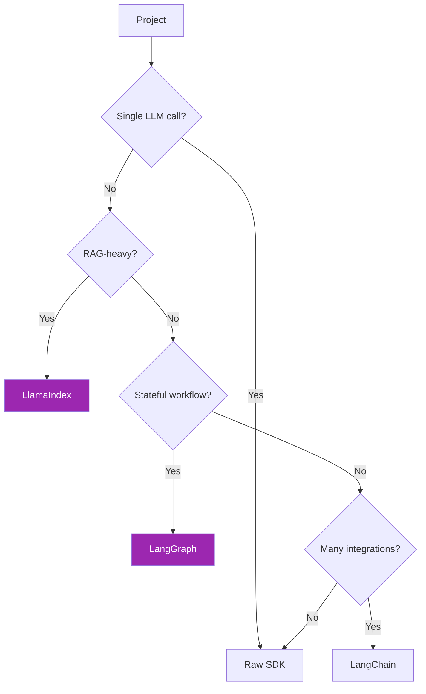

# Day 45: ทำไมต้องใช้ Framework? 🤔

<div class="lesson-meta">
⏱️ 2 ชั่วโมง &nbsp;|&nbsp; 📊 Intermediate &nbsp;|&nbsp; 📋 Prerequisites: Day 11 (API)
</div>

## 🎯 Learning Objectives

<ul class="objectives">
<li>รู้ขีดจำกัดของ raw Anthropic SDK</li>
<li>เห็นว่า framework แก้ปัญหาอะไร</li>
<li>เข้าใจ trade-off ของ framework (lock-in, learning curve)</li>
<li>ตัดสินใจได้ว่า project ไหนต้อง framework</li>
</ul>

---

## 1. Raw SDK ดียังไง

```python
from anthropic import Anthropic
client = Anthropic()
resp = client.messages.create(...)
```

**ข้อดี:**
- ไม่มี dependency เพิ่ม
- Full control
- เข้าใจ Claude API โดยตรง
- เร็วในการ debug

→ เหมาะกับ: prototype, simple app, learning

---

## 2. ปัญหาเมื่อ scale

### ปัญหา 1: Pipeline ซับซ้อน

```python
# Raw — กลายเป็น spaghetti
def my_rag(question):
    chunks = retrieve(question)
    reranked = rerank(chunks)
    context = format(reranked)
    answer = client.messages.create(...)
    if not validate(answer):
        # retry...
    return answer
```

→ Boilerplate เยอะ, test ยาก

### ปัญหา 2: Multi-provider

ลูกค้าบอก "วันหนึ่งอยากเปลี่ยนไป OpenAI ก็ทำได้นะ" → ต้องเขียนหลาย backend

### ปัญหา 3: Stateful workflows

Agent loop ที่ branch / merge / human-in-the-loop → ยากเขียน raw

### ปัญหา 4: Observability

Production ต้อง trace ทุก LLM call → ต้อง wrap manually

---

## 3. Framework ตอบโจทย์อะไร



---

## 4. 5 Frameworks หลักที่จะเรียน

| Framework | Best for | Day |
|-----------|---------|-----|
| **LangChain** | Composable chains, broad integrations | 46 |
| **LangGraph** | Stateful, graph-based workflows | 47 |
| **LlamaIndex** | RAG-first apps, query engines | 48 |
| **DSPy** | Programmatic prompts (compile, not write) | 49 |
| **Pydantic** | Type-safe structured outputs | 50 |

---

## 5. Trade-offs ของ Framework

| ✅ ข้อดี | ❌ ข้อเสีย |
|--------|----------|
| Abstraction → less code | Hidden complexity → debug ยาก |
| Multi-provider | Vendor lock-in (framework lock-in) |
| Built-in observability | API surface ใหญ่ → learning curve |
| Community examples | Breaking changes บ่อย |
| Composability | Performance overhead |

!!! tip "หลัก"
    เริ่มจาก **raw SDK** จน feel pain แล้วค่อย adopt framework — อย่า over-engineer ตั้งแต่แรก

---

## 6. Decision Tree



---

## 🛠️ Hands-on Exercise

!!! example "Exercise 1: Raw vs Framework"
    เลือก task ใน Week 5-6 ของคุณ → เขียน 2 versions:
    1. Raw SDK
    2. LangChain (preview, ใน Day 46)
    
    เปรียบเทียบ: line count, readability, flexibility

!!! example "Exercise 2: Industry Job Listings"
    ค้น "GenAI Engineer" บน LinkedIn 10 ตำแหน่ง — สังเกตว่า framework ไหนถูกถามบ่อย?

---

## ✅ Self-Check Quiz

<div class="quiz">

**Q1:** เมื่อไหร่ raw SDK ดีกว่า framework?

??? success "ดูคำตอบ"
    - Prototype / POC
    - Single LLM call
    - Team เล็ก, codebase เล็ก
    - ต้องการ full control
    - หลีกเลี่ยง dependency

**Q2:** ตัวไหนเหมาะกับ RAG ที่สุด?

??? success "ดูคำตอบ"
    LlamaIndex — design first-class สำหรับ RAG; LangChain ก็ได้แต่ generic กว่า

</div>

---

## 🔍 Cross-check & References

- 📘 [LangChain vs LlamaIndex (comparison)](https://www.deeplearning.ai/short-courses/)
- 📄 [Building LLM apps without LangChain](https://www.octomind.dev/blog/why-we-no-longer-use-langchain-for-building-our-ai-agents)

[ต่อไป → Day 46: LangChain :material-arrow-right:](day-46.md){ .md-button .md-button--primary }
